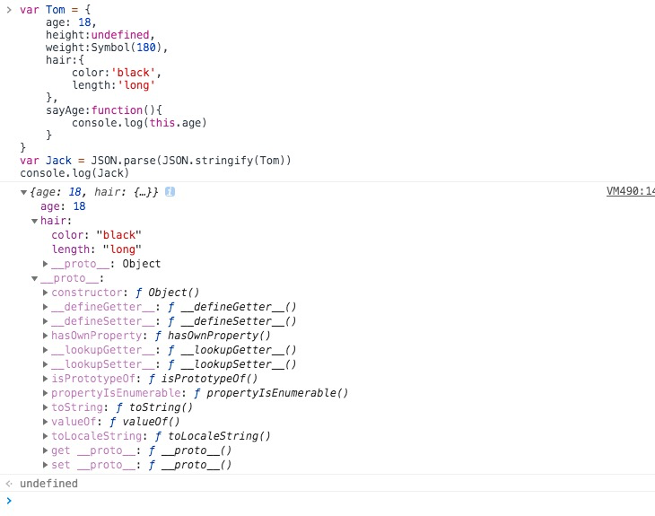

# JS 进阶

## call、apply、bind的模拟实现

### call

语法

```
fn.call(thisArg,arg1,arg2,...)
```

该方法有2个参数，第一个参数为需要被指定的this值，第二个参数为一个参数列表

thisArg 取值有以下四种情况：
* 不传、或者传null、undefined，this指向window对象
* 传递另一个函数的函数名，this指向这个函数的引用
* 传递字符串、数组或布尔类型等基础类型，this指向其对应的包装对象。
* 传递一个对象时，this指向这个对象

示例使用：
```
var foo = {
  value:1
}

function bar(){
  console.log(this.value)
}

bar.call(foo) // 1
```
注意两点：

1. this指向被改变为指向foo
2. bar 被执行了

### call模拟实现 

#### 第一版: 实现改变this指向

在上述例子中，试想当调用call方法时，把bar理解为foo内部一个函数时，this是不是就指向为foo，输出的值就为1啦。
```
var foo = {
  value:1,
  bar:function(){
    console.log(this.value)
  }
}
foo.bar() //1
```
所以我们的思路可以分为：
1.将函数设置为对象的属性
2.函数被调用
3.删选该函数

根据这个思路，尝试实现如下代码：

```
Function.prototype.myCall = function(obj){
  obj.fn = this;  //这里的this就是调用mycall的函数
  obj.fn();
  delete obj.fn
}
```
#### 第二版：实现传参数

call方法传入的参数是不确定的，那我们可以从argument对象中获取。
```
var args = []
for(var i = 1 ;i < arguments.length; i ++ ){
  args.push('arguments['+ i +']')
}

// 执行后 args为 [ "arguments[1]", "arguments[2]", "arguments[3]",... ]
```

你可能会对 为何不去直接拿arguments[1]的值呢，如果我们直接去拿arguments[1]的值的话，你测试一下传一个字符串参数，像这样，func.mycall(obj, ‘dd’);就会报错，告诉你dd is not defined。 因为eval会把字符串解析成一个变量。

不定长的参数问题解决了，我们接着要把这个参数数组放到要执行的函数的参数里面去。

具有三种方法：
1、eval('obj.fn('+ args +')');

2、obj.fn.apply(obj, args); 

3、obj.fn(…args);//es6解构语法

整合代码之后：

```
Function.prototype.myCall = function(obj){
  var args = [];
  for(var i = 1;i < arguments.length; i++){
    args.push('arguments[' + i +']')
  }
  obj.fn = this;
  eval('obj.fn('+args+')')
  delete obj.fn
}
```

#### 最终版 完善细节 

call方法第一个参数可以为null、函数调用具有返回值

```
Function.prototype.myCall = function(obj){
  var args = [];
  for(var i = 1; i < argumens.length; i++){
    args.push('arguments[' + i + ']')
  }
  obj.fn = obj || window
  var result = eval('obj.fn('+args+')')
  delete obj.fn
  return result
}

```

### apply

apply和call 很相似，区别在于第二个参数。apply 是需要参数数组，call 是需要参数列表。

语法

```
func.apply(thisArg, argsArray)
```

该方法有2个参数，第一个参数为需要指定的this值，第二个参数为一个数组。

由于apply和call区别在于第二个参数是否为数组，所以直接给出代码：
```
Function.prototype.myApply = function(obj,arr){
 obj.fn = this || window;
 var result;
 if(!arr){
   result = obj.fn()
 }else{
   var args = [];
   for(var i = 1; i < arr.length; i++){
     args.push('arr['+i+']')
   }
   result = eval('obj.fn('+args+')')
 }
 delete obj.fn
 return result
}
```


### bind

bind() 方法会创建一个新函数。当这个新函数被调用时，bind() 的第一个参数将作为它运行时的 this，之后的一序列参数将会在传递的实参前传入作为它的参数。(来自于 MDN )

语法
```
function.bind(thisArg[, arg1[, arg2[, ...]]])
```

参数：thisArg
调用绑定函数时作为 this 参数传递给目标函数的值。 如果使用new运算符构造绑定函数，则忽略该值。当使用 bind 在 setTimeout 中创建一个函数（作为回调提供）时，作为 thisArg 传递的任何原始值都将转换为 object。如果 bind 函数的参数列表为空，执行作用域的 this 将被视为新函数的 thisArg。


使用示例：
```
var foo = {
  value:1
}
function bar(){
  console.log(console.log(this.value))
}

var bindFoo = bar.bind(foo)

bindFoo() // 1
```

### bind模拟实现

```
Function.prototype.myBind = function(obj){
  var that = this // this为调用myBind的函数
  var args = Array.prototype.slice.call(arguments,1) // 获取myBind函数从第二个参数到最后一个参数
  return function(){
     // 这个时候的arguments是指bind返回的函数传入的参数
    var bindArgs = Array.prototype.slice.call(arguments);
    return that.apply(obj,args.concat(bindArgs))
  }
}
```

## new 操作符

### new 的作用

示例说明new操作的作用

```
function Foo(name){
  this.name = name;
}

Foo.prototype.sayName = function (){
  console.log(this.name)
}

const f = new Foo('ye')
console.log(f.name) // ye
f.sayName() //ye
```

根据例子可以得到以下结论：
1. new 通过构造函数 Foo 创建出来的实例可以访问到构造函数中的属性
2. new 通过构造函数 Foo 创建出来的实例可以访问到构造函数原型链中的属性

构造函数一般是没有显示的返回值的，默认返回是undefined,那么当设置了返回值对于new 操作符会有什么影响呢。看下面的例子：

```
1. function Foo(name){
  this.name = name
  return 1
}
const f = new Foo('ye')
console.log(t.name) // ye

2. function Foo(name){
  this.name = name
  return { age:26}
}
const f = new Foo('ye')
console.log(f) // {age:26}
console.log(f.name) // undefined
```

从例子可以看出，当具有返回值时，构造函数内部 this 还是正常的，但当返回值是对象时，返回值会被正常使用。

### new 模拟实现

主要要实现的功能：
1. new 操作符会返回一个对象
2. 返回的对象，可以访问到挂载在this身上的任意属性
3. 返回的对象可以访问到构造函数原型上的属性
4. 返回原始值需要忽略，返回对象需要正常处理

实现代码
```
function myNew(){
  var obj = new Object()
  var fn = [].shift.call(arguments)
  obj.__proto__ = fn.prototype
  var result = fn.apply(obj,arguments)
  return result instanceof Object ? result : obj
}
```

## 深浅拷贝

先用简单的例子来说明深浅拷贝的作用。

```
let Tom = {
  age:18
}

ley Jack = Tom;
Tom.age = 20;
console.log(Jack.age) //20
```

从上面的例子中可以发现，如果给一个变量赋值一个对象，那么两者的值为同一个引用，其中一方改变，另一方也会改变。这在我们实际的开发场景中是不希望看见的。那么深浅拷贝就为了解决这个问题的。

### 浅拷贝

针对对象的情况可以使用Object.assgin 和 展开运算符（...）;针对数组的可以使用slice、concat等方法。

```
let Tom = {
  age:18
}
let Jack = Object.assign({},Tom) 或者 let Jack = {...Tom}
Tom.age = 20
console.log(Jack.age) // 10
```
浅拷贝基本上可以解决大部分问题，但是如果是下面的情况，还是需要深拷贝。

```
let Tom = {
    age: 18;
    hair:{
        color:'black',
        length:'long'
    }
}
let Jack = { ...Tom };
Tom.hair.color = 'red';
console.log(Jack.hair.color) // red
```
当有多层嵌套的时候，浅拷贝就不能满足需求了，那就需要深拷贝

### 深拷贝

那如何深拷贝呢，最简单的方法就是使用`JSON.parse(JSON.stringify(obj))`,但是这个方法具有一定的局限性。如图所示:


从上图中你会发现
1. 不拷贝undefined和Symbol类型的值
2. 不拷贝函数


### 浅拷贝实现

```
function shallowCopy(obj){
   // 只拷贝对象
  if(typeof obj !== 'object') return;
  var newObj = Array.isArray(obj) ? [] : {}
  for(var key in obj){
     // 遍历obj，并且判断是obj的属性才拷贝
    if(obj.hasOwnProperty(key)){
      newObj[key] = obj[key]
    }
  }
  return newObj
}
```

思路:
1. 前提针对引用类型
2. 判断类型进行不同的初始化
3. 遍历排除不是自身的属性时不进行拷贝

### 深拷贝实现

```
function deepCopy(obj){
  if(typeof(obj) !== 'object') return;
  var newObj = Array.isArray(obj) ? [] : {}
  for(var key in obj){
    if(obj.hasOwnProperty(key)){
      if(typeof(obj[key]) == 'object'){
        deepCopy(obj[key])
      }else{
        newObj[key] = obj[key]
      }
    }
  }
  return newObj
}
```
思路与浅拷贝类似，只是添加在遍历中判断子项是否为object，如果是递归遍历，不是就赋值。