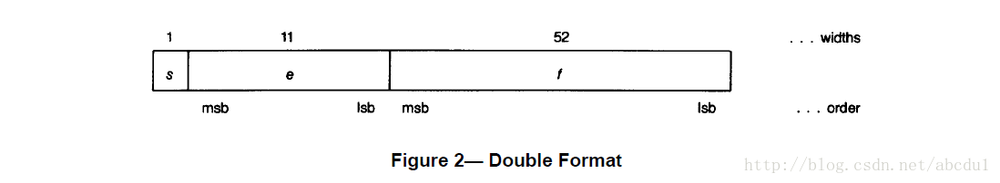
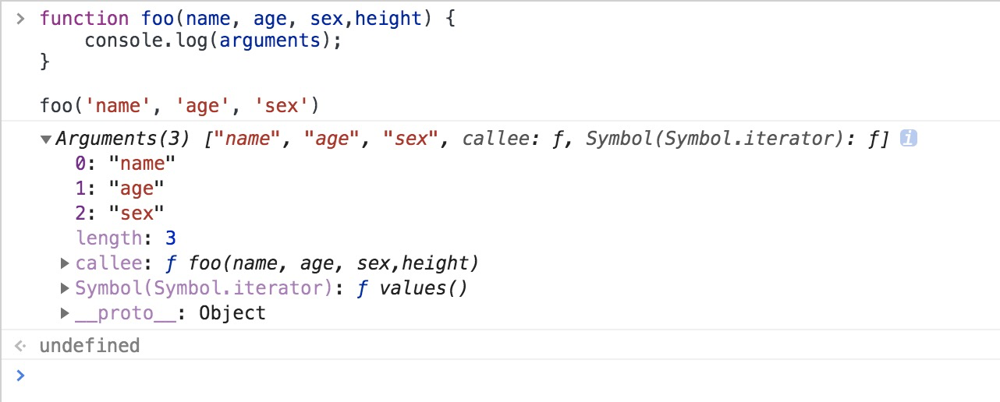
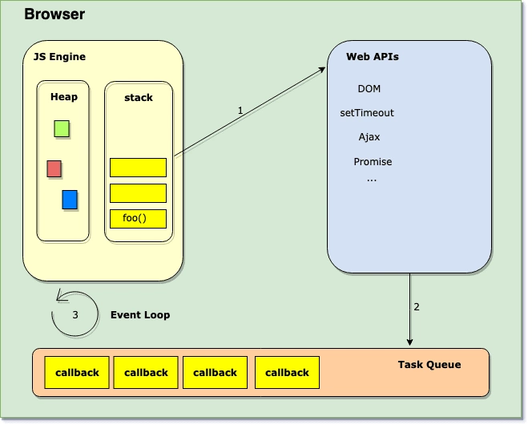
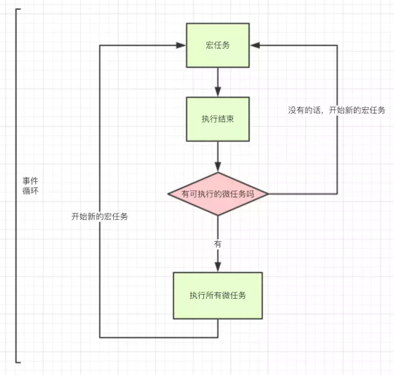
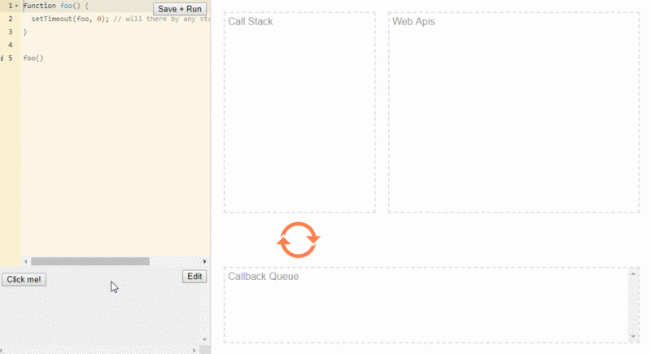

# JS 基础

## 基本数据类型

### 类型数量

到目前为止 JS 具有8种数据类型。

Number、String、Boolean、Null、Undefined、Object、Symbol、BigInt

1. Number

Number 类型包含整数和浮点数两种值。

  NaN 非数字类型 

  + 涉及到任何关于NaN的操作都会返回NaN 
  + NaN 不等于自身

2. String 

字符串是存储字符的变量，由双引号或者单引号表示，具有length属性。可使用String()或者toString()方法转换为String类型

3. Boolean

具有 true 和 false 2个值 true 为 1 ; false 为 0 

4. Undefined

undefined表示系统级的、出乎意料的或类似错误的值的空缺；表示缺少值，此处应该有值，但没有定义

5. Null 

null表示程序级的、正常的或在意料之中的值的空缺

6. Object

ECMAjavascript中的对象其实就是一组数据和功能的集合。对象可以通过执行new操作符后跟要创建的对象类型的名称来创建。创建object类型的实例并为其添加属性（或）方法，就可以自定义创建对象。

        如：var o = new Object( ); 

        object 的每个实例都有下列属性和方法：

        constructor：保存着用于创建当前对象的函数。（构造函数)constructor就是object(); 

        hasOwnProperty(propertyName): 用于检查给定的当前属性在当前对象实例中）而不是在实例原型中）是否存在。

        isPrototypeOf(object): 用于检查传入的对象是否是传入对象原型。

        propertyIsEnumerable(propertyName): 用于检查给定属性是否能够用for-in语句。

        toLocaleString( ): 返回对象的字符串表示，该字符串与执行环境的地区对应。

        toString( ): 返回对象的字符串表示。

        valueOf( ): 返回对象的字符串、数值或者布尔值表示。通常与toString( )方法的返回值得相同。

        ECMAJS中object是所有对象的基础，因些所有对象都具有这些基本的属性和方法。

7. Symbol

Symbol 类型的对象永远不相等，即便创建的时候传入相同的值。因此，可以用解决属性名冲突的问题（适用于多少编码），做为标记。ES6 新增的

8. BigInt

BigInt 提供了一种方法来表示大于  2^53 - 1 的整数。这原本是 Javascript中可以用 Number 表示的最大数字。BigInt 可以表示任意大的整数。

可以用在一个整数字面量后面加 n 的方式定义一个 BigInt ，如：10n，或者调用函数BigInt()。

## 数据类型判断

JS 数据类型的判断主要有以下几种方法：typeof、instanceof 、Objeact.prototype.toString.call()、constructor

### typeof 

返回一个表示数据类型的字符串，返回结果包含：number、boolean、string、symbol、object、undefined、function、bigint等 缺点不能判断null和array

``` javascript
typeof '' // string    有效
typeof 1 // number    有效
typeof NaN // number    有效
typeof true // boolean   有效
typeof undefined // undefined 有效
typeof new Function() // function  有效
typeof 11n // bigint    有效
typeof null // object    无效
typeof [] // object    无效
typeof new Date() // object    无效
typeof new RegExp() // object    无效
```

### instanceof

instanceof 是用来判断 A 是否为 B 的实例，表达式为 A instanceof B；如果 A 是 B 的实例，则返回 true，否则返回 false。

``` javascript
[] instanceof Array // true
{} instanceof Object // true
new Date() instanceof Date // true

[] instanceof Object // true
null instanceof Null // 报错
null instanceof Object // false 

2 instanceof Number //false
    'str'
instanceof String // false
true instanceof Boolean // false
```

instanceof可以精准判断引用数据类型（Array，Function，Object），而基本数据类型不能被instanceof精准判断。

会发现 [] 既是 Array的实例，又是Object的实例。因为 instanceOf 检测的是原型。[] 的 `__proto__ ` 直接指向 Array.prototype, Array的 `__proto__ ` 指向 Object.prototype. 所以 [] 间接指向了 Object.prototype. 所以 instanceof 只能用来判断两个对象是否属于实例关系，而不能判断一个对象实例具体属于哪种类型。

在MDN中的解释：instanceof 运算符用来测试一个对象在其原型链中是否存在一个构造函数的 prototype 属性。其意思就是判断对象是否是某一数据类型的实例，请重点关注一下是判断一个对象是否是数据类型的实例。在这里字面量值，2， true ，'str'不是实例，所以判断值为false。

#### instanceof 的实现原理

原理是在实例的 原型对象链 中找到该构造函数的prototype属性所指向的 原型对象，就返回true。

##### 简易实现

``` javascript
function newInstanceof(l, r) {
    var o = r.prototype;
    l = l.__proto__;
    while (true) {
        if (l === null) {
            return false
        }
        if (o === l) {
            return true
        }
        l = l.__proto__
    }
}
```

### Object.prototype.toString.call()

这是最准确的类型判断方法

toString() 是 Object 的原型方法，调用该方法，默认返回当前对象的 [[Class]] 。这是一个内部属性，其格式为 [object Xxx] ，其中 Xxx 就是对象的类型。

对于 Object 对象，直接调用 toString() 就能返回 [object Object] 。而对于其他对象，则需要通过 call / apply 来调用才能返回正确的类型信息。

``` javascript
Object.prototype.toString.call(''); // [object String]
Object.prototype.toString.call(1); // [object Number]
Object.prototype.toString.call(true); // [object Boolean]
Object.prototype.toString.call(Symbol()); // [object Symbol]
Object.prototype.toString.call(undefined); // [object Undefined]
Object.prototype.toString.call(null); // [object Null]
Object.prototype.toString.call(new Function()); // [object Function]
Object.prototype.toString.call(new Date()); // [object Date]
Object.prototype.toString.call([]); // [object Array]
Object.prototype.toString.call(new RegExp()); // [object RegExp]
Object.prototype.toString.call(new Error()); // [object Error]
Object.prototype.toString.call(document); // [object HTMLDocument]
Object.prototype.toString.call(window); // [object global] window 是全局对象 global 的引用
```

### constructor 属性

constructor 属性返回所有 JavaScript 变量的构造函数。

``` javascript
"John".constructor // 返回函数 String()  { [native code] }
(3.14).constructor // 返回函数 Number()  { [native code] }
false.constructor // 返回函数 Boolean() { [native code] }
[1, 2, 3, 4].constructor // 返回函数 Array()   { [native code] }
{
    name: 'John',
    age: 34
}.constructor // 返回函数 Object()  { [native code] }
new Date().constructor // 返回函数 Date()    { [native code] }
function() {}.constructor // 返回函数 Function(){ [native code] }
```

例子： [].constructor.toString().indexOf("Array") > -1

## 类型转换

### 原始值转布尔

可以使用 Boolean 函数将类型转换成布尔类型，在js中，只有6种值可以被转换为false，其他都为true

``` javascript
console.log(Boolean()) //false
console.log(Boolean(false)) //false
console.log(Boolean(undefined)) //false
console.log(Boolean(null)) //false
console.log(Boolean(+0)) //false
console.log(Boolean(-0)) //false
console.log(Boolean(NaN)) //false
console.log(Boolean("")) //false
```

注意 当 Boolean 函数不传入参数时，会返回false

### 原始值转数字

可以使用Number 函数将类型转换成数字类型，如果参数无法被转换为数字，则返回NaN.

在[ES5规范15.7.11](http://es5.github.io/#x15.7.1.1)关于Number 函数的介绍

> 15.7.1.1 Number ( [ value ] ) # Ⓣ  

  Returns a Number value (not a Number object) computed by ToNumber(value) if value was supplied, else returns +0.

翻译理解一下就是 如果Number 函数有参数 则使用 ToNumber(value) 计算，没有参数则返回+0

那 ToNumber 又是什么呢 ，在[ES5规范9.3](http://es5.github.io/#x9.3)有说明。

给出了一个对应的结果表

|参数类型|结果|
|:-:|:-:|
|Undefiend|NaN|
|Null|+0|
|Boolean|true 为1, false为+0|
|Number|返回与之相等的值|
|String|请参阅下面的示例。|
|Object|1. 先使用 ToPrimitive(input argument, hint Number) 得到 primValue.     2. 返回 ToNumber(primValue). |

这又涉及了 ToPrimitive 方法 在后面做介绍。

``` javascript
console.log(Number()) // +0

console.log(Number(undefined)) // NaN
console.log(Number(null)) // +0

console.log(Number(false)) // +0
console.log(Number(true)) // +0

// 字符串
console.log(Number("123")) // 123
console.log(Number("-123")) // -123
console.log(Number("-1.2")) // -1.2
console.log(Number("-0012")) // -12
console.log(Number("")) // 0
console.log(Number(" ")) // 0
console.log(Number("123 123")) // NaN
console.log(Number("a")) // NaN
console.log(Number("12a")) // NaN
```

如果通过 Number 转换函数传入一个字符串，它会试图将其转换成一个整数或浮点数，而且会忽略所有前导的 0，如果有一个字符不是数字，结果都会返回 NaN，鉴于这种严格的判断，我们一般还会使用更加灵活的 parseInt 和 parseFloat 进行转换。

### 原始值转字符

可以使用String 函数将类型转换成字符串类型。

在[ES5规范15.7.11](http://es5.github.io/#x15.5.1.1)关于String 函数的介绍

> 15.5.1.1 String ( [ value ] ) # Ⓣ 

  Returns a String value (not a String object) computed by ToString(value). If value is not supplied, the empty String "" is returned.

如果 String 函数不传参数，返回空字符串，如果有参数，调用 ToString(value)，而 ToString 也给了一个对应的结果表

|参数类型|结果|
|:-:|:-:|
|Undefiend|"undefined"|
|Null|"null"|
|Boolean|true 为"true", false为"false"|
|Number|[规范9.8.1节](http://es5.github.io/#x9.8.1) 下面用例子说明|
|String|返回与之相等的值|
|Object|1. 先使用 ToPrimitive(input argument, hint String) 得到 primValue 2. 返回 ToString(primValue). |

``` javascript
console.log(String()) //""

console.log(String(undefined)) //"undefined"
console.log(String(null)) //"null"

console.log(String(false)) //"false"
console.log(String(true)) //"true"

console.log(String(0)) //"0"
console.log(String(NaN)) //"NaN"
console.log(String(Infinity)) //"Infinity"
console.log(String(1)) //"1"
```

注意这里的 ToString 和上一节的 ToNumber 都是底层规范实现的方法，并没有直接暴露出来

### 原始值转对象

原始值到对象的转换非常简单，原始值通过调用 String()、Number() 或者 Boolean() 构造函数，转换为它们各自的包装对象。

``` javascript
var a = 1;
console.log(typeof a); // number
var b = new Number(a);
console.log(typeof b); // object
```

null 和 undefined 属于例外，当将它们用在期望是一个对象的地方都会造成一个类型错误 (TypeError) 异常，而不会执行正常的转换。

### 对象转布尔值

对象到布尔值的转换非常简单：所有对象(包括数组和函数)都转换为 true。

### 对象转字符串和数字

对象到字符串和对象到数字的转换都是通过调用待转换对象的一个方法来完成的。而 JavaScript 对象有两个不同的方法来执行转换，一个是 toString，一个是 valueOf。注意这个跟上面所说的 ToString 和 ToNumber 是不同的，这两个方法是真实暴露出来的方法。

#### toString

所有的对象除了 null 和 undefined 之外的任何值都具有 toString 方法，通常情况下，它和使用 String 方法返回的结果一致。

在[数据类型判断](#object-prototype-tostring-call)中有说到过toString的用法.

对于 Object 对象，直接调用 toString() 就能返回 [object Object] 。而对于其他对象，则需要通过 call / apply 来调用才能返回正确的类型信息。如果直接调用会得到不同的结果 如下所示：

1. 数组的 toString 方法将每个数组元素转换成一个字符串，并在元素之间添加逗号后合并成结果字符串。
2. 函数的 toString 方法返回源代码字符串。
3. 日期的 toString 方法返回一个可读的日期和时间字符串。
4. RegExp 的 toString 方法返回一个表示正则表达式直接量的字符串。

``` javascript
console.log(({}).toString()) // [object Object]

console.log([].toString()) // ""
console.log([0].toString()) // 0
console.log([1, 2, 3].toString()) // 1,2,3
console.log((function() {
    var a = 1;
}).toString()) // function (){var a = 1;}
console.log((/\d+/g).toString()) // /\d+/g
console.log((new Date()).toString()) // Wed May 27 2020 15:03:50 GMT+0800 (中国标准时间)
```

#### valueOf

valueOf 表示对象的原始值。默认的 valueOf 方法返回这个对象本身，数组、函数、正则简单的继承了这个默认方法，也会返回对象本身。日期是一个例外，它会返回它的一个内容表示: 1970 年 1 月 1 日以来的毫秒数。

### ToPrimitive

语法：

``` javascript
ToPrimitive(input[, PreferredType])
```

参数：
第一个参数是input，表示要处理的输入值
第二个参数是PreferredType, 非必填，表示希望转换成的类型，有两个值可以选，Number或者String

当不传入 PreferredType 时，如果 input 是日期类型，相当于传入 String，否则，都相当于传入 Number。

如果传入的 input 是 Undefined、Null、Boolean、Number、String 类型，直接返回该值。

如果是 ToPrimitive(obj, Number)，处理步骤如下：

如果 obj 为 基本类型，直接返回
否则，调用 valueOf 方法，如果返回一个原始值，则 JavaScript 将其返回。
否则，调用 toString 方法，如果返回一个原始值，则 JavaScript 将其返回。
否则，JavaScript 抛出一个类型错误异常。

如果是 ToPrimitive(obj, String)，处理步骤如下：

如果 obj为 基本类型，直接返回
否则，调用 toString 方法，如果返回一个原始值，则 JavaScript 将其返回。
否则，调用 valueOf 方法，如果返回一个原始值，则 JavaScript 将其返回。
否则，JavaScript 抛出一个类型错误异常。

看到这里上文的原始值转换中 对象转字符串、对象转数字的规则已经出来了。

## 操作符

### 一元操作符

只能操作一个值的操作符叫做一元操作符

#### 递增 (++) 和 递减 （--）操作符

具有前置型和后置型

**前置型**

`++num、--num` 

执行前置递增和递减操作时，变量的值都是在语句被求值以前改变的

**后置型**

`num++、num--` 

执行后置递增和递减操作是在包含它们的语句被求 值之后才执行的

区别示例

``` javascript
var num1 = 2;
var num2 = 20;
var _num1 = 2;
var num3 = --num1 + num2 // 21
var num4 = num1 + num2 // 21
var num5 = _num1-- + num2 // 22
var num6 = _num1 + num2 // 21
```

#### 一元加(+)和减（-）操作符

一元加操作符以一个加号 `+` 表示，放在数值前面，对数值不会产生任何影响。但是对于非数值应用一元操作符，该操作符会像Number()转型函数一样，对这个值执行转换

示例

``` javascript
var s1 = "01"
var s2 = "1.1"
var s3 = "z"
var b = false
var f = 1.1;
var o = {
        valueOf: function() {
            return -1
        }
    }

    +s1 // 1
    +s2 // 1.1
    +s3 // NaN
    +b // 0
    +f // 1.1
    +o // -1
```

一元减操作符主要用于表示负数，当应用于数值时，数值变为负数；当应用于非数值时，与一元加具有相同的规则，最后将得到的数值变为负数。

### 位操作符

位操作符用于在最基本的层次上，即按内存中表示数值的位来操作数值。ECMAScript 中的所有数值都以IEEE-754 64位格式存储，但是位操作符不直接操作64位的值，而是先将64位转换为32位，执行操作，然后在转换为64位

**二进制码、反码、补码** 

二进制码 就是每一位表示2的幂。例如 18 二级制表示 10010 

负数用二进制补码表示。

反码：将二进制每一位 0 替换为 1， 1 替换为 0

补码：反码加1

**位操作符包含**

1. 按位非（~）返回数值的反码
2. 按位与（&）
3. 按位或 (|)
4. 按位异或（^）
5. 左移（<<）
6. 有符号右移（>>）
7. 无符号右移（>>>）

### 布尔操作符

布尔操作符公有3个：非、与、或

#### 逻辑非

逻辑非操作符由一个 `!` 表示，可以应用于任何值，返回一个布尔值。先将操作数转换为布尔值，然后求反

* 操作数是对象，返回 false 
* 操作数是空字符串，返回ture
* 操作数是非空字符串，返回false
* 操作数是数值0，返回ture
* 操作数是null，返回true
* 操作数是NaN，返回true
* 操作数是undefined，返回true

#### 逻辑与

逻辑与操作符由 `&&` 表示，可以应用于任何类型的操作数，但是不一定返回布尔值。

在一个操作数不是布尔的情况下，遵循如下规则：

* 如果第一个操作数是对象，则返回第二个操作数
* 如果第二个操作数是对象，则在第一个操作数结果为true的情况下返回
* 如果两个操作数都是对象，返回第二个
* 如果有一个操作数为null，返回null
* 如果有一个操作数为NaN，返回NaN
* 如果有一个操作数为undefined，返回undefined

逻辑与操作属于短路操作，如果第一个操作数能够决定结果，则不会对第二个操作数**求值**。这一点很重要。示例说明

```javascript
var a = true;
var res = (a || b)
console.log(res) // 报错

如果
var a = false,
    则会输出false， 因为进行了求值操作
```

#### 逻辑或

逻辑或操作符由 `||` 表示，与逻辑与相似，也不一定返回布尔值。遵循如下规则：

* 如果第一个操作数是对象，则返回第一个操作数
* 如果第一个个操作数的求值结果为false，返回第二个
* 如果两个操作数都是对象，返回第一个个
* 如果有一个操作数为null，返回null
* 如果有一个操作数为NaN，返回NaN
* 如果有一个操作数为undefined，返回undefined

逻辑或操作也属于短路操作，如果第一个操作数能够决定结果，则不会对第二个操作数**求值**。

### 加性操作符

具有加法（+） 和 减法（-）2个操作符

#### 加法（+）

遵循如下规则：

* 两个都是数值，常规计算
* 有一个为NaN, 然后NaN
* 两个都是字符串时，则进行拼接
* 其中一个为字符串，则将另一个转换为字符串，进行拼接
* 有一个为对象、数组、布尔值，则调用它们的toSting()方法取相应字符串值，然后应用上述关于字符串的规则。
* 对应null和undefined，则调用String()取得"undefined"和"null"

只要 `+` 号两边有一边是字符串 作为字符串连接理解，反之作为算术运算符理解。

``` javascript
1. console.log(1 + "true") // 1true
2. console.log(1 + true) // 2
3. console.log(1 + undefined) // NaN
4. console.log(1 + null) // 1

问题对应转换理解

1. String(1) + 'true' = '1true'
2. 1 + Number(true) = 1 + 1 = 2
3. 1 + Number(undefined) = 1 + NaN = NaN
4. 1 + Number(null) = 1 + 0 = 1

``` 

#### 关系运算符

小于（<）、大于（>）、小于等于（>=）、大于等于（>=）等关系操作符对两个值进行比较，返回一个布尔值。

当关系操作符的操作数为非数值时，也需要进行数据转换。遵循如下相应规则：

* 两个都为数值时，进行数值比较
* 两个都为字符串时，比较两个字符串对应的字符编码值
* 一个为数值时，则将另一个转换为数值进行数值比较
* 如果一个为布尔值时，则转换为数值, 进行比较
* 如果一个是对象，则调用这个对象的valueOf(), 用得到的结果按照前面的规则执行比较，如果没有valueOf方法，则调用toString().

``` javascript

1. console.log('2' > 10) // false
2. console.log('2' > '10') // true
3. console.log('abc' > 'b') // false
4. console.log('abc' > 'aad') // false

// 解析

1. console.log('2' > 10) - > Number('2') > 10
2. console.log('2' > '10') - > '2'.charCodeAt() > '10'.charCodeAt() = 59 > 49
3. console.log('abc' > 'b') - > 'abc'.charCodeAt() > 'b'.charCodeAt() = 97 > 98
4. console.log('abc' > 'aad') 先是比较 'a'

和 'a'
比较 然后是第二个字符 // 将2个数都是多位字符串时从左往右依次对位比较
```

#### 相等操作符

具有 相等和不相等、全等和不全等；相等和不相等先转换再比较，全等和不全等仅比较不转换

##### 相等和不相等

相等（==） 和 不相等（!=）两个操作符都会先转换操作数(强制转换), 然后再比较他们的相等性。

在转换不同的数据类型时，遵循如下规则

* 如果有一个为布尔值，先转换为数值，再比较
* 如果有一个为字符串，另一个为数值，则将字符串转数值比较
* 如果一个操作数是对象，另一个不是，则调用对象的valueOf(), 得到基本类型值再按照前面的规则比较
* null 和 undefined 相等
* 要比较相等性之前，不能讲null和undefined转换成其他任何值
* NaN == NaN // false ; NaN != NaN // true
* 如果两个操作数都是对象，则比较它们是不是同一个对象，指向同一个对象返回true

``` javascript
null == undefined // true
5 == NaN // flase
true == 1 // true
true == 2 // false
0 == undefined // false
0 == null // false
'5' == 5 // true
```

##### 全等和不全等

使用全等符号时，不会自动转换数据类型，所有该符号也对数据类型进行了比较。

``` javascript
null === undefined // false
null === null // true
undefined === undefined // true
```

## 类型转换之隐式转换

### 定义

在js中，当运算符在运算时，如果两边数据不统一，cpu就无法计算，这时编辑器会自动将运算符两边的数据进行类型转换，转换成一样的类型进行计算。
这种编辑器自动转换的操作被称为隐式转换。

### 触发条件

* 转成String 类型 `+` (字符串连接符)
* 转成Number 类型 `++/--` (自增自减运算符) `+ - * / %` (算法运算符) `> < >= <= == != ` (关系运算符)
* 转成Boolean 类型 `!` （逻辑非运算符）

### 问题解析

#### 字符串连接符与算术运算符

``` javascript

1. console.log(1 + "true") // 1true
2. console.log(1 + true) // 2
3. console.log(1 + undefined) // NaN
4. console.log(1 + null) // 1

```

**解析**

只要 `+` 号两边有一边是字符串 作为字符串连接理解，反之作为算术运算符理解。

1. 作为字符串连接符时，会将其他数据类型调用String()方法转为字符串然后拼接
2. 作为算法运算符时，会将其他数据调用Number()方法转为数字然后加法运算

问题对应转换理解

``` javascript

1. String(1) + 'true' = '1true'
2. 1 + Number(true) = 1 + 1 = 2
3. 1 + Number(undefined) = 1 + NaN = NaN
4. 1 + Number(null) = 1 + 0 = 1

```

#### 关系运算符

``` javascript

1. console.log('2' > 10) // false
2. console.log('2' == 2) // false
3. console.log('2' > '10') // true
4. console.log('abc' > 'b') // false
5. console.log('abc' > 'aad') // false
6. console.log(undefined == null) // false
7. console.log(NaN == NaN) // false

```

**解析**

1. 当关系运算符两边有一边是字符串时，会将其他数据类型使用Number()转换后比较。

``` javascript

1. console.log('2' > 10) - > Number('2') > 10
2. console.log('2' == 2) - > Number('2') == 2

```

2. 当关系运算符两边都是字符串的时候，此时同时转成Number然后比较关系，但此时不用Number()方法来转换，而是按照字符串的unicode编码来转换为数字

charCodeAt 方法可以查看字符的unicode编码

``` javascript

1. console.log('2' > '10') - > '2'.charCodeAt() > '10'.charCodeAt() = 59 > 49
2. console.log('abc' > 'b') - > 'abc'.charCodeAt() > 'b'.charCodeAt() = 97 > 98

// 将2个数都是多位字符串时从左往右依次对位比较

3. console.log('abc' > 'aad') 先是比较 'a'

和 'a'
比较 然后是第二个字符
```

3. 特殊情况 如果数据类型是 Undefined 和 Null 得出固定结果；NaN与任何数据类型比较都是NaN 

``` javascript

1. console.log(undefined == null) // true
2. console.log(undefined == undefined) // true
3. console.log(nul == null) // true
4. console.log(NaN == NaN) // false

```

#### 复杂数据类型隐式转换

复杂数据类型在隐式转换时会先使用valueOf()方法获取原始值如果原始值不是Number类型，则使用toString()转成String，然后再将String转成Number运算

例如：

``` javascript
console.log([1, 2] == '1,2');

[1, 2].valueOf() - > [1, 2] - > [1, 2].toString() - > '1,2'

var a = {}
console.log(a == "[object Object]")

a.valueOf() - > {} - > a.valueOf().toString() - > "[object Object]"
```

**经典试题**

如何完善a，使得能正确输出

``` javascript
var a = ?
    if (a == 1 && a == 2 && a == 3) {
        console.log(1)
    }
```

分析题目得出要有输出结果 那么需要满足a等于1且等于2且等于3，在数学逻辑上一个简单类型的常量是不能实现的，那么转变思维，那是一个复杂数据类型呢。当a是一个对象时是不是可以满足。这就满足了上面讲述的复杂数据类型隐式转换.

``` javascript
var a = {
    i: 0,
    valueOf: () => {
        return ++a.i
    }
}
```

我们重写valueOf 方法 便可以满足条件成功输出，因为每一次 比较 '==' 时 都会调用一次valueOf 方法

#### 逻辑非隐式转换 与 关系运算符结合

``` javascript
[].toString() - > '' {}.toSrring() - > '[object Object]'
```

注意：空数组的toString()得到的是空字符串，空对象得到的是'[object, Object]'

**例题**

``` javascript

1. console.log([] == 0) //true
2. console.log(![] == 0) //true
3. console.log([] == ![]) //true
4. console.log([] == []) //false
5. console.log({} == !{}) //false
6. console.log({} == {}) //false

```

1. 关系运算符：将其他数据类型转换成数字
2. 逻辑非：将其他数据类型使用Boolean()转换成布尔类型

以下情况转换为布尔值为false, 反则为true

* 0 或 -0
* NaN
* undefined
* null
* 空字符串

**问题分析**

问题1：该问题是复杂数据类型和关系运算符的结合，[].valueOf().toString()得到空字符串，空字符串使用Number()转换得到的是0 所以输出true

问题2：逻辑非优先级高于关系运算符，所以问题变为![] 和 0 比较，[]转换为布尔值为ture，取非为false，0为false 所以输出ture

问题3：问题本质是[] 与 ![] 但是不是转换为布尔值比较而是转变为数字比较 []转为数字 [].valueOf().toString() -> '' -> Number('') -> 0, ![]转化为数字 ![] -> false -> 0 所以输出为true

问题4：[]为引用类型, 数据存在堆中, 栈中存储的是地址，所以结果是false

问题5：问题本质是{} 与 !{} 也是转换为数字比较不是布尔值比较。{}.valueOf().toString() -> '[object Object]' -> Number('[object Object]') -> NaN, !{} -> false -> 0 所以结果是 false

问题6：该问题同问题4 都是引用类型数据的比较问题。

## 基本类型和引用类型

基本类型值指的是简单的数据段；引用类型值指那些可能由多个值构成的对象

基本类型：Number、String、Null、Undefined、Boolean

引用类型：Object、Fuction、Array、Date等

js的变量的存储方式--栈（stack）和堆（heap）

栈：自动分配内存空间，系统自动释放，里面存放的是基本类型的值和引用类型的地址

堆：动态分配的内存，大小不定，也不会自动释放。里面存放引用类型的值。

基本类型的比较是值比较；引用类型的比较是引用的比较。

### 动态属性 

对于引用类型的值，可以添加属性和方法，也可以改变和删除其属性和方法, 基本类型不行。

``` javascript
var o = new Objeact()
o.name = 'name'
console.log(0.name) // 'name'

var name = 'name'
name.age = 1
console.log(name.age) // undefined
```

### 复制变量值

基本类型复制的是值，引用类型复制的是地址。

``` javascript
var num1 = 5
var num2 = num1;

num1 = 6

console.log(num1) // 6
console.log(num2) // 5

var obj1 = new Object()
var obj2 = obj1;
obj1.name = 'name'

console.log(obj2.name) // name

obj1、 obj2 指向的是同一片内存
```

### 传递参数

函数的参数都是按值传递的。

``` javascript
1.

function addTen(num) {
    return num += 10;
}

var count = 20;
var res = addTen(count)

console.log(count) // 20
console.log(res) // 30

2.

function setName(obj) {
    obj.name = 'ye'
}

var person = new Object()
setName(person)
console.log(person.name) // ye

3.

function setName(obj) {
    obj.name = 'ye'
    obj = new Object()
    obj.name = 'a'
}

var person = new Object()
setName(person)
console.log(person.name) // ye
```

示例3与示例2的比较在于重新定义了一个对象，如果是按传地址的方式话  name 会被修改的


## JS执行机制

### 变量提升（Hoisting）

在了解变量提升之前，先需要了解JS中的**声明**与**赋值**.下面用例子说明：

```javascript
var myname = 'Ye'

function foo(){
  console.log('foo')
}
var bar = function(){
  console.log('bar')
}
```
将上面代码转换成下面的样子

```javascript
var name = undefiend // 声明
myname = 'ye' // 赋值

function foo = function(){ //声明
  console.log('foo')
}

var bar = undefined  // 声明
bar = function(){ // 赋值
  console.log('bar')
}
```
转换之后应该理解什么是**声明**与**赋值**了吧。

**那么所谓的变量提升，是指在 JavaScript 代码执行过程中，JavaScript 引擎把变量的声明部分和函数的声明部分提升到代码开头的“行为”。变量被提升后，会给变量设置默认值，这个默认值就是我们熟悉的 undefined。**


从概念的字面意义上来看，“变量提升”意味着变量和函数的声明会在物理层面移动到代码的最前面，正如我们所模拟的那样。但，这并不准确。实际上变量和函数声明在代码里的位置是不会改变的，而且是在编译阶段被 JavaScript 引擎放入内存中。如图所示


1. 编辑阶段

当输入一段代码，经过编译之后，会生成两部分内容：**执行上下文Execution context）**和**可执行代码**

执行上下文是 JavaScript 执行一段代码时的运行环境，比如调用一个函数，就会进入这个函数的执行上下文，确定该函数在执行期间用到的诸如 this、变量、对象以及函数等。

如果在编译阶段，存在两个相同的函数，那么最终存放在变量环境中的是最后定义的那个，这是因为后定义的会覆盖掉之前定义的。例子说明
```javascript

function showName() {
    console.log('ye1');
}
showName();
function showName() {
    console.log('ye2');
}
showName(); 
```
两次输出都是ye2

2. 执行阶段

JavaScript 引擎开始执行“可执行代码”，按照顺序一行一行地执行。该阶段 JavaScript 引擎会从变量环境中去查找自定义的变量和函数。

### 调用栈

上文说过，当一段代码被执行时，JavaScript 引擎先会对其进行编译，并创建执行上下文。那什么情况下都会被创建吗，并不是的。

创建执行上下文。一般说来，有这么三种情况：
1. 当 JavaScript 执行全局代码的时候，会编译全局代码并创建全局执行上下文，而且在整个页面的生存周期内，全局执行上下文只有一份。
2. 当调用一个函数的时候，函数体内的代码会被编译，并创建函数执行上下文，一般情况下，函数执行结束之后，创建的函数执行上下文会被销毁。
3. 当使用 eval 函数的时候，eval 的代码也会被编译，并创建执行上下文

在一个js文件中肯定有很多个函数，那这些函数上下文是怎么被管理的呢？

Javascript引擎利用栈的结果来管理执行上下文。在执行上下文创建好后，JavaScript 引擎会将执行上下文压入栈中，通常把这种用来管理执行上下文的栈称为**执行上下文栈**，又称**调用栈**。

接下来用一段示例代码和图片来说明栈的工作机制：

```javascript
var a = 2
function add(b,c){
  return b+c
}
function addAll(b,c){
var d = 10
result = add(b,c)
return  a+result+d
}
addAll(3,6)
```
1. 第一步，创建全局上下文，并将其压入栈底。如下图所示：

全局执行上下文压入到调用栈后，JavaScript 引擎便开始执行全局代码了。首先会执行 a=2 的赋值操作，执行该语句会将全局上下文变量环境中 a 的值设置为 2。设置后的全局上下文的状态如下图所示：

2. 第二步 调用 addAll 函数 JavaScript 引擎会编译该函数，并为其创建一个执行上下文，最后还将该函数的执行上下文压入栈中，如下图所示：

addAll 函数的执行上下文创建好之后，便进入了函数代码的执行阶段了，这里先执行的是 d=10 的赋值操作，执行语句会将 addAll 函数执行上下文中的 d 由 undefined 变成了 10。
3. 第三步，当执行到 add 函数 当调用该函数时,同样会为其创建执行上下文，并将其压入调用栈，如下图所示：


4. 当 add 函数返回时，该函数的执行上下文就会从栈顶弹出，并将 result 的值设置为 add 函数的返回值，也就是 9。如下图所示：


5. 紧接着 addAll 执行最后一个相加操作后并返回，addAll 的执行上下文也会从栈顶部弹出，此时调用栈中就只剩下全局上下文了。最终如下图所示：


至此，整个 JavaScript 流程执行结束了。

#### 如何利用浏览器查看调用栈的信息

这里我们拿上面的那段代码做个演示，你可以打开“开发者工具”，点击“Source”标签，选择 JavaScript 代码的页面，然后在第 3 行加上断点，并刷新页面。你可以看到执行到 add 函数时，执行流程就暂停了，这时可以通过右边“call stack”来查看当前的调用栈的情况，如下图：


从图中可以看出，右边的“call stack”下面显示出来了函数的调用关系：栈的最底部是 anonymous，也就是全局的函数入口；中间是 addAll 函数；顶部是 add 函数。这就清晰地反映了函数的调用关系，所以在分析复杂结构代码，或者检查 Bug 时，调用栈都是非常有用的

除了通过断点来查看调用栈，你还可以使用 console.trace() 来输出当前的函数调用关系.

#### 栈溢出（Stack Overflow）

现在你知道了调用栈是一种用来管理执行上下文的数据结构，符合后进先出的规则。不过还有一点你要注意，**调用栈是有大小的**，当入栈的执行上下文超过一定数目，JavaScript 引擎就会报错，我们把这种错误叫做**栈溢出**。

栈溢出抛出的错误信息为：超过了最大栈调用大小（Maximum call stack size exceeded）


### 作用域

作用域是指程序源代码中定义变量的区域，规定了如何查找变量，也就是确定当前执行代码对变量的访问权限。


在 ES6 之前，ES 的作用域只有两种：**全局作用域**和**函数作用域**。
* 全局作用域中的对象在代码中的任何地方都能访问，其生命周期伴随着页面的生命周期。
* 函数作用域就是在函数内部定义的变量或者函数，并且定义的变量或者函数只能在函数内部被访问。函数执行结束之后，函数内部定义的变量会被销毁。

ES6中引入了**块级作用域**

那么为什么ES6需要支持块级作用域呢，主要是为了解决变量提升所带来的问题。

1. 变量容易在不被察觉的情况下被覆盖掉

```javascript
var myname = "ye"
function showName(){
  console.log(myname);
  if(0){
   var myname = "ye1"
  }
  console.log(myname);
}
showName()
```
当你看上之前的文章，想必你肯定知道答案输出的是undefined。这输出的结果和其他大部分支持块级作用域的语言都不一样。如果你大学学过c语言，就会觉得这段好变扭

2. 本应销毁的变量没有被销毁

```javascript
function foo(){
  for (var i = 0; i < 7; i++) {
  }
  console.log(i); 
}
foo()
```
如果你使用 C 语言或者其他的大部分语言实现类似代码，在 for 循环结束之后，i 就已经被销毁了，但是在 JavaScript 代码中，i 的值并未被销毁，所以最后打印出来的是 7。

那ES6是怎么解决这个问题的呢？为了解决这些问题，ES6 引入了 **let 和 const**关键字，从而使 JavaScript 也能像其他语言一样拥有了块级作用域。ES6具体的知识点[请点击此处](/es6.html)

#### JavaScript 是如何支持块级作用域的

现在你知道了 ES6 可以通过使用 let 或者 const 关键字来实现块级作用域，不过你是否有过这样的疑问：“在同一段代码中，ES6 是如何做到既要支持变量提升的特性，又要支持块级作用域的呢？”

那么接下来，我们就要站在**执行上下文**的角度来揭开答案。先带下面这段代码：
```javascript

function foo(){
    var a = 1
    let b = 2
    {
      let b = 3
      var c = 4
      let d = 5
      console.log(a)
      console.log(b)
    }
    console.log(b) 
    console.log(c)
    console.log(d)
}   
foo()
```
在没有引入let关键字之前，怎么创建执行上下文，前文已经介绍过了，现在我们引入了 let 关键字，let 关键字会创建块级作用域，那么 let 关键字是如何影响执行上下文的呢？

1. 第一步是编译并创建执行上下文


* 函数内部通过 var 声明的变量，在编译阶段全都被存放到变量环境里面了。
* 通过 let 声明的变量，在编译阶段会被存放到词法环境（Lexical Environment）中。
* 在函数的作用域块内部，通过 let 声明的变量并没有被存放到词法环境中。

2. 第二步继续执行代码，当执行到代码块里面时，变量环境中 a 的值已经被设置成了 1，词法环境中 b 的值已经被设置成了 2.

从图中可以看出，当进入函数的作用域块时，作用域块中通过 let 声明的变量，会被存放在词法环境的一个单独的区域中，这个区域中的变量并不影响作用域块外面的变量，比如在作用域外面声明了变量 b，在该作用域块内部也声明了变量 b，当执行到作用域内部时，它们都是独立的存在。

其实，在词法环境内部，维护了一个小型栈结构，栈底是函数最外层的变量，进入一个作用域块后，就会把该作用域块内部的变量压到栈顶；当作用域执行完成之后，该作用域的信息就会从栈顶弹出，这就是词法环境的结构。需要注意下，我这里所讲的变量是指通过 let 或者 const 声明的变量。

3. 再接下来，当执行到作用域块中的console.log(a)这行代码时，就需要在词法环境和变量环境中查找变量 a 的值了，具体查找方式是：沿着词法环境的栈顶向下查询，如果在词法环境中的某个块中查找到了，就直接返回给 JavaScript 引擎，如果没有查找到，那么继续在变量环境中查找

完整的流程图如下：


JS 采用的是词法作用域，也就是静态作用域。

#### 静态作用域和动态作用域

静态作用域，函数的作用域在函数定义的时候就决定了；动态作用域，函数的作用域在函数调用的时候才决定。

示例分析：

``` javascript
var value = 1;

function foo() {
    console.log(value)
}

function bar() {
    var value = 2
    foo()
}

bar() // 输出结果是什么
```

输出的结果是1，代表是静态作用域；输出结果是2，代表是动态作用域。

当foo函数执行时，当访问value变量时，现在定义函数内查找 ，没有查找到向上一层查找。如果是静态作用域的例子中的上一层就是全局，动态作用域就是bar函数

#### 作用域链

> 当代码在一个环境中执行时，会创建变量对象的一个作用域链。作用域的用途，是保证对执行环境有权访问的所有变量和函数的有序访问。作用域的前端，始终都是当前执行的代码所在环境的变量对象。作用域链中的下一个变量对象来自包含（外部）环境，则再一个变量对象则来自下一个包含环境。这样，一直延续到全局执行环境；全局执行环境的变量对象始终都是作用域链中的最后一个对象

这样由多个执行上下文的变量对象构成的链表就叫做作用域链。

以一个函数的创建和激活两个时期来讲解作用域链是如何创建和变化的

**函数创建**

JS采用的是词法作用域，所以函数的作用域在函数定义的时候就决定了。这是因为函数有一个内部属性[[scope]], 当函数创建的时候，就会保存所有父变量对象到其中，你可以理解[[scope]]就是所有父变量对象的层级链，但注意[[scope]]并不代表完整的作用域链

实例:

``` javascript
function foo() {
    function bar() {
        ...
    }
}
```

函数创建时，各自的[[scope]]为:

``` javascript
foo.[[scope]] = [
    globalContext.VO
]

bar.[[scope]] = [
    fooContext.AO,
    globalContext.VO
]
```

**函数激活**
当函数激活时，进入函数上下文，创建VO/AO后，就会将活动对象添加到作用域链的前端。这时候执行上下文的作用域链，我们命名为Scope：

``` javascript
Scope = [AO].concat([
    [Scope]
])
```

至此，作用域链创建完毕

### 总结归纳

想必看完上面的执行上下文栈、变量对象、作用域链会很混乱，那就结合知识点和例题一起解析。

``` javascript
var scope = "global scope";

function checkscope() {
    var scope = "local scope";

    function f() {
        return scope;
    }
    return f();
}
checkscope();
```

执行过程如下：

1. 执行全局代码，创建全局执行上下文，全局上下文被压入执行上下文栈

``` javascript
ECStack = [
    globalContext
]
```

2. 全局上下文初始化

``` javascript
globalContext = {
    VO: [global],
    Scope: [globalContext.VO],
    this.globalContext.VO
}
```

初始化的同时，checkscope函数被创建，保存作用域链到函数内部属性[[scope]]

``` javascript
checkscope.[[scope]] = [
    globalContext.VO
]
```

3. 执行checkscope函数，创建checkscope函数执行上下文，checkscope函数执行上下文被压入执行上下文栈

``` javascript
ECStack = [
    globalContext,
    checkscopeContext
]
```

4.checkscope 函数执行上下文初始化

  1. 复制函数[[scope]]属性创建作用域链
  2. 用arguments创建活动对象
  3. 初始化活动对象，即加入形参、函数声明、变量声明
  4. 将活动对象压入checkscope作用域链顶端

同时f函数被创建，保存作用域链到f函数的内部属性[[scope]]

``` javascript
checkscopeContext = {
    AO: {
        arguments: {
            length: 0
        },
        scope: undefined,
        f： reference to

        function f() {}
    },
    Scope: [AO, globalContext.VO],
    this: undefined
}
```

5. 执行f函数，创建f函数执行上下文，f函数执行上下文被压入执行上下文栈

``` javascript
ECStack = [
    globalContext
    checkscopeContext,
    fContext
]
```

6. f函数执行上下文初始化：
  1. 复制函数[[scope]]属性创建作用域链
  2. 用arguments创建活动对象
  3. 初始化活动对象，即加入形参、函数声明、变量声明
  4. 将活动对象压入f作用域链顶端

``` javascript
fContext = {
    AO: {
        arguments: {
            length: 0
        }
    },
    Scope: [AO, checkscopeContext.AO, globalContext.VO],
    this: undefined
}
```

7. f函数执行，沿着作用域链查找scope值，返回scope值

8. f函数执行完毕，f函数上下文从执行上下文栈中弹出

``` javascript
ECStack = [
    globalContext
    checkscopeContext,
]
```

9.checkscope函数执行完毕，checkscope执行上下文弹出

``` javascript
ECStack = [
    globalContext
]
```

## This

想必this指向问题是一个让很多同学都头疼的问题，当一些常用场景还是明确的。如下：

``` javascript
var obj = {
    a: 1,
    b: function() {
        console.log(this);
    }
}
1、 作为对象调用时， 指向该对象 obj.b(); // 指向obj
2、 作为函数调用,
var b = obj.b;
b(); // 指向全局window
3、 作为构造函数调用
var b = new Fun(); // this指向当前实例对象
4、 作为call与apply调用 obj.b.apply(object, []); // this指向当前的object 
```

但是如果遇到更复杂的情况呢 例如：

``` javascript
var foo = {
    bar: function() {
        alert(this);
    }
};

1. foo.bar();

2.(foo.bar)();
3.(foo.bar = foo.bar)();
4.(false || foo.bar)();
5.(foo.bar, foo.bar)();
```

这5道题又该输出什么呢。

那么接下来我们将介绍 引用类型（Reference type），它与this的指向有密切关系。你会觉得这是一种什么类型，这其实是ECMAScript 规范中的一种规范类型，它们的作用是用来描述语言底层行为逻辑。

抄袭尤雨溪大大的话，就是：

> 这里的 Reference 是一个 Specification Type，也就是 “只存在于规范里的抽象类型”。它们是为了更好地描述语言的底层行为逻辑才存在的，但并不存在于实际的 js 代码中。

ECMASciript5 规范地址

英文版：[http://es5.github.io/#](http://es5.github.io/#)

中文版：[http://yanhaijing.com/es5/#](http://yanhaijing.com/es5/#)

### Reference

Reference 由三部分组成

* base (基值)
* referenced name (引用名称)
* strict reference 严格引用标识

base value 就是**属性所在的对象**或者就是 **EnvironmentRecord**，它的值只可能是 undefined, an Object, a Boolean, a String, a Number, or an environment record 其中的一种。

示例说明：

``` javascript
var foo = 1;

// 对应的reference
var fooReference = {
    base: EnvironmentRecord,
    name: 'foo',
    strict: false
}

// 或者
var foo = {
    bar: function() {
        return this
    }
}
foo.bar() // foo

对应的reference
var barReference = {
    base: foo,
    name: 'bar',
    strict: false
}
```

规范中具有以下几种方法与reference相关

#### GetBase

GetBase()方法用于获取到reference的base value

#### IsPropertyReference

用于判断base value 是否是一个对象，是返回true

#### GetValue

用于从reference 类型获取对应的值。GetValue 返回对象属性真正的值，但是要注意：调用 GetValue，返回的将是具体的值，而不再是一个 Reference

### 如何确定this的值

规范第11.2.3节 函数的调用中描述了如何确定this 的值。

> The production CallExpression : MemberExpression Arguments is evaluated as follows:

> Let ref be the result of evaluating MemberExpression.

> Let func be GetValue(ref).

> Let argList be the result of evaluating Arguments, producing an internal list of argument values (see 11.2.4).

> If Type(func) is not Object, throw a TypeError exception.

> If IsCallable(func) is false, throw a TypeError exception.

> If Type(ref) is Reference, then

> If IsPropertyReference(ref) is true, then

> Let thisValue be GetBase(ref).

> Else, the base of ref is an Environment Record

> Let thisValue be the result of calling the ImplicitThisValue concrete method of GetBase(ref).

> Else, Type(ref) is not Reference.

> Let thisValue be undefined.

> Return the result of calling the [[Call]] internal method on func, providing thisValue as the this value and providing the list argList as the argument values.

主要的信息是：

1. 令ref为评估MemberExpression的结果。
2. 三种逻辑情况
* 如果Type（ref）是Reference，且 IsPropertyReference（ref）为true，那么令thisValue为GetBase（ref）
* 如果Type（ref）是Reference，且 ref 是 Environment Record，令thisValue为调用GetBase（ref）的ImplicitThisValue具体方法的结果
* Type（ref）不是Reference。让thisValue为undefined。
3. thisValue 就是this

那么 MemberExpression 又是什么呢，见规范11.2 Left-Hand-Side Expressions，左值表达式

#### MemberExpression

MemberExpression :

PrimaryExpression // 原始表达式 可以参见《JavaScript权威指南第四章》

FunctionExpression // 函数定义表达式

MemberExpression [ Expression ] // 属性访问表达式

MemberExpression . IdentifierName // 属性访问表达式

new MemberExpression Arguments // 对象创建表达式

示例说明

``` javascript
function foo() {
    console.log(this)
}

foo(); // MemberExpression 是 foo

function foo() {
    return function() {
        console.log(this)
    }
}

foo()(); // MemberExpression 是 foo()

var foo = {
    bar: function() {
        return this;
    }
}

foo.bar(); // MemberExpression 是 foo.bar
```

所以简单理解 MemberExpression 其实就是()左边的部分。

那么 MemberExpression的值又怎么计算

规范11.2.1

``` javascript
// MemberExpression [ Expression ] 可以理解为 foo[bar] MemberExpression == foo ,Expression == bar
The production MemberExpression: MemberExpression[Expression] is evaluated as follows:

    1. Let baseReference be the result of evaluating MemberExpression.

2. Let baseValue be GetValue(baseReference).

3. Let propertyNameReference be the result of evaluating Expression.

4. Let propertyNameValue be GetValue(propertyNameReference).

5. Call CheckObjectCoercible(baseValue).

6. Let propertyNameString be ToString(propertyNameValue).

7. If the syntactic production that is being evaluated is contained in strict mode code,

    let strict be true,
        else let strict be false.

8. Return a value of type Reference whose base value is baseValue and whose referenced name is propertyNameString, and whose strict mode flag is strict.

```

重要信息是第8条 返回一个 Reference 类型，其基值为 baseValue 且其引用名为 propertyNameString, 严格模式标记为 strict. baseValue第2条讲述如何获取，propertyNameString第6条讲述如何获取。

### 示例解析

现在所有的涉及知识点都已经讲述清楚，那么用最开始的示例来结合知识点具体分析

``` javascript
var foo = {
    bar: function() {
        alert(this);
    }
};

1. foo.bar(); // foo

2.(foo.bar)(); // foo 
3.(foo.bar = foo.bar)(); // global
4.(false || foo.bar)(); // global
5.(foo.bar, foo.bar)(); // global
```

1. MemberExpression 的值是foo.bar  返回的值是 

``` javascript
Reference = {
    base: foo,
    name: bar,
    strict: false
}
```

ref = Reference, 
结合this的逻辑判断三种情况，符合第一种，那么 this == GetBase（ref）所以this 指向foo

问题2，3，4，5中涉及了运算符 ，还需要涉及了解下[运算符优先级](https://developer.mozilla.org/zh-CN/docs/Web/JavaScript/Reference/Operators/Operator_Precedence)

2. 分组操作符 查看规范 [11.1.6 The Grouping Operator](http://es5.github.io/#x11.1.6)

> 分组表达式 , 产生式 PrimaryExpression : ( Expression ) 

> 按照下面的过程执行 : 返回执行Expression的结果，它可能是Reference类型。 

所以那么 MemberExpression = foo.bar , 那this的结果就同问题一, 指向foo

3. 赋值操作符，查看规范 [11.13.1 Simple Assignment ( = )](http://es5.github.io/#x11.13.1) 得出结果 (foo.bar = foo.bar) 返回的值是 `Return rval` 、 `Let rval be GetValue(rref).` 那么返回值就不是reference 类型，那么this是的值是undefined，隐式转换为全局变量

4. 逻辑与操作符，查看规范 [11.11 Binary Logical Operators](http://es5.github.io/#x11.11) `Return GetValue(rref)` . 那么this 就是global

5. 逗号操作符，查看规范[11.14 Comma Operator](http://es5.github.io/#x11.14)  'Return GetValue(rref).' 那么this 就是global

### 总结

上述的this 判断规则是基于规范中的描述来判断的，可能有很多同学一遍看不懂，其实作者本人也是读了好几遍 [冴羽](https://github.com/mqyqingfeng/Blog/issues/7)和[汤姆大叔](https://www.cnblogs.com/TomXu/archive/2012/01/17/2310479.html)的this文章，并结合读规范才逐渐理解的。如果觉得难以理解可以看接下来的this的绑定规则来理解this指向


## This的绑定规则

this的绑定规则有以下5种
1. 默认绑定
2. 隐式绑定
3. 显示绑定
4. new绑定
5. 箭头函数绑定

### 默认绑定

默认绑定，`在不能应用其它绑定规则时使用的默认规则`，通常是`独立函数调用`。

严格模式下，不能将全局对象用于默认绑定，this会绑定到undefined。只有函数运行在非严格模式下，默认绑定才能绑定到全局对象。在严格模式下调用函数则不影响默认绑定。

```javascript
function sayHi(){
  console.log('Hello',this.name)
}
var name = 'Ye'
sayHi() // 'Hello Ye'
```

### 隐式绑定

1. 函数的调用是在某个对象上触发的，即调用位置上存在上下文对象。典型的形式为 XXX.fun() 

```javascript
function sayHi(){
  console.log('Hello',this.name)
}
var person = {
  name: 'Ye',
  sayHi: sayHi
}
var name = 'Hong'
person.sayHi() // Hello Ye
```

2. 对象属性引用链中只有上一层或者说最后一层在调用中起作用。

```javascript
function sayHi(){
    console.log('Hello,', this.name);
}
var person1 = {
    name: 'Hong',
    friend: person2
}
var person2 = {
    name: 'Ye',
    sayHi: sayHi
}
person1.friend.sayHi(); // Hello Hong
```
3. 隐式绑定有一个坑，隐式绑定丢失


```javascript
function sayHi(){
    console.log('Hello,', this.name);
}
var person = {
    name: 'Ye',
    sayHi: sayHi
}
var name = 'Hong';
var Hi = person.sayHi;
Hi(); // Hello Hong
```
赋值操作会倒是隐式绑定丢失。参数传递就是一种隐式赋值，传入函数时也会被隐式赋值。回调函数丢失this绑定是非常常见的。

```javascript
function sayHi(){
    console.log('Hello,', this.name);
}
var person1 = {
    name: 'YvetteLau',
    sayHi: function(){
        setTimeout(function(){
            console.log('Hello,',this.name);
        })
    }
}
var person2 = {
    name: 'Christina',
    sayHi: sayHi
}
var name='Wiliam';
person1.sayHi();
setTimeout(person2.sayHi,100);
setTimeout(function(){
    person2.sayHi();
},200);
```
结果为
```
Hello, Wiliam
Hello, Wiliam
Hello, Christina
```

1. 第一条输出很容易理解，setTimeout的回调函数中，this使用的是默认绑定，非严格模式下，执行的是全局对象

2. 第二条输出是不是有点迷惑了？说好XXX.fun()的时候，fun中的this指向的是XXX呢，为什么这次却不是这样了！Why?

其实这里我们可以这样理解: setTimeout(fn,delay){ fn(); },相当于是将person2.sayHi赋值给了一个变量，最后执行了变量，这个时候，sayHi中的this显然和person2就没有关系了。

3. 第三条虽然也是在setTimeout的回调中，但是我们可以看出，这是执行的是person2.sayHi()使用的是隐式绑定，因此这是this指向的是person2，跟当前的作用域没有任何关系。


### 显示绑定

显式绑定比较好理解，就是通过call,apply,bind的方式，显式的指定this所指向的对象

call,apply和bind的第一个参数，就是对应函数的this所指向的对象。call和apply的作用一样，只是传参方式不同。call和apply都会执行对应的函数，而bind方法不会。

```javascript
function sayHi(){
    console.log('Hello,', this.name);
}
var person = {
    name: 'Ye',
    sayHi: sayHi
}
var name = 'Hong';
var Hi = person.sayHi;
Hi.call(person); 
```
输出的结果为: Hello, Ye. 因为使用硬绑定明确将this绑定在了person上

### new 绑定

* 在JS中，构造函数只是使用new操作符时被调用的普通函数，他们不属于某个类，也不会实例化一个类。
* 包括内置对象函数（比如Number(..)）在内的所有函数都可以用new来调用，这种函数调用被称为构造函数调用。
* 实际上并不存在所谓的“构造函数”，只有对于函数的“构造调用”。

使用new来调用函数，会自动执行下面的操作：

1. 创建（或者说构造）一个新对象。
2. 这个新对象会被执行[[Prototype]]连接。
3. 这个新对象会绑定到函数调用的this。
4. 如果函数没有返回其他对象，那么new表达式中的函数调用会自动返回这个新对象。

具体实现可以查看[new-操作符](/js_advanced.html#new-操作符)

```javascript
function sayHi(name){
    this.name = name;
	
}
var Hi = new sayHi('Ye');
console.log('Hello,', Hi.name);
```
输出结果为 Hello, Ye, 原因是因为在var Hi = new sayHi('Ye');这一步，会将sayHi中的this绑定到Hi对象上。

### 绑定优先级

`new绑定 > 显式绑定 > 隐式绑定 > 默认绑定`

### 绑定例外

如果我们将null或者是undefined作为this的绑定对象传入call、apply或者是bind,这些值在调用时会被忽略，实际应用的是默认绑定规则。

```javascript
var foo = {
    name: 'Selina'
}
var name = 'Chirs';
function bar() {
    console.log(this.name);
}
bar.call(null); //Chirs 
```
输出的结果是 Chirs，因为这时实际应用的是默认绑定规则。

### 箭头函数

ES6新增一种特殊函数类型：箭头函数，箭头函数无法使用上述四条规则，而是根据外层（函数或者全局）作用域（词法作用域）来决定this。

```javascript
function foo() {
    // 返回一个箭头函数
    return (a) => {
        // this继承自foo()
        console.log( this.a );
    };
}

var obj1 = {
    a: 2
};

var obj2 = {
    a: 3
}

var bar = foo.call( obj1 );
bar.call( obj2 ); // 2，不是3！
```
foo()内部创建的箭头函数会捕获调用时foo()的this。由于foo()的this绑定到obj1，bar(引用箭头函数)的this也会绑定到obj1，箭头函数的绑定无法被修改(new也不行)。

### 总结

1. 函数是否在new中调用(new绑定)，如果是，那么this绑定的是新创建的对象。
2. 函数是否通过call,apply调用，或者使用了bind(即硬绑定)，如果是，那么this绑定的就是指定的对象。
3. 函数是否在某个上下文对象中调用(隐式绑定)，如果是的话，this绑定的是那个上下文对象。一般是obj.foo()
4. 如果以上都不是，那么使用默认绑定。如果在严格模式下，则绑定到undefined，否则绑定到全局对象。
5. 如果把Null或者undefined作为this的绑定对象传入call、apply或者bind，这些值在调用时会被忽略，实际应用的是默认绑定规则。
6. 如果是箭头函数，箭头函数的this继承的是外层代码块的this。


## 原型和原型链

### 构造函数、实例原型、实例之间的关系

每个构造函数(constructor)都有一个原型对象(prototype), 原型对象都包含一个指向构造函数的指针, 而实例(instance)都包含一个指向原型对象的内部指针( `__proto__` ).


### 原型的原型

每个对象都有__proto__ 属性，指向创建该对象的构造函数的原型。大多数情况下 `__proto__` 可以理解为 构造器的原型，即： `__proto__ === constructor.prototype` 

那么原型也是对象，那它的原型是什么呢。既然是对象，那么最原始的创建方式就是 `new Object（）` ，那它的构造函数就是Object 构造函数，结合上述知识点那原型的原型就是 `Object.prototype` 


### 原型链

引用JavaScript高级程序设计中的话

> ECMAScript 中描述了原型链的概念，并将原型链作为实现继承的主要方法。其基本思想是利用原型让一个引用类型继承另一个引用类型的属性和方法

> 那么，假如我们让原型对象等于另一个类型的实例，结果会怎么样呢? 显然，此时的 原型对象将包含一个指向另一个原型的指针，相应地，另一个原型中也包含着一个指向另一个构造函数 的指针。假如另一个原型又是另一个类型的实例，那么上述关系依然成立，如此层层递进，就构成了实 例与原型的链条。这就是所谓原型链的基本概念。

你可能会觉得那么Object.prototype 的原型又是什么呢。

Object.prototype的原型其实是null。null表示程序级的、正常的或在意料之中的值的空缺。所以 `Object.prototype.__proto__ ` 的值为 null 跟 Object.prototype 没有原型，其实表达了一个意思。也可以理解为系统内置的一个值。所以查找属性的时候查到原型为null就可以停止查找了。


图中由相互关联的原型组成的链状结构就是原型链，也就是蓝色的这条线。

### 函数的原型

函数也是一种对象，那么它也有原型，那它的原型是什么呢。

``` javascript
function foo(x, y) {
    return x + y
}
console.log(foo(1, 2))

var foo1 = new Function("x", "y", "return x + y")
console.log(foo1(1, 2))
```

示例代码中有两种创建函数的方法，第一种是常用的，第二种通过 new Function创建，但是这种不推荐；只是为了说明函数的构造函数是**Function**

那么可以得出 `foo.__proto__ === Function.prototype` 

其实 `Object.__proto__ === Function.prototype` , Object 函数 个人理解作为内置对象在环境创建的时候就被内置，因为它们也是函数，也需要继承来自 Function.prototype 的方法，所以又将它们的 `__proto__` 指向了 Function.prototype，

你可能又会有疑问 那 `Function.__proto__ ` 等于什么呢 ?

因为Funtion 函数也是系统内置的，默认的指向了Function.prototype.

`Function.__proto__ === Function.prototype` 

那Function.prototype 的 `__proto__` 又是什么呢?

因为Function.prototype也是一个对象，所以 `Function.prototype.__proto__ == Object.prototype` 

完成的图如下：


如下几点需要注意加深记忆理解：

1. `Object.__proto__ === Function.prototype` 

2. `Object.prototype.__proto__ === null` 

3. `Function.prototype.__proto__ === Object.prototype` 

4. `Function.__proto__ === Function.prototype` 

## 继承

实现继承的多种方式, 以及其的优缺点。

首先我们先创建一个父类

``` javascript
function Animal(name) {
    this.name = name || 'Tom'
    this.colors = ['red', 'bule']
}

Animal.prototype.sayName = function(food) {
    return this.name
}
```

### 原型链继承

核心：父类的实例作为子类的原型

``` javascript
function Cat() {}

Cat.prototype = new Animal();

var cat = new Cat()

console.log(cat.sayName) // Tom

console.log(cat instanceof Animal); // true
console.log(cat instanceof Cat); // true
```

#### 特点

* 非常简单的继承关系，实例是子类的实例，也是父类的实例
* 父类新增原型方法/属性，子类都能访问到

#### 缺点

1. 子类型重写超类型中的方法，或者添加超类型中不存在的方法。给原型添加/重写方法的代码一定要放在替换原型的语句之后。

示例说明

``` 
function Cat(){}

// 1
Cat.prototype.height = 20;
Cat.prototype.sayHeight = function(){
    return this.height;
}
//

Cat.prototype = new Animal();

// 2
Cat.prototype.height = 20;
Cat.prototype.sayHeight = function(){
    return this.height;
}
//

var cat = new Cat()

console.log(cat.height); //1. undefined    2. 20
console.log(cat.sayHeight()); //1. not a function     2. 20
```

如果代码放在1号位则输出的undfined，放在2号位则能正常输出数值20

2. 引用类型的属性被所有实例共享

示例说明

``` 
var cat1 = new Cat()
cat1.colors.push('white')
console.log(cat1.colors) // ['red','bule','white']

var cat2 = new Cat()
console.log(cat2.colors) // ['red','bule','white']
```

3. 创建子类实例时，无法向父类构造函数传参
4. 无法实现多继承

### 借用构造函数继承

在解决原型中包含引用类型值所带来问题的过程中开始使用一种叫做借用构造函数 (constructor stealing)的技术(有时候也叫做伪造对象或经典继承)。这种技术的基本思想相当简单，即在子类型构造函数的内部调用超类型构造函数。

``` 
function Cat(){
  Animal.call(this)
}

var cat1 = new Cat()
cat1.colors.push('white')
console.log(cat1.colors) // ['red','bule','white']

var cat2 = new Cat()
console.log(cat2.colors) // ['red','bule']
```

#### 特点

1. 解决了原型链继承中，子类实例共享父类引用属性的问题
2. 创造子类实例时，可以向父类传递参数

``` 
function Cat(name){
  Animal.call(this,name)
}
var cat1 = new Child('Tom')
console.log(cat1.name) // Tom

var cat2 = new Child('Jack')
console.log(cat2.name) // Jack
```

3. 可以实现多继承 call 多个父类

#### 缺点

1. 实例是子类实例，不是父类实例 `console.log(cat instanceof Animal); // false` 
2. 方法都在构造函数中定义，因此无法实现函数复用，每次创建实例都会创建一遍方法，影响性能

### 组合继承

组合继承，有时也叫做伪经典继承，指的是将原型链和借用构造函数的技术组合到一块，从而发挥二者之长的一种继承模式。其背后的思路是使用原型链实现对原型属性和方法的继承，而通过借用构造函数来实现对实例属性的继承。

``` 
function Cat(name,age){
  // 继承属性
  Animal.call(this,name) //第二次调用Animal() 父类构造器
  this.age = age;
}

Cat.prototype = new Animal() //第一次调用Animal() 父类构造器
Cat.prototype.constructor = Cat 

// 继承属性
Cat.prototype.sayAge = function(){
  return this.age
}

var cat1 = new Cat('Jack',18)
cat1.colors.push('white')
console.log(cat.colors) // ['red','blue','white']
cat1.sayName() // 'Jack'
cat.sayAge() // 18

var cat2 = new Cat('Rose',19)
console.log(cat2.colors) // ['red','blue']
cat2.sayName() // Rose
cat2.sayAge() // 19
```

组合继承避免了原型链和借用构造函数的缺陷，融合了它们的优点，成为 JavaScript 中最常用的继 承模式。而且，instanceof 和 isPrototypeOf()也能够用于识别基于组合继承创建的对象。

缺点：调用两次超类型构造函数: 一次是在创建子类型原型的时候，另一次是 在子类型构造函数内部

### 原型式继承

该方法是由道格拉斯·克罗克福德所提出，他的想法是借助原型可以基于已有的对象创建新的对象，同时还不必因此创建自定义类型。

``` 
function object(o){
  function F()
  F.prototype = o
  return new F()
}
```

ECMAScript 5 通过新增 Object.create()方法规范化了原型式继承

``` 
var person = {
    name: 'Tom',
    friends: ['Jack', 'Rose']
}

var person1 = object(person)
var person2 = object(person)

person1.name = 'person1';
console.log(person2.name); // Tom

person1.firends.push('Tisa');
console.log(person2.friends); // ["Jack", "Rose", "Tisa"]
```

缺点：

包含引用类型的属性值始终都会共享相应的值，这点跟原型链继承一样。

### 寄生式继承

``` 
function createObj (o) {
    var clone = Object.create(o);
    clone.sayName = function () {
        console.log('hi');
    }
    return clone;
}
```

缺点：跟借用构造函数模式一样，每次创建对象都会创建一遍方法。

### 寄生组合式继承

所谓寄生组合式继承，即通过借用构造函数来继承属性，通过原型链的混成形式来继承方法。其背 后的基本思路是: 不必为了指定子类型的原型而调用超类型的构造函数，我们所需要的无非就是超类型 原型的一个副本而已。本质上，就是使用寄生式继承来继承超类型的原型，然后再将结果指定给子类型 的原型。

核心:

``` 
function inheritPrototype(subType,superType){
  var prototype = superType.prototype
  prototype.constructor = subType
  supType.prototype = prototype
}

```

这个函数接收两个参数: 子类型构造函数和超类型构造函数。在函数内部，

第一步是创建超类型原型的一个副本。

第二步是为创建的副本添加 constructor 属性，从而弥补因重写原型而失去的默认的 constructor 属性。 

最后一步，将新创建的对象(即副本)赋值给子类型的原型

（简单理解就是找个中间商转接一下原型，为了不被看出来有中间商，指向一下constructor. 哈哈哈哈哈）

如何使用：

``` 
function Animal(name) {
    this.name = name || 'Tom'
    this.colors = ['red', 'bule']
}

Animal.prototype.sayName = function(food) {
    return this.name
}

function Cat(name,age){
  Animal.call(this,name)
  this.age = age
}

inheritPrototype(Cat,Animal)

var cat1 = new Child('Jack', '18');

```

这个例子的高效率体现在它只调用了一次 Animal 构造函数，并且因此避免了在 Cat.prototype 上面创建不必要的、多余的属性。与此同时，原型链还能保持不变; 因此，还能够正常使用 instanceof 和 isPrototypeOf()。开发人员普遍认为寄生组合式继承是引用类型最理想的继承范式。

## 闭包

### 定义

《JavaScript高级程序设计》中指出 闭包是指有权访问另一个函数作用域中的变量的函数。

《JavaScript权威指南》中就讲到：从技术的角度讲，所有的JavaScript函数都是闭包。

ECMAScript中，闭包指的是：

1. 从理论角度：所有的函数。因为它们都在创建的时候就将上层上下文的数据保存起来了。哪怕是简单的全局变量也是如此，因为函数中访问全局变量就相当于是在访问自由变量，这个时候使用最外层的作用域。
2. 从实践角度：以下函数才算是闭包：
    1. 即使创建它的上下文已经销毁，它仍然存在（比如，内部函数从父函数中返回）
    2. 在代码中引用了自由变量

自由变量是指在函数中使用的，但既不是函数参数也不是函数的局部变量的变量。

### 案例说明

示例1：

``` 
var a = 1;

var foo(){
  console.log(a)
}

foo()// 1
```

该示例 a 不是全局作用域下的变量，但是在函数foo作用域里面可以访问，那是不是就满足第一天定义所描述的闭包，那肯定也符合第二条。 但你会有疑问，这和我理解的闭包不一样啊。因为这是从理论上说嘛，那接下来谈谈从实践角度。

示例2：

``` 
var scope = 'global scope';
function checkscope(){
  var scope = 'local scope';
  function f(){
    return scope
  }
  return f
}
checkscope()()  //输出什么
```

根据执行上下文的知识点，进行分析：

1. 执行全局代码，创建全局上下文、全局上下文进入执行栈、全局上下文初始化

``` 
ECStack=[
  globalContext
]
globalContext = {
  AO:{
    scope:undefined,
    checkscope:reference to function checkscope(){},
  },
  [[scope]]:[global],
}
```

2. 创建checkscope函数上下文、checkscope函数上下文初始化

``` 
scopeContext = {
  AO:{
    arguments:{
      length:0
    }
    scope:undefined,
    f:reference to function f(){},
  },
  [[scope]]:[globalContext.AO]
}
```

3. 创建f函数上下文、f函数上下文初始化

``` 
fContext = {
  AO:{
    arguments:{
      length:0
    }
  },
  [[scope]]:[globalContext.AO,scopeContext.AO]
}
```

4.checkscope函数执行，checkscopeContext进入执行栈，修改变量对象的值

5.checkscope函数执行结束，退出执行栈

6.f函数执行，fContext进入执行栈，修改变量对象的值

7.f函数执行结束，fContext退出执行栈

当我们了解了具体的执行过程后，我们知道 f 执行上下文维护了一个作用域链：

你会发现当checkscopeContext退出的执行栈的时候变量还是能被访问到，这是因为fContext中的作用域链。

``` 
fContext = {
    Scope: [AO, checkscopeContext.AO, globalContext.VO],
}
```

对的，就是因为这个作用域链，f 函数依然可以读取到 checkscopeContext. AO 的值，说明当 f 函数引用了 checkscopeContext. AO 中的值的时候，即使 checkscopeContext 被销毁了，但是 JavaScript 依然会让 checkscopeContext. AO 活在内存中，f 函数依然可以通过 f 函数的作用域链找到它，正是因为 JavaScript 做到了这一点，从而实现了闭包这个概念。

这不是就符合了上述的第三条定义。 

### 经典面试题

``` 
var result = [];
for (var i=0; i < 3; i++){
  result[i] = function(){
    console.log(i)
  };
}
result[0]() 
result[1]() 
result[2]() 
// 上述3次输出分别为什么
```

输出结果都为3，但是想输出0，1，2改如何改呢。

该面试题想必很多同学遇到过，也知道怎么解。最简单的就是将var 改为let；还有一种解法就是构建一个闭包。但是为什么呢，底层原理又是什么呢想必有不多同学不知道吧。

这问题本质还是与执行上下文有关系。

当执行result[0]之前，全局上下文

``` 
glbalContext:{
  AO:{
    result:[...],
    i:3
  }
}
```

当执行 result[0] 函数的时候，result[0] 函数的上下文为：

``` 
result[0]Context = {
  AO:{
    arguments:{
      length:0
    }
  }
  [[scope]]: [AO, globalContext.VO]
}
```

result[0]Context 的 AO 并没有 i 值，所以会从 globalContext. VO 中查找，i 为 3，所以打印的结果就是3

result[1] 和 result[2]都是一样的原理

#### 闭包解法

但是使用闭包为什么有可以了呢, 我们先改成闭包的写法

``` 
var result = [];
for (var i=0; i < 3; i++){
  result[i] = function(i){
    return function()
    console.log(i)
  }(i)
}
result[0]() 
result[1]() 
result[2]() 
```

当执行result[0]之前，全局上下文没有变还是

``` 
glbalContext:{
  AO:{
    result:[...],
    i:3
  }
}
```

但是当result[0]执行时，result[0] 函数的上下文变为：

``` 
result[0]Context = {
  AO:{
    arguments:{
      length:0
    }
  }
  [[scope]]: [globalContext.VO,匿名函数Context.AO,AO]
}
```

那多当 result[0]Context 的 AO 并没有 i 值，所以会先从 匿名函数Context. AO中查找，再去 globalContext. VO 中查找。

此时的匿名函数Context为:

``` 
匿名函数Context={
  AO:{
    arguments:{
      0:0,
      lenght:1
    },
    i:0
  }
}
```

所以输出结果为0. result[1] 和 result[2] 同理

#### 内存泄露

闭包会引起内存泄露，这时就需要垃圾回收机制。JS的垃圾回收的方法主要有2种。标记清除法和引用计数 具体见[垃圾回收机制](https://github.com/lewisYe/front-end-engineer/issues/30)文章

## 浮点数精度

经典的 `0.1 + 0.2 !== 0.3` 想必许多同学都知道，也都知道这是由于浮点数精度问题导致。其主要原因在于采用的是 IEEE 754标准。这不是JavaSript的特例。

### IEEE 754标准

ECMAScript 中的 Number 类型使用 IEEE754 标准来表示整数和浮点数值。所谓 IEEE754 标准，全称 IEEE 二进制浮点数算术标准，这个标准定义了表示浮点数的格式等内容。

IEEE 754标准中，浮点格式主要分为四种类型，即单精度格式、双精度格式、扩展单精度格式和扩展双精度格式。它们的构成都由以下三部分组成：

* 符号位，控制数值的正负 Sign  （S） 0 为正 1为负
* 指数位，控制数值的大小 Exponent （E）
* 尾数位，控制数值的精度 Mantissa   （M）

ECMAScript 中 采用的是双精度(64位)格式。构成如图所示：



求值方法:(-1)^S*(1. M)*2^(E-1023) 

双精度的指数部分（E）采用的偏置码为1023

### 浮点数转二进制

我们所常用的是十进制数字，但是计算机所存储的是二进制。这就涉及到了进制转换。

以十进制浮点数转换二进制为例。(其它进制转换自行查阅)

整数部分：除以2，取出余数，商继续除以2，直到得到0为止，将取出的余数逆序

小数部分：乘以2，然后取出整数部分，将剩下的小数部分继续乘以2，然后再取整数部分，一直取到小数部分为零为止。如果永远不为零，则按要求保留足够位数的小数，最后一位做0舍1入。将取出的整数顺序排列。

十进制22.8125转二进制的具体计算过程：

整数部分：除以2，商继续除以2，得到0为止，将余数逆序排列。

``` 
22 / 2     11 余 0
11/2       5  余 1
5  /2      2  余 1
2  /2      1  余 0
1  /2      0  余 1
```

得到22的二进制是10110

小数部分：乘以2，取整，小数部分继续乘以2，取整，得到小数部分0为止，将整数顺序排列。

``` 
0.8125x2=1.625  取整1,小数部分是0.625
0.625x2=1.25    取整1,小数部分是0.25
0.25x2=0.5      取整0,小数部分是0.5
0.5x2=1.0       取整1,小数部分是0，
```

得到0.8125的二进制是0.1101

结果：十进制22.8125等于二进制10110.1101

### 浮点数的计算

关于浮点数的运算，一般由以下五个步骤完成：对阶、尾数运算、规格化、舍入处理、溢出判断。我们来简单看一下 0.1 和 0.2 的计算。

首先是对阶，所谓对阶，就是把阶码调整为相同，比如 0.1 是 1.1001100110011…… * 2^-4，阶码是 -4，而 0.2 就是 1.10011001100110...* 2^-3，阶码是 -3，两个阶码不同，所以先调整为相同的阶码再进行计算，调整原则是小阶对大阶，也就是 0.1 的 -4 调整为 -3，对应变成 0.11001100110011…… * 2^-3

接下来是尾数计算:

``` 
  0.1100110011001100110011001100110011001100110011001101

* 1.1001100110011001100110011001100110011001100110011010

————————————————————————————————————————————————————————
 10.0110011001100110011001100110011001100110011001100111
```

我们得到结果为 10.0110011001100110011001100110011001100110011001100111 * 2^-3

将这个结果处理一下，即结果规格化，变成 1.0011001100110011001100110011001100110011001100110011(1) * 2^-2

括号里的 1 意思是说计算后这个 1 超出了范围，所以要被舍弃了。

再然后是舍入，四舍五入对应到二进制中，就是 0 舍 1 入，因为我们要把括号里的 1 丢了，所以这里会进一，结果变成

1.0011001100110011001100110011001100110011001100110100 * 2^-2

所以最终的结果存成 64 位就是

0 01111111101 0011001100110011001100110011001100110011001100110100

将它转换为10进制数就得到 0.30000000000000004440892098500626

因为两次存储时的精度丢失加上一次运算时的精度丢失，最终导致了 0.1 + 0.2 !== 0.3

## 类数组对象与arguments

### 类数组对象

所谓的类数组对象拥有一个 length 属性和若干索引属性的对象。

具有数组length属性，也能使用索引访问，也能遍历。但是不能使用数组的方法。

举个例子：

``` 
var array = ['name', 'age', 'sex'];

var arrayLike = {
    0: 'name',
    1: 'age',
    2: 'sex',
    length: 3
}

console.log(array[0]); // name
console.log(arrayLike[0]); // name

array[0] = 'new name';
arrayLike[0] = 'new name';

console.log(array.length); // 3
console.log(arrayLike.length); // 3

console.log(array.length); // 3
console.log(arrayLike.length); // 3

array.push('4'); // ['name', 'age', 'sex','4'];
arrayLike.push('4');arrayLike.push is not a function 

```

那类数组对象是否可以使用数组的方法呢？

#### 调用数组方法

不能直接的调用数组方法，可以使用 Functuon.call 间接调用

``` 
var arrayLike = {
    0: 'name',
    1: 'age',
    2: 'sex',
    length: 3
}

Array.prtototype.push.call(arrayLike,'4')
```

#### 类数组转数组方法

1. Array.prototype.slice()
2. Array.prototype.splice()
3. Array.from()
4. Array.prototype.concat()
5. 扩展运算符

``` 

1. Array.prototype.slice.call(arguments) 或者 [].slice.call(arguments)
2. Array.prototype.splice.call(arrayLike, 0)
3. Array.from() // es6
4. [...arguments] // es6
5. Array.prototype.concat.apply([], arrayLike)  // 这里不使用call 是在于apply 的参数区别

```

要说到类数组对象，Arguments 对象就是一个类数组对象。在客户端 JavaScript 中，一些 DOM 方法(document.getElementsByTagName()等)也返回类数组对象。

### arguments

Arguments 对象只定义在函数体中，包括了函数的参数和其他属性。在函数体中，arguments 指代该函数的 Arguments 对象。

示例：

``` 
function foo(name, age, sex) {
    console.log(arguments);
}

foo('name', 'age', 'sex')
```

输出如下：



如图可以看出

1. arguments的长度只与实参的个数有关，与形参定义的个数没有直接关系。
2. arguments 具有 length、callee、Symbol.iterator等属性

#### callee 属性

指向当前执行的函数。

闭包经典面试题使用 callee 的解决方法：

``` 
var data = []

for(var i=0;i < 10;i++){
  (data[i]=function(){
    return arguments.callee.i
  }).i = i
}

data[0] // 0
data[1] // 1
```

arguments还具有caller属性 指向调用当前函数的函数。 但是该属性已经被删选了

#### arguments对象与剩余参数、默认参数和解构赋值参数结合使用

``` 
function foo(...args) {
  return args;
}
foo(1, 2, 3);  // [1,2,3]
```

在严格模式下，剩余参数、默认参数和解构赋值参数的存在不会改变 arguments对象的行为，但是在非严格模式下就有所不同了。

当非严格模式中的函数**没有**包含剩余参数、默认参数和解构赋值，那么arguments对象中的值会跟踪参数的值（反之亦然） 看下面的代码：

``` 
function func(a) { 
  arguments[0] = 99;   // 更新了arguments[0] 同样更新了a
  console.log(a);
}
func(10); // 99

function func(a) { 
  a = 99;              // 更新了a 同样更新了arguments[0] 
  console.log(arguments[0]);
}
func(10); // 99
```

当非严格模式中的函数**有**包含剩余参数、默认参数和解构赋值，那么arguments对象中的值不会跟踪参数的值（反之亦然）。相反, arguments反映了调用时提供的参数：

``` 
function func(a = 55) { 
  arguments[0] = 99; // updating arguments[0] does not also update a
  console.log(a);
}
func(10); // 10

function func(a = 55) { 
  a = 99; // updating a does not also update arguments[0]
  console.log(arguments[0]);
}
func(10); // 10

function func(a = 55) { 
  console.log(arguments[0]);
}
func(); // undefined
```

### 类数组检测

``` 
function isArrayLike(o) {
    if (o &&                                // o is not null, undefined, etc.
        typeof o === 'object' &&            // o is an object
        isFinite(o.length) &&               // o.length is a finite number
        o.length >= 0 &&                    // o.length is non-negative
        o.length===Math.floor(o.length) &&  // o.length is an integer
        o.length < 4294967296)              // o.length < 2^32
        return true;                        // Then o is array-like
    else
        return false;                       // Otherwise it is not
}
```

代码来自《JavaScript权威指南》

## JS运行机制

### JS 单线程

JavaScript 语言的一大特点就是单线程，也就是说，同一个时间只能做一件事。作为浏览器脚本语言，JavaScript的主要用途是与用户互动，以及操作DOM。这决定了它只能是单线程，否则会带来很复杂的同步问题。比如，假定JavaScript同时有两个线程，一个线程在某个DOM节点上添加内容，另一个线程删除了这个节点，这时浏览器应该以哪个线程为准？

为了利用多核CPU的计算能力，HTML5提出Web Worker标准，允许JavaScript脚本创建多个线程，但是子线程完全受主线程控制，且不得操作DOM。所以，这个新标准并没有改变JavaScript单线程的本质。

### 任务队列

任务可以分为两种：同步任务（synchronous） 和 异步任务（asynchronous）。

同步任务指的是在主线程上排队执行的任务，只有前一个任务执行完毕，才能执行后一个任务

异步任务指的是不进入主线程、而进入任务队列（task queue）的任务。只有"任务队列"通知主线程，某个异步任务可以执行了，该任务才会进入主线程执行。

异步执行的运行机制如下：

1. 所有同步任务都在主线程上执行，形成一个执行栈

2. 主线程之外，在存在一个任务队列。只要异步任务有了运行结果，就在任务队列之中放置一个事件

3. 一旦执行栈中的所有同步任务执行完毕，系统就会读取任务队列，那么异步任务就会进入执行栈 执行

4. 主线程不断重复上面的3个步骤


只要主线程空了，就会去读取"任务队列"，这就是JavaScript的运行机制。这个过程会不断重复。

### Event Loop

主线程从"任务队列"中读取事件，这个过程是循环不断的，所以整个的这种运行机制又称为Event Loop（事件循环）

为了更好地理解Event Loop，请看下图:


以下几种情况会放入异步任务队列中：

1. setTimeout和setlnterval
2. DOM事件
3. ES6中的Promise
4. Ajax异步请求
5. 异步任务

#### 定时器注意点

定时器功能主要由setTimeout()和setInterval()这两个函数来完成，它们的内部运行机制完全一样，区别在于前者指定的代码是一次性执行，后者则为反复执行。

setTimeout()接受两个参数，第一个是回调函数，第二个是推迟执行的毫秒数。

当第二个参数缺省时，默认为 0；当指定的值小于 4 毫秒，则增加到 4ms(4ms 是 HTML5 标准指定的，对于 2010 年及之前的浏览器则是 10ms); 也就是说至少需要4毫秒，该setTimeout()拿到任务队列中。

需要注意的是，setTimeout()只是将事件插入了"任务队列"，必须等到当前代码（执行栈）执行完，主线程才会去执行它指定的回调函数。要是当前代码耗时很长，有可能要等很久，所以并没有办法保证，回调函数一定会在setTimeout()指定的时间执行。

### 微任务和宏任务

异步任务可以分为微任务（Microtak） 和 宏任务（Macrotask）

宏任务包括：

* script(全局任务)
* setTimeout/setInterval
* setImmediate
* I/O
* UI rendering

微任务包括：

* new Promise().then(回调)
* Async/Await
* process.nextTick
* MutationObserver(html5新特性)

那有个问题哪个先执行呢？

如下图所示：



从图中得出：

1. 存在微任务的话，那么就执行所有的微任务
2. 微任务都执行完之后，执行第一个宏任务，
3. 循环以上的步骤

举个例子：

``` 
Promise.resolve().then(()=>{
  console.log('Promise1')  
  setTimeout(()=>{
    console.log('setTimeout2')
  },0)
})
setTimeout(()=>{
  console.log('setTimeout1')
  Promise.resolve().then(()=>{
    console.log('Promise2')    
  })
},0)
```

最后输出结果是Promise1，setTimeout1，Promise2，setTimeout2

### Node.js的Event Loop

Node.js也是单线程的Event Loop，但是它的运行机制不同于浏览器环境。

请看下面的示意图


根据上图，Node.js的运行机制如下。

> （1）V8引擎解析JavaScript脚本。
>
> （2）解析后的代码，调用Node API。
>
> （3）[libuv库](https://github.com/joyent/libuv)负责Node API的执行。它将不同的任务分配给不同的线程，形成一个Event Loop（事件循环），以异步的方式将任务的执行结果返回给V8引擎。
>
> （4）V8引擎再将结果返回给用户。

除了setTimeout和setInterval这两个方法，Node.js还提供了另外两个与"任务队列"有关的方法：[process.nextTick](http://nodejs.org/docs/latest/api/process.html#process_process_nexttick_callback)和[setImmediate](http://nodejs.org/docs/latest/api/timers.html#timers_setimmediate_callback_arg)。它们可以帮助我们加深对"任务队列"的理解。

process.nextTick方法可以在当前"执行栈"的尾部----下一次Event Loop（主线程读取"任务队列"）之前----触发回调函数。也就是说，它指定的任务总是发生在所有异步任务之前。如果有多个process.nextTick语句（不管它们是否嵌套），将全部在当前"执行栈"执行。

setImmediate方法则是在当前"任务队列"的尾部添加事件，也就是说，它指定的任务总是在下一次Event Loop时执行，这与setTimeout(fn, 0)很像。

### 知识点实践运用解题

1. 如果我们在浏览器控制台中运行下列的'foo'函数，是否会导致堆栈溢出错误？

``` 
function foo() {
  setTimeout(foo, 0); // 是否存在堆栈溢出错误?
}; 
```

答案是不会那是为什么呢

因为setTimeout 是个异步流 宏任务。

JS调用栈是后进先出(LIFO)的。引擎每次从堆栈中取出一个函数，然后从上到下依次运行代码。每当它遇到一些异步代码，如setTimeout，它就把它交给Web API。因此，每当事件被触发时，callback 都会被发送到任务队列

事件循环(Event loop)不断地监视任务队列(Task Queue)，并按它们排队的顺序一次处理一个回调。每当调用堆栈(call stack)为空时，Event loop获取回调并将其放入堆栈(stack )中进行处理。请记住，如果调用堆栈不是空的，则事件循环不会将任何回调推入堆栈。

运行过程如下图：


2. 如果在控制台中运行以下函数，当前页面(选项卡)的 UI 是否仍然响应

``` 
function foo() {
  return Promise.resolve().then(foo);
};  
```

答案是不响应 

setTimeout回调是宏任务，而Promise回调是微任务。

宏任务在单个循环周期中一次一个地推入堆栈，但是微任务队列总是在执行后返回到事件循环之前清空。因此，如果你以处理条目的速度向这个队列添加条目，那么你就永远在处理微任务。只有当微任务队列为空时，事件循环才会重新渲染页面、

## Object 常用方法

### Object.assgin()

用于将所有**可枚举**属性的值从一个或多个源对象复制到目标对象。它将返回目标对象。Object.assign()拷贝的是属性值。假如源对象的属性值是一个对象的引用，那么它也只指向那个引用。

``` 
const o1 = { a: 1 };
const o2 = { b: 2 };
const o3 = { c: 3 };

const obj = Object.assign(o1, o2, o3);
console.log(obj); // { a: 1, b: 2, c: 3 }
console.log(o1);  // { a: 1, b: 2, c: 3 }, 注意目标对象自身也会改变。
```

### Object.create()

Object.create()方法创建一个新对象，使用现有的对象来提供新创建的对象的__proto__。

语法： `Object.create(proto[, propertiesObject])` 

参数 

* proto 新创建对象的原型对象。
* propertiesObject 可选。如果没有指定为 undefined，则是要添加到新创建对象的不可枚举（默认）属性对象的属性描述符以及相应的属性名称。这些属性对应Object.defineProperties()的第二个参数。

返回值  一个新对象，带着指定的原型对象和属性。

3. Object.defineProperties()

Object.defineProperties() 方法直接在一个对象上定义新的属性或修改现有属性，并返回该对象。

语法： `Object.defineProperties(obj, props)` 

参数:

* obj 在其上定义或修改属性的对象。
* props 要定义其可枚举属性或修改的属性描述符的对象。

对象中存在的属性描述符主要有两种：数据描述符和访问器描述符。

描述符具有以下键：

configurable

true 当且仅当该属性描述符的类型可以被改变并且该属性可以从对应对象中删除。默认为 false

enumerable

true 当且仅当在枚举相应对象上的属性时该属性显现。默认为 false

value

与属性关联的值。可以是任何有效的JavaScript值（数字，对象，函数等）。默认为 undefined.

writable

true当且仅当与该属性相关联的值可以用assignment operator改变时。默认为 false

get

作为该属性的 getter 函数，如果没有 getter 则为undefined。函数返回值将被用作属性的值。默认为 undefined

set

作为属性的 setter 函数，如果没有 setter 则为undefined。函数将仅接受参数赋值给该属性的新值。默认为 undefined

``` 
var obj = {};
Object.defineProperties(obj, {
  'property1': {
    value: true,
    writable: true
  },
  'property2': {
    value: 'Hello',
    writable: false
  }
  // etc. etc.
});
```

Object.defineProperty() 与 Object.defineProperties()的区别在于一次只能定义一个属性

### Object.getOwnPropertyDesriptor()

Object.getOwnPropertyDescriptor() 方法返回指定对象上一个自有属性对应的属性描述符。（自有属性指的是直接赋予该对象的属性，不需要从原型链上进行查找的属性）

语法 `Object.getOwnPropertyDescriptor(obj, prop)` 

参数 obj 需要查找的目标对象 prop目标对象内属性名称

返回值 如果指定的属性存在于对象上，则返回其属性描述符对象（property descriptor），否则返回 undefined。

``` 
var o, d;

o = { get foo() { return 17; } };
d = Object.getOwnPropertyDescriptor(o, "foo");
// d {
//   configurable: true,
//   enumerable: true,
//   get: /*the getter function*/,
//   set: undefined
// }

o = { bar: 42 };
d = Object.getOwnPropertyDescriptor(o, "bar");
// d {
//   configurable: true,
//   enumerable: true,
//   value: 42,
//   writable: true
// }
```

### Object.getOwnPropertyDesriptors()

Object.getOwnPropertyDescriptors() 方法用来获取一个对象的所有自身属性的描述符。

语法： `Object.getOwnPropertyDescriptors(obj)` 

参数 obj 任意对象

返回值 所指定对象的所有自身属性的描述符，如果没有任何自身属性，则返回空对象。

### Object.getOwnPropertyNames()

Object.getOwnPropertyNames()方法返回一个由指定对象的所有自身属性的属性名（包括不可枚举属性但不包括Symbol值作为名称的属性）组成的数组。

``` 
// 类数组对象
var obj = { 0: "a", 1: "b", 2: "c"};
console.log(Object.getOwnPropertyNames(obj)); // ["0", "1", "2"]
```

### Object.getPropertyOf()

Object.getPrototypeOf() 方法返回指定对象的原型（内部[[Prototype]]属性的值）

语法: `Object.getPrototypeOf(obj)` 

参数 obj 要返回其原型的对象。

返回值 给定对象的原型。如果没有继承属性，则返回 null 。

``` 
var proto = {};
var obj = Object.create(proto);
Object.getPrototypeOf(obj) === proto; // true

Object.getPrototypeOf( Object ) === Function.prototype;        // true
```

### Object.prototype.hasOwnProperty()

hasOwnProperty() 方法会返回一个布尔值，指示对象**自身属性**中是否具有指定的属性（也就是，是否有指定的键）。

``` 
const object1 = new Object();
object1.property1 = 42;

console.log(object1.hasOwnProperty('property1'));
// expected output: true
```

### Object.setPrototypeOf()

Object.setPrototypeOf() 方法设置一个指定的对象的原型 ( 即, 内部[[Prototype]]属性）到另一个对象或  null。

语法： `Object.setPrototypeOf(obj, prototype)` 

参数 obj 要设置其原型的对象。prototype 该对象的新原型(一个对象 或 null).

Object.setPrototypeOf()是ECMAScript 6最新草案中的方法，相对于 Object.prototype.__proto__ ，它被认为是修改对象原型更合适的方法

### Object.prototype.isPrototypeOf()

isPrototypeOf() 方法用于测试一个对象是否存在于另一个对象的原型链上。

语法： `prototypeObj.isPrototypeOf(object)` 

参数：object 在该对象的原型链上搜寻 

返回值 Boolean，表示调用对象是否在另一个对象的原型链上。

如果 prototypeObj 为 undefined 或 null，会抛出 TypeError。

## Array的常用方法

### Array.from()

从一个类数组或者可迭代对象创建一个新的、浅拷贝的数组实例

``` javascript
// 从 String 生成数组
Array.from('foo');
["f", "o", "o"]

//从 Set 生成数组
const set = new Set(['foo', 'bar', 'baz', 'foo']);
Array.from(set);

//从 Map 生成数组
const map = new Map([
    [1, 2],
    [2, 4],
    [4, 8]
]);
Array.from(map);
[
    [1, 2],
    [2, 4],
    [4, 8]
]

//从类数组对象（arguments）生成数组
function f() {
    return Array.from(arguments);
}

f(1, 2, 3); // [ 1, 2, 3 ]
```

### Array.prototype.entries()

entries() 方法返回一个新的Array Iterator对象，该对象包含数组中每个索引的键/值对。

``` javascript
var arr = ["a", "b", "c"];
var iterator = arr.entries();
console.log(iterator);

/*Array Iterator {}
         __proto__:Array Iterator
         next:ƒ next()
         Symbol(Symbol.toStringTag):"Array Iterator"
         __proto__:Object
*/
```

### Array.prototype.filter()

创建一个新数组, 其包含通过所提供函数实现的测试的所有元素。 

`var newArray = arr.filter(callback(element[, index[, array]])[, thisArg])` 

callback 被调用时传入三个参数：元素的值、元素的索引、被遍历的数组本身

filter 不会改变原数组，它返回过滤后的新数组。

filter 遍历的元素范围在第一次调用 callback 之前就已经确定了。在调用 filter 之后被添加到数组中的元素不会被 filter 遍历到。如果已经存在的元素被改变了，则他们传入 callback 的值是 filter 遍历到它们那一刻的值。被删除或从来未被赋值的元素不会被遍历到。

``` javascript
function isBigEnough(element) {
    return element >= 10;
}
var filtered = [12, 5, 8, 130, 44].filter(isBigEnough);
// filtered is [12, 130, 44] 
```

### Array.prototype.reduce()

reduce() 方法对数组中的每个元素执行一个由您提供的reducer函数(升序执行)，将其结果汇总为单个返回值。

`arr.reduce(callback(accumulator, currentValue[, index[, array]])[, initialValue])` 

参数
callback
执行数组中每个值 (如果没有提供 initialValue则第一个值除外)的函数，包含四个参数：

1. accumulator 累计器累计回调的返回值; 它是上一次调用回调时返回的累积值，或initialValue（见于下方）。

2. currentValue 数组中正在处理的元素。 index 可选 数组中正在处理的当前元素的索引。 如果提供了initialValue，则起始索引号为0，否则从索引1起始。

3. array可选 调用reduce()的数组

4. initialValue可选

作为第一次调用 callback函数时的第一个参数的值。 如果没有提供初始值，则将使用数组中的第一个元素。 在没有初始值的空数组上调用 reduce 将报错。

### Array.prototype.flat()

flat() 方法会按照一个可指定的深度递归遍历数组，并将所有元素与遍历到的子数组中的元素合并为一个新数组返回。简单来说就是数组扁平化

`var newArray = arr.flat([depth])` 

depth 可选 指定要提取嵌套数组的结构深度，默认值为 1。

``` 
var arr1 = [1, 2, [3, 4]];
arr1.flat(); 
// [1, 2, 3, 4]

var arr2 = [1, 2, [3, 4, [5, 6]]];
arr2.flat();
// [1, 2, 3, 4, [5, 6]]

//使用 Infinity，可展开任意深度的嵌套数组
var arr4 = [1, 2, [3, 4, [5, 6, [7, 8, [9, 10]]]]];
arr4.flat(Infinity);
// [1, 2, 3, 4, 5, 6, 7, 8, 9, 10]
```

flat() 方法会移除数组中的空项:

**扁平化数组的替代实现**

1. reduce 和 concat 

``` javascript
var arr = [1, 2, [3, 4]]
// 展开一层
arr.reduce((acc, val) => acc.concat(val), [])

// 多层次的话 递归
function flatDeep(arr, deep) {
    return d > 0 ? arr.reduce((arr, v) => acc.concat(Array.isAarray(v) ? flatDepp(v, deep - 1) : val), []) : arr.slice()
}
```

### Array.prototype.sort()

sort() 方法用原地算法对数组的元素进行排序，并返回数组。默认排序顺序是在将元素转换为字符串，然后比较它们的UTF-16代码单元值序列时构建的
`arr.sort([compareFunction])` 

``` javascript
const months = ['March', 'Jan', 'Feb', 'Dec'];
months.sort();
console.log(months);
// expected output: Array ["Dec", "Feb", "Jan", "March"]

const array1 = [1, 30, 4, 21, 100000];
array1.sort();
console.log(array1);
// expected output: Array [1, 100000, 21, 30, 4]
```

如果没有指明 compareFunction ，那么元素会按照转换为的字符串的诸个字符的Unicode位点进行排序。例如 "Banana" 会被排列到 "cherry" 之前。当数字按由小到大排序时，9 出现在 80 之前，但因为（没有指明 compareFunction），比较的数字会先被转换为字符串，所以在Unicode顺序上 "80" 要比 "9" 要靠前。

如果指明了 compareFunction ，那么数组会按照调用该函数的返回值排序。即 a 和 b 是两个将要被比较的元素：

* 如果 compareFunction(a, b) 小于 0 ，那么 a 会被排列到 b 之前；
* 如果 compareFunction(a, b) 等于 0 ， a 和 b 的相对位置不变。备注： ECMAScript 标准并不保证这一行为，而且也不是所有浏览器都会遵守（例如 Mozilla 在 2003 年之前的版本）；
* 如果 compareFunction(a, b) 大于 0 ， b 会被排列到 a 之前。

compareFunction(a, b) 必须总是对相同的输入返回相同的比较结果，否则排序的结果将是不确定的。

### Array.prototype.splice()

splice() 方法通过删除或替换现有元素或者原地添加新的元素来修改数组, 并以数组形式返回被修改的内容。此方法会改变原数组。

`array.splice(start[, deleteCount[, item1[, item2[, ...]]]])` 

``` javascript
从第 3 位开始删除 1 个元素
var myFish = ['angel', 'clown', 'drum', 'mandarin', 'sturgeon'];
var removed = myFish.splice(3, 1);

// 运算后的 myFish: ["angel", "clown", "drum", "sturgeon"]
// 被删除的元素: ["mandarin"]

从第 2 位开始删除 1 个元素， 插入“ trumpet”
var myFish = ['angel', 'clown', 'drum', 'sturgeon'];
var removed = myFish.splice(2, 1, "trumpet");

// 运算后的 myFish: ["angel", "clown", "trumpet", "sturgeon"]
// 被删除的元素: ["drum"]
```

### Array.prototype.slice()

slice() 方法返回一个新的数组对象，这一对象是一个由 begin 和 end 决定的原数组的浅拷贝（包括 begin，不包括end）。原始数组不会被改变。

`arr.slice([begin[, end]])` 

``` javascript
const animals = ['ant', 'bison', 'camel', 'duck', 'elephant'];

console.log(animals.slice(2));
// expected output: Array ["camel", "duck", "elephant"]

console.log(animals.slice(2, 4));
// expected output: Array ["camel", "duck"]

console.log(animals.slice(1, 5));
// expected output: Array ["bison", "camel", "duck", "elephant"]
```

## DOM事件

### 事件级别

事件级别可以分为：DOM0级事件、DOM2级事件、DOM3级事件

#### DOM 0级事件

DOM 0级： 写法：el.οnclick=function(){}

当希望为同一个元素/标签绑定多个同类型事件的时候，是不被允许的。DOM0事件绑定，给元素的事件行为绑定方法，这些方法都是在当前元素事件行为的冒泡阶段(或者目标阶段)执行的。

#### DOM 2级事件

DOM 2级 写法：el.addEventListener(event-name, callback, useCapture)

1. event-name: 事件名称，可以是标准的DOM事件
2. callback: 回调函数，当事件触发时，函数会被注入一个参数为当前的事件对象 event
3. useCapture: 默认是false，代表事件句柄在冒泡阶段执行

DOM 2级 可以为同一个元素绑定多个事件

#### DOM 3级事件

DOM 3级 写法和DOM2级一致 只是在DOM 2级事件的基础上添加了更多的事件类型

列如 load、scroll等

### 事件流

事件流描述的是从页面中接收事件的顺序。事件流模型可以分为事件冒泡和事件捕获两种。

1. **事件冒泡**

事件冒泡既事件开始时由最具体的元素接收，然后逐级向上传播到较为不具体的节点。这种事件流的概念由IE提出

2. **事件捕获** 

事件捕获的思想 是不太具体的节点应该更早接收到事件，而最具体的节点应该最后接收到事件。

事件流可以分为三个阶段：

1. 捕获阶段：事件从window对象自上而下向目标节点传播的阶段；
2. 目标阶段：真正的目标节点正在处理事件的阶段；
3. 冒泡阶段：事件从目标节点自下而上向window对象传播的阶段

#### 事件委托

由于事件会在冒泡阶段向上传播到父节点，因此可以把子节点的监听函数定义在父节点上，由父节点的监听函数统一处理多个子元素的事件。这种方法叫做事件的代理（delegation）

这种做可以达到：

1. 减少内存消耗，提高性能(不需要为每一个子元素绑定事件)
2. 动态绑定事件

#### Event对象使用

1. 阻止默认行为：event. preventDefault()

什么是默认事件呢？例如表单一点击提交按钮(submit)跳转页面、a标签默认页面跳转或是锚点定位等

2. 阻止冒泡

event.stopPropagation() 方法阻止事件冒泡到父元素，阻止任何父事件处理程序被执行

stopImmediatePropagation 既能阻止事件向父元素冒泡，也能阻止元素同事件类型的其它监听器被触发

 e.cancelBubble=true; IE下阻止冒泡

3. event.target 和 event.currentTarget

event.currentTarget始终是监听事件者，而event.target是事件的真正发出者

用例子说明：

``` 
<div id="a">
    aaaa
  <div id="b">
      bbbb
    <div id="c">
        cccc
      <div id="d">
          dddd
      </div>
    </div>
  </div>
</div>

<script>
    document.getElementById("a").addEventListener("click", function (e) {
        console.log(
            "target:" + e.target.id + ";currentTarget:" + e.currentTarget.id
        );
    });
    document.getElementById("b").addEventListener("click", function (e) {
        console.log(
            "target:" + e.target.id + ";currentTarget:" + e.currentTarget.id
        );
    });
    document.getElementById("c").addEventListener("click", function (e) {
        console.log(
            "target:" + e.target.id + ";currentTarget:" + e.currentTarget.id
        );
    });
    document.getElementById("d").addEventListener("click", function (e) {
        console.log(
            "target:" + e.target.id + ";currentTarget:" + e.currentTarget.id
        );
    });
</script>

当我们点击最里层的元素d的时候，会依次输出:
target:d;currentTarget:d
target:d;currentTarget:c
target:d;currentTarget:b
target:d;currentTarget:a

```

#### 事件模拟

可以在 document 对象上使用 createEvent()方法创建 event 对象。

在创建了 event 对象之后，还需要使用与事件有关的信息对其进行初始化。每种类型的 event 对 象都有一个特殊的方法，为它传入适当的数据就可以初始化该 event 对象。不同类型的这个方法的名 字也不相同，具体要取决于 createEvent()中使用的参数。

模拟事件的最后一步就是触发事件。这一步需要使用 dispatchEvent()方法。调用 dispatchEvent()方法时，需要传入一个参数，即表示要触发事件 的 event 对象

以下用UIEvent 来举个例子：

``` 
var resizeEvent = window.document.createEvent('UIEvents');
resizeEvent .initUIEvent('resize', true, false, window, 0);
window.dispatchEvent(resizeEvent);
```

## 正则

## Ajax
