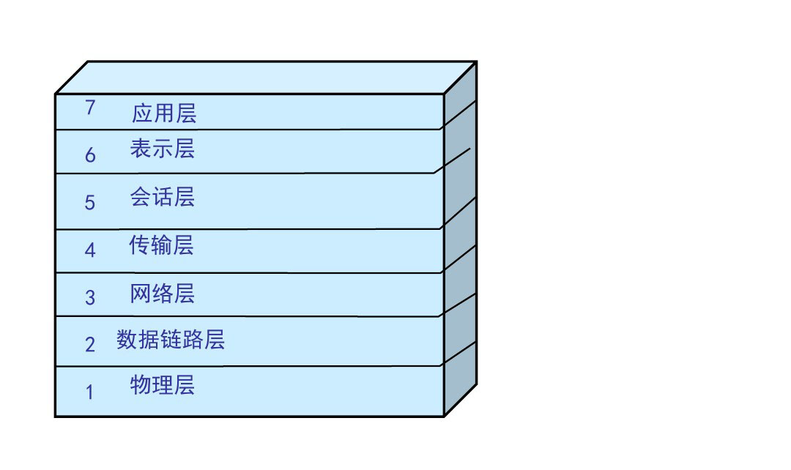
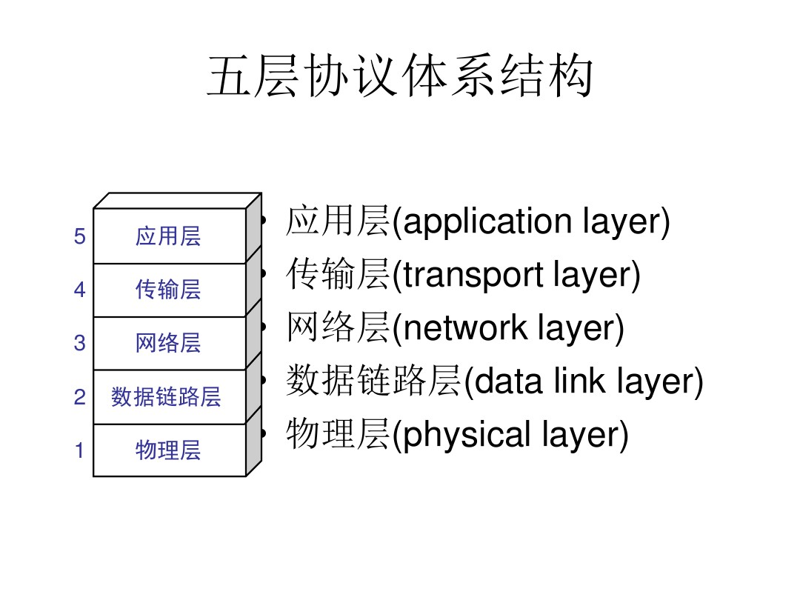
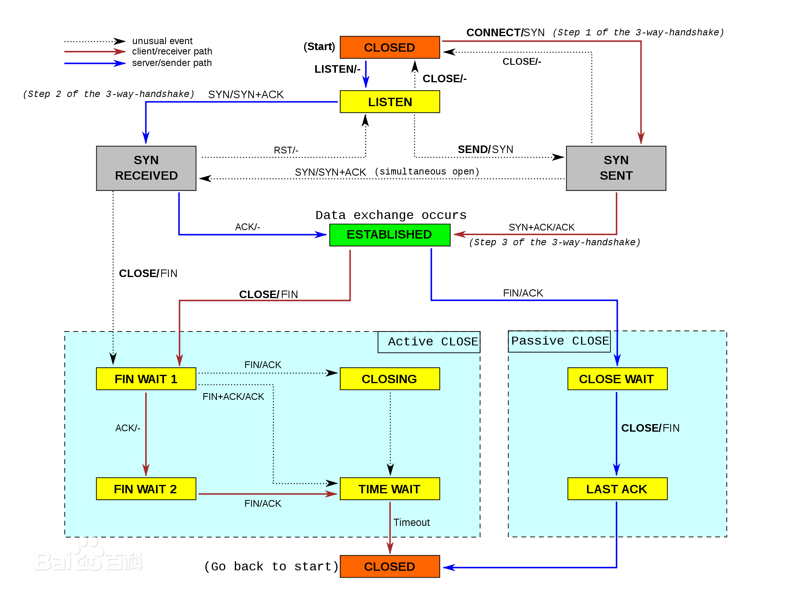

# 网络与安全

## 网络分层

网络协议体系结构的两种国际标准。
* 理论上的国际标准 OSI网络协议体系
* 事实上的国际标准 TCP/IP网络协议体系

OSI七层协议

TCP/IP四层协议

TCP/IP四层体系结构最下层的网络接口层并没有具体内容，因此往往采取折中的方法，即综合OSI和TCP/IP的优点，采用一种只有五层协议的体系结构。

**物理层协议：**

负责0、1 比特流（0/1序列）与电压的高低、逛的闪灭之间的转换。规定了激活、维持、关闭通信端点之间的机械特性、电气特性、功能特性以及过程特性；该层为上层协议提供了一个传输数据的物理媒体，只是说明标准。
在这一层，数据的单位称为比特（bit）（注：bit和字节Byte，我们常说的1字节8位2进制即：1B=8bit）。属于物理层定义的典型规范代表包括：EIA/TIA RS-232、EIA/TIA RS-449、V.35、RJ-45、fddi令牌环网。

**数据链路层协议：**

负责物理层面上的互联的、节点间的通信传输（例如一个以太网项链的2个节点之间的通信）；该层的作用包括：物理地址寻址、数据的成帧、流量控制、数据的检错、重发等。
在这一层，数据的单位称为帧（frame）。数据链路层协议的代表包括：ARP、RARP、SDLC、HDLC、PPP、STP、帧中继等。

**网络层协议：**

将数据传输到目标地址；目标地址可以使多个网络通过路由器连接而成的某一个地址，主要负责寻找地址和路由选择，网络层还可以实现拥塞控制、网际互连等功能。在这一层，数据的单位称为数据包（packet）。网络层协议的代表包括：IP、IPX、RIP、OSPF等。

**传输层协议（核心层）：**

传输层是OSI中最重要、最关键的一层,是唯一负责总体的数据传输和数据控制的一层；

传输层提供端到端的交换数据的机制，检查分组编号与次序，传输层对其上三层如会话层等，提供可靠的传输服务,对网络层提供可靠的目的地站点信息主要功能。

在这一层，数据的单位称为数据段（segment）。主要功能：

1：为端到端连接提供传输服务。

2：这种传输服务分为可靠和不可靠的,其中TCP是典型的可靠传输,而UDP则是不可靠传输。

3：为端到端连接提供流量控制,差错控制,服务质量(Quality of Service,QoS)等管理服务。

包括的协议如下：

TCP：传输控制协议，传输效率低，可靠性强。

UDP：用户数据报协议，适用于传输可靠性要求不高，数据量小的数据。

DCCP、SCTP、RTP、RSVP、PPTP等协议。

**会话层协议：**

负责建立和断开通信连接（数据流动的逻辑通路），记忆数据的分隔等数据传输相关的管理。

**表示层协议：**

将数据格式转换为标准格式。将应用处理的信息转换为适合网络传输的格式，或将来自下一层的数据转换为上层能够处理的格式；主要负责数据格式的转换，确保一个系统的应用层信息可被另一个系统应用层读取。具体来说，就是将设备固有的数据格式转换为网络标准传输格式，不同设备对同一比特流解释的结果可能会不同；因此，主要负责使它们保持一致。

**应用层协议：**

1：超文本传输协议HTTP：这是一种最基本的客户机/服务器的访问协议；浏览器向服务器发送请求，而服务器回应相应的网页。

2：文件传送协议FTP：提供交互式的访问，基于客户服务器模式，面向连接 使用TCP可靠的运输服务。主要功能:减少/消除不同操作系统下文件的不兼容性。

3：远程登录协议TELNET：客户服务器模式，能适应许多计算机和操作系统的差异，网络虚拟终端NVT的意义。

4：简单邮件传送协议SMTP：Client/Server模式，面向连接。基本功能：写信、传送、报告传送情况、显示信件、接收方处理信件。

5：DNS域名解析协议：DNS是一种用以将域名转换为IP地址的Internet服务。

6：简单文件传送协议TFTP：客户服务器模式，使用UDP数据报，只支持文件传输，不支持交互，TFTP代码占内存小。

7：简单网络管理协议（SNMP）: SNMP模型的4个组件：被管理结点、管理站、管理信息、管理协议。SNMP代理：运行SNMP管理进程的被管理结点。

8：DHCP动态主机配置协议: 发现协议中的引导文件名、空终止符、属名或者空,DHCP供应协议中的受限目录路径名 Options –可选参数字段，参考定义选择列表中的选择文件。

## TCP协议

TCP(Transmission Control Protocol 传输控制协议)是一种面向连接的、可靠的、基于字节流的传输层通信协议。

TCP协议具有的特点：
* 基于流的方式
* 面向连接的传输层协议
* 可靠通信方式
* 在网络状况不佳的时候尽量降低系统由于重传带来的带宽开销
* 通信连接维护是面向通信的两个端点的，而不考虑中间网段和节点

### TCP报文头部

对于 TCP 头部来说，以下几个字段是很重要的

* Sequence number，这个序号保证了 TCP 传输的报文都是有序的，对端可以通过序号顺序的拼接报文
* Acknowledgement Number，这个序号表示数据接收端期望接收的下一个字节的编号是多少，同时也表示上一个序号的数据已经收到
* Window Size，窗口大小，表示还能接收多少字节的数据，用于流量控制
* 标识符
  * URG=1：该字段为一表示本数据报的数据部分包含紧急信息，是一个高优先级数据报文，此时紧急指针有效。紧急数据一定位于当前数据包数据部分的最前面，紧急指针标明了紧急数据的尾部。
  * ACK=1：该字段为一表示确认号字段有效。此外，TCP 还规定在连接建立后传送的所有报文段都必须把 ACK 置为一。
  * PSH=1：该字段为一表示接收端应该立即将数据 push 给应用层，而不是等到缓冲区满后再提交。
  * RST=1：该字段为一表示当前 TCP 连接出现严重问题，可能需要重新建立 TCP 连接，也可以用于拒绝非法的报文段和拒绝连接请求。
  * SYN=1：当SYN=1，ACK=0时，表示当前报文段是一个连接请求报文。当SYN=1，ACK=1时，表示当前报文段是一个同意建立连接的应答报文。
  * FIN=1：该字段为一表示此报文段是一个释放连接的请求报文。

### TCP状态机

HTTP 是无连接的，所以作为下层的 TCP 协议也是无连接的，虽然看似 TCP 将两端连接了起来，但是其实只是两端共同维护了一个状态。

### TCP的工作方式

如下图TCP的通信过程所示：

#### 建立连接（三次握手）

建立一个TCP连接时需要三次握手，指的是客户端和服务端总共发送3个包以确认连接的建立。

1. 第一次握手 客户端发送SYN（seq=x）报文给服务器端,进入SYN_SENT状态，等待服务器确认

2. 第二次握手 服务器端收到SYN报文，回应一个SYN （seq=y）ACK（ACK=x+1）报文，进入SYN_RCVD状态。

3. 第三次握手 客户端收到服务器端的SYN报文，回应一个ACK（ACK=y+1）报文，进入ESTABLISHED状态。

#### 连接终止（四次挥手）

建立一个连接需要三次握手，而终止一个连接要经过四次握手，这是由TCP的半关闭（half-close）造成的

四次挥手（Four-Way Wavehand）指断开一个TCP连接时，需要客户端和服务端总共发送4个包以确认连接的断开。

1. 第一次挥手 客户端发送一个 FIN ，用来关闭客户端到服务端的数据传送，客户端进入 FIN_WAIT_1 状态。

2. 第二次挥手 服务端收到 FIN 后，发送一个 ACK 给客户端，确认序号为收到序号+1，服务端进入 CLOSE_WAIT 状态。

3. 第三次挥手 服务端发送一个 FIN ，用来关闭服务端到客户端的数据传送，服务端进入 LAST_ACK 状态。

4. 第四次挥手 客户端收到 FIN 后，客户端进入 TIME_WAIT 状态，接着发送一个 ACK 给服务端，确认序号为收到序号+1，服务端进入 CLOSED 状态，完成四次挥手。

### ARQ协议

ARQ协议也就是超时重传机制。通过确认和超时机制保证了数据的正确送达，ARQ协议包含停止等待ARQ和连续ARQ

#### 停止等待ARQ

**正常传输过程**

只要A向B发送一段报文，都要停止发送并启动一个定时器，等待对端响应，在定时器时间内接受到对端应答就取消定时器发送下一段报文

**报文丢失或出错**

在报文的传输过程中可能会出现丢包的情况。这时候超过定时器设定的时间就会再次发送丢包的数据直到对端响应，所以需要每次都备份发送的数据。

即使报文正常的传输到对端，也可能出现在传输过程中报文报错的问题。这时候对端会抛弃该报文并等待重传。

PS：一般定时器设定的时间都会大于一个 RTT 的平均时间。RTT 表示发送端发送数据到接收到对端数据所需的往返时间。

**ACK 超时或丢失**

对端传输的应答也可能出现丢失或超时的情况。那么超过定时器时间 A 端照样会重传报文。这时候 B 端收到相同序号的报文会丢弃该报文并重传应答，直到 A 端发送下一个序号的报文。

在超时的情况下也可能出现应答很迟到达，这时 A 端会判断该序号是否已经接收过，如果接收过只需要丢弃应答即可。

这个协议的缺点就是传输效率低，在良好的网络环境下每次发送报文都得等待对端的 ACK 。

#### 连续ARQ

在连续 ARQ 中，发送端拥有一个发送窗口，可以在没有收到应答的情况下持续发送窗口内的数据，这样相比停止等待 ARQ 协议来说减少了等待时间，提高了效率。

**累计确认**

连续 ARQ 中，接收端会持续不断收到报文。如果和停止等待 ARQ 中接收一个报文就发送一个应答一样，就太浪费资源了。通过累计确认，可以在收到多个报文以后统一回复一个应答报文。报文中的 ACK 可以用来告诉发送端这个序号之前的数据已经全部接收到了，下次请发送这个序号 + 1的数据。

但是累计确认也有一个弊端。在连续接收报文时，可能会遇到接收到序号 5 的报文后，并未接到序号 6 的报文，然而序号 7 以后的报文已经接收。遇到这种情况时，ACK 只能回复 6，这样会造成发送端重复发送数据，这种情况下可以通过 Sack 来解决，这个会在下文说到

### 滑动窗口

在上面小节中讲到了发送窗口。在 TCP 中，两端都维护着窗口：分别为发送端窗口和接收端窗口。

发送端窗口包含已发送但未收到应答的数据和可以发送但是未发送的数据。

发送端窗口是由接收窗口剩余大小决定的。接收方会把当前接收窗口的剩余大小写入应答报文，发送端收到应答后根据该值和当前网络拥塞情况设置发送窗口的大小，所以发送窗口的大小是不断变化的。

当发送端接收到应答报文后，会随之将窗口进行滑动

滑动窗口实现了流量控制。接收方通过报文告知发送方还可以发送多少数据，从而保证接收方能够来得及接收数据

#### Zero窗口

在发送报文的过程中，可能会遇到对端出现零窗口的情况。在该情况下，发送端会停止发送数据，并启动 persistent timer 。该定时器会定时发送请求给对端，让对端告知窗口大小。在重试次数超过一定次数后，可能会中断 TCP 链接

### 拥塞处理

拥塞处理和流量控制不同，后者是作用于接收方，保证接收方来得及接受数据。而前者是作用于网络，防止过多的数据拥塞网络，避免出现网络负载过大的情况。

拥塞处理包括了四个算法，分别为：慢开始，拥塞避免，快速重传，快速恢复。

#### 慢开始算法

慢开始算法，顾名思义就是在传输开始时将发送窗口慢慢指数级扩大，从而避免一开始就传输大量数据导致网络拥塞。

慢开始算法步骤具体如下：

1. 连接初始设置拥塞窗口（Congestion Window）为1 MSS一个分段的最大数据量）
2. 每过一个RTT就将窗口大小乘二
3. 指数级增长肯定不能没有限制的，所以有一个阀值限制，当窗口大小大于阀值时就会启动拥塞避免算法

#### 拥塞避免算法

拥塞避免算法相比简单点，每过一个RTT窗口大小只加一，这样能够避免指数级增长导致网络拥塞，慢慢将大小调整到最佳值。

在传输过程中可能定时间超时的情况，这时候TCP会认为网络拥塞了，会马上进行以下步骤：

1. 将阀值设为当前拥塞窗口的一半
2. 将拥塞窗口设为1 MSS
3. 启动拥塞避免算法

#### 快速重传

快速重传一般和快恢复一起出现。一旦接收端收到的报文出现失序的情况，接收端只会回复最后一个顺序正确的报文序号。如果收到三个重复的ACK，无需等待定时器超时再重发而是启动快速重传。具体算法分为两种：

TCP Taho 实现如下

* 将阀值设为当前拥塞窗口的一半
* 将拥塞窗口设为1 MSS
* 重新开始慢开始算法

TCP Reno 实现如下

* 拥塞窗口减半
* 将阀值设为当前拥塞窗口
* 进入快恢复阶段（重发对端需要的包，一旦收到一个新的 ACK 答复就退出该阶段）
* 使用拥塞避免算法

TCP New Ren 改进后的快恢复

TCP New Reno 算法改进了之前 TCP Reno 算法的缺陷。在之前，快恢复中只要收到一个新的 ACK 包，就会退出快恢复。

在 TCP New Reno 中，TCP 发送方先记下三个重复 ACK 的分段的最大序号。

假如我有一个分段数据是 1 ~ 10 这十个序号的报文，其中丢失了序号为 3 和 7 的报文，那么该分段的最大序号就是 10。发送端只会收到 ACK 序号为 3 的应答。这时候重发序号为 3 的报文，接收方顺利接收并会发送 ACK 序号为 7 的应答。这时候 TCP 知道对端是有多个包未收到，会继续发送序号为 7 的报文，接收方顺利接收并会发送 ACK 序号为 11 的应答，这时发送端认为这个分段接收端已经顺利接收，接下来会退出快恢复阶段。

## UDP协议

UDP 是User Datagram Protocol的简称， 中文名是用户数据报协议，是OSI（Open System Interconnection，开放式系统互联） 参考模型中一种无连接的传输层协议，提供面向事务的简单不可靠信息传送服务，IETF RFC 768是UDP的正式规范。UDP在IP报文的协议号是17。

### 特性

1. UDP是面向报文的

UDP 是一个面向报文（报文可以理解为一段段的数据）的协议。意思就是 UDP 只是报文的搬运工，不会对报文进行任何拆分和拼接操作

具体来说：
* 在发送端，应用层将数据传递给传输层的 UDP 协议，UDP 只会给数据增加一个 UDP 头标识下是 UDP 协议，然后就传递给网络层了
* 在接收端，网络层将数据传递给传输层，UDP 只去除 IP 报文头就传递给应用层，不会任何拼接操作

2. 不可靠性

* UDP 是无连接的，也就是说通信不需要建立和断开连接。
* 协议收到什么数据就传递什么数据，并且也不会备份数据，对方能不能收到是不关心的
* UDP 没有拥塞控制，一直会以恒定的速度发送数据。即使网络条件不好，也不会对发送速率进行调整。这样实现的弊端就是在网络条件不好的情况下可能会导丢包，但是优点也很明显，在某些实时性要求高的场景（比如电话会议）就需要使用 UDP 而不是 TCP。

3. 高效性

因为 UDP 没有 TCP 那么复杂，需要保证数据不丢失且有序到达。所以 UDP 的头部开销小，只有八字节，相比 TCP 的至少二十字节要少得多，在传输数据报文时是很高效的。

头部包含了以下几个数据

* 两个十六位的端口号，分别为源端口（可选字段）和目标端口
* 整个数据报文的长度
* 整个数据报文的检验和（IPv4 可选 字段），该字段用于发现头部信息和数据中的错误

4. 一对多传输

UDP 不止支持一对一的传输方式，同样支持一对多，多对多，多对一的方式，也就是说 UDP 提供了单播，多播，广播的功能。

### TCP协议和UDP协议的区别

1、TCP面向连接（如打电话要先拨号建立连接）;UDP是无连接的，即发送数据之前不需要建立连接

2、TCP提供可靠的服务。也就是说，通过TCP连接传送的数据，无差错，不丢失，不重复，且按序到达;UDP尽最大努力交付，即不保证可靠交付

3、TCP面向字节流，实际上是TCP把数据看成一连串无结构的字节流;UDP是面向报文的 UDP没有拥塞控制，因此网络出现拥塞不会使源主机的发送速率降低（对实时应用很有用，如IP电话，实时视频会议等）

4、每一条TCP连接只能是点到点的;UDP支持一对一，一对多，多对一和多对多的交互通信

5、TCP首部开销20字节;UDP的首部开销小，只有8个字节

6、TCP的逻辑通信信道是全双工的可靠信道，UDP则是不可靠信道

## HTTP

HTTP 协议是 Hyper Text Transfer Protocol (超文本传输协议)的缩写，是用于从万维网服务器传输超文本到本来浏览器的传送协议。基于TCP/IP通信协议来传递数据。它是一个**无状态的请求/响应协议**

HTTP 使用统一资源标识符（Uniform Resource Identifiers, URI） 来传输数据和建立连接。URL是一种特殊类型的URI。

### Request

客户端发送一个HTTP请求到服务器的请求消息包括以下格式：请求行（request line）、请求头部（header）、空行和请求数据四个部分组成，下图给出了请求报文的一般格式。

1. 第一部分： 请求行，用来说明请求类型，要访问的资源以及使用的HTTP的版本

2. 第二部分：请求头部，紧接着请求行（即第一行）之后的部分，用来说明服务器要使用的附加信息

3. 第三部分：空行，请求头部后面的空行是必须的

4. 第四部分：请求数据也叫主体，可以添加任意的其他数据。

### Response

HTTP响应也由四个部分组成，分别是：状态行、消息报头、空行和响应正文。

1. 第一部分： 状态行，由HTTP协议版本号，状态码，状态消息 三部分组成

2. 第二部分：消息报头，用来说明客户端要使用的一些附加信息

3. 第三部分：空行，消息报头后面的空行是必须的

4. 第四部分：响应正文，服务器返回客户端的文本信息

### 请求方式

HTTP1.0定义了三种请求方法： GET, POST 和 HEAD方法。

HTTP1.1新增了五种请求方法：OPTIONS, PUT, DELETE, TRACE 和 CONNECT 方法。

1. GET      请求指定的页面信息，并返回实体主体。
2. HEAD     类似于get请求，只不过返回的响应中没有具体的内容，用于获取报头
3. POST     向指定资源提交数据进行处理请求（例如提交表单或者上传文件）。数据被包含在请求体中。POST请求可能会导致      新的资源的建立和/或已有资源的修改。
4. PUT      从客户端向服务器传送的数据取代指定的文档的内容。
5. DELETE   请求服务器删除指定的页面。
6. CONNECT  HTTP/1.1协议中预留给能够将连接改为管道方式的代理服务器。
7. OPTIONS  允许客户端查看服务器的性能。
8. TRACE    回显服务器收到的请求，主要用于测试或诊断。

### POST 和 GET 的区别

先引入副作用和幂等的概念。

副作用指对服务器上的资源做改变，搜索是无副作用的，注册是副作用的。

幂等指发送 M 和 N 次请求（两者不相同且都大于 1），服务器上资源的状态一致，比如注册 10 个和 11 个帐号是不幂等的，对文章进行更改 10 次和 11 次是幂等的。

在规范的应用场景上说，Get 多用于无副作用，幂等的场景，例如搜索关键字。Post 多用于副作用，不幂等的场景，例如注册。

1. 从缓存的角度，GET 请求会被浏览器主动缓存下来，留下历史记录，而 POST 默认不会。
2. 从编码的角度，GET 只能进行 URL 编码，只能接收 ASCII 字符，而 POST 没有限制。
3. 从参数的角度，GET 一般放在 URL 中，因此不安全，POST 放在请求体中，更适合传输敏感信息。
4. 从幂等性的角度，GET是幂等的，而POST不是。(幂等表示执行相同的操作，结果也是相同的)
5. 从TCP的角度，GET 请求会把请求报文一次性发出去，而 POST 会分为两个 TCP 数据包，首先发 header 部分，如果服务器响应 100(continue)， 然后发 body 部分。(火狐浏览器除外，它的 POST 请求只发一个 TCP 包)

### 状态码

状态代码有三位数字组成，第一个数字定义了响应的类别，共分五种类别：

1xx: 指示信息 -- 表示请求已接收，继续处理

2xx: 成功 -- 表示请求已被成功接收、理解、接受

3xx: 重定向 -- 表示要完成请求必须进行更进一步的操作

4xx: 客户端错误 —- 表示请求有语法错误或请求无法实现

5xx: 服务器端错误 -- 表示服务器未能实现合法的请求

常见状态码：

2xx:

* 200 OK 表示从客户端发来的请求在服务器端被正确处理
* 204 No content 表示请求成功，但响应报文不含实体的主体部分
* 205 Reset Content 表示请求成功，但响应报文不含实体的主体部分，但是与204响应不同在于要求请求方重置内容
* 206 Partial Content 进行范围请求

3xx

* 301 Moved Permanently,永久性重定向，表示资源已被分配了新的URL
* 302 Found 临时性重定向，表示资源临时被分配了新的URL
* 303 See Other 表示资源存在着另一个URL，应使用GET方法获取资源
* 304 Not Modified 表示服务器允许访问资源，但因发生请求未满足条件的情况
* 307 Temporary Redirect 临时重定向 和302含义类似，但是期望客户端保持请求方法不变向新的地址发出请求

4xx 

* 400 Bad Request 请求报文存在语法错误
* 401 Unauthorized 表示发送的请求需要通过HTTP认证的认证信息
* 403 Forbidden 表示对请求资源的访问被服务器拒绝
* 404 Not Found 表示在服务器上没有找到请求的资源

5xx

* 500 Internal Server Error 表示服务器端在执行请求时发生了错误
* 501 Not Implemented 表示服务器不支持当前请求所需要的某个功能
* 502 Bad Gateway 服务器自身是正常的，但访问的时候出错了，啥错误咱也不知道。
* 503 Service Unavailable 表示服务器暂时处于超负载或正在停机维护，无法处理请求

### 首部字段

HTTP首部字段根据实际用途被分为以下4中类型

* 通用首部字段（General Header Fields） 请求报文和响应报文都会使用的首部
* 请求首部字段 (Request Header Fields) 客服端向服务器端发送请求报文时使用的首部
* 响应首部字段 (Response Header Fields) 服务器端向客户端返回响应报文时使用的首部。
* 实体首部字段 (Entity Header Fields) 针对请求报文和响应报文的实体部分使用的首部

#### 通用首部字段

首部字段名 |  说明 
:- | :- 
Cache-Control | 用来指定当前的请求/回复中的，是否使用缓存机制。
Connection | 客户端想要优先使用的连接类型 
Date | 发送该消息的日期和时间（以RFC 7231中定义的"HTTP日期"格式来发送）
Pragma | 报文指令
Trailer | 报文末端的首部一览
Transfer-Encoding | 指定报文主体的传输编码方式
Upgrade |  升级为其他协议
Via | 代理服务器的相关信息
Warning | 错误通知

#### 请求首部字段

首部字段名 |  说明 
:- | :- 
Accept	|用户代理可以处理的媒体类型
Accept-Charset	|优先的字符集
Accept-Encoding	|优先的内容编码
Authorization	|Web认证信息
Except|	期待服务器的特定行为
Host	|请求资源所在的服务器
if-Match	|比较实体标记（ETag）
if-Modified-Since	|比较资源的更新时间
Range	|实体的字节范围请求
Refer	|实体的字节范围请求
TE	|传输编码的优先级
User-Agent|	HTTP客户端程序的信息

#### 响应首部字段

响应头 | 说明
-- | -- 
Accept-Ranges	| 是否接受字节范围请求
Age	| 推算资源创建经过的时间
ETag |	资源的匹配信息
Location	| 令客户端重定向至指定UPI
Proxy-Authenticate | 	代理服务器对客户端的认证信息
WWW-Authenticate |	服务器对客户端的认证信息
Server |	HTTP服务器的安装信息
Vary |	代理服务器的管理信息

####  实体首部字段

响应头 | 说明 
-- | -- 
Allow	| 资源可支持的HTTP方法
Content-Encoding |	实体主体适用的编码方式
Content-Language |	实体主体的自然语言
Content-Length |	实体主体的大小
Content-Location |	替代对应资源的URI
Content-MD5	| 实体主体的报文摘要
Content-Range |	实体主体的位置范围
Content-Type	| 实体主体的媒体类型
EXpires	| 实体主体过期的日期时间
Last-Modified	| 资源的最后修改日期时间

### 缺点

HTTP缺点

* 通信使用明文，可能被窃听
* 不验证通信方的身份，可能遭遇伪装
* 无法证明报文的完整性，有可能遭遇篡改

## HTTPS

HTTPS （全称：Hyper Text Transfer Protocol over SecureSocket Layer），是以安全为目标的 HTTP 通道，在HTTP的基础上通过传输加密和身份认证保证了传输过程的安全性。HTTPS 在HTTP 的基础下加入SSL 层，HTTPS 的安全基础是 SSL，因此加密的详细内容就需要 SSL。

HTTP +  加密 + 认证 +  完整性保护 = HTTPS

### SSL/TLS 

SSL 即安全套接层（Secure Sockets Layer），在 OSI 七层模型中处于会话层(第 5 层)。之前 SSL 出过三个大版本，当它发展到第三个大版本的时候才被标准化，成为 TLS（传输层安全，Transport Layer Security），并被当做 TLS1.0 的版本，准确地说，TLS1.0 = SSL3.1。当前大多浏览器使用的是TSL1.2版本

在对SSL进行理解之前，我们先来了解一下加密方法。SSL采用一种叫做**公开密钥加密（Public-key cryptography）**的加密处理方式

#### 共享密钥加密（对称加密)

加密和解密同用一个密钥的方式称为共享密钥加密（Common key crypto system）也被叫做对称密钥加密

以共享密钥方式加密时必须将密钥也发给对方。这就存在一个问题，如何安全的转交密钥呢。如果被监听那么加密也就失效了。

#### 公开密钥加密（非对称加密）

公开密钥加密方式很好的解决了共享密钥的困境

公开密钥加密使用一对非对称的密钥。一把叫做私有密钥（private key） 另一把叫做公开密钥（public key）.顾名思义，私有密钥是别人不知道的，而公有密钥则是可以发送任何人都可以知道的。

使用公开密钥加密方式。发送密文的一方使用**对方的公钥**进行加密，对方收到加密信息之后，使用自己的私钥进行解密。这种方式不需要发送私钥给给人，那就避免了解密的可能。而且根据加密的信息和公约反向破加密文是相当难的，现阶段是不可能实现的。

#### 混合加密机制

混合加密机制是指共享密钥加密和公开密钥加密两者并用。

HTTPS 就是采用的这种方式。你可能会有疑问 公开密钥加密 不是可以做到信息不会被获取了吗 为什么不被采用。其实理论上是可以的，但是现实很骨感。因为公开密钥加密需要的计算量非常大，对于稍微大一点的数据即使用最快的处理器也非常耗时，速度慢。所以要充分发挥两者的优势。

具体的操作就是 使用公开密钥加密（非对称加密）交换密钥，之后的建立通信交换报文阶段则使用共享密钥加密（对称加密)。

#### 证书

其实公开密钥加密（非对称加密）并不是完美的，那就是无法证明公开密钥本身就是真的密钥。（真假美猴王知道吗，都说自己是真的）为了解决这个问题可以使用数字证书机构（CA）和其相关机关颁发的公开密钥证书。

数字证书认证机构处于客户端和服务器双方都可以信赖的第三方机构的立场上。

### SSL握手阶段

"握手阶段"涉及四次通信

1. step1 客户端发出请求 ClientHello

首先，客户端（通常是浏览器）先向服务器发出加密通信的请求，这被叫做ClientHello请求。会携带上一下信息：
* 支持的协议版本
* 一个客户端生成的随机数，用于之后生成"对话密钥"
* 支持的加密方法，比如RSA公钥加密
* 支持的压缩方法

2. step2 服务器回应 ServerHello

服务器收到客户端请求后，向客户端发出回应，这叫做SeverHello。服务器的回应包含以下内容:
* 确认使用到的加密通信协议版本，如果浏览器和服务器支持的版本不一致，服务器关闭加密通信
* 一个服务器生成的随机数，用于之后生成的"对话密钥"
* 确认使用的加密方法，比如RSA公钥加密
* 服务器证书

3. step3 客户端回应

客户端收到服务器回应以后，首先验证服务器证书。如果证书不是可信机构颁布、或者证书中的域名与实际域名不一致、或者证书已经过期，就会向访问者显示一个警告，由其选择是否还要继续通信。

如果证书没有问题，客户端就会从证书中取出服务器的公钥。然后，向服务器发送下面三项信息：
* 一个随机数。该随机数用服务器公钥加密，防止被窃听。
* 编码改变通知，表示随后的信息都将用双方商定的加密方法和密钥发送。
* 客户端握手结束通知，表示客户端的握手阶段已经结束。这一项同时也是前面发送的所有内容的hash值，用来供服务器校验。

到这一步客户端和服务器就同时有了三个随机数，接着双方就用事先商定的加密方法，各自生成本次会话所用的同一把"会话密钥"。

至于为什么一定要用三个随机数，来生成"会话密钥:

"不管是客户端还是服务器，都需要随机数，这样生成的密钥才不会每次都一样。由于SSL协议中证书是静态的，因此十分有必要引入一种随机因素来保证协商出来的密钥的随机性。

对于RSA密钥交换算法来说，pre-master-key本身就是一个随机数，再加上hello消息中的随机，三个随机数通过一个密钥导出器最终导出一个对称密钥。

pre master的存在在于SSL协议不信任每个主机都能产生完全随机的随机数，如果随机数不随机，那么pre master secret就有可能被猜出来，那么仅适用pre master secret作为密钥就不合适了，因此必须引入新的随机因素，那么客户端和服务器加上pre master secret三个随机数一同生成的密钥就不容易被猜出了，一个伪随机可能完全不随机，可是是三个伪随机就十分接近随机了，每增加一个自由度，随机性增加的可不是一。"

4. 服务器的最后回应

服务器收到客户端的第三个随机数pre-master key之后，计算生成本次会话所用的"会话密钥"。然后，向客户端最后发送下面信息
* 编码改变通知，表示随后的信息都将用双方商定的加密方法和密钥发送。
* 服务器握手结束通知，表示服务器的握手阶段已经结束。这一项同时也是前面发送的所有内容的hash值，用来供客户端校验。

### HTTPS缺点

1. 增加延时

分析前面的握手过程，一次完整的握手至少需要两端依次来回两次通信，至少增加延时2* RTT，利用会话缓存从而复用连接，延时也至少1* RTT

2. 消耗较多的CPU资源

HTTPS通信主要包括对对称加解密、非对称加解密(服务器主要采用私钥解密数据) 这都是耗cpu性能的

3. 费用相对比较贵

相对比http需要购买证书

## HTTP 2.0

HTTP 2.0 相对比于 HTTP 1.x 可以说是大幅度提高了web性能。

HTTP 1.x 存在一个队头阻塞的问题。指的是浏览器限制了同一个域名下的请求数量，当队列中第一个请求数据量大消耗时间久时，会阻塞队列中之后的请求

### 二进制传输

在HTTP2.0版本之前，是通过文本的方式传输数据。在2.0版本中引入了新的编码机制，所有传输的数据都会被分割，并采用二进制格式编码。这是2.0版本加强性能的核心点

在二进制传输中， HTTP/2 会将所有传输的信息分割为更小的消息和帧（frame）,并对它们采用二进制格式的编码 ，其中 HTTP1.x 的首部信息会被封装到 HEADER frame，而相应的 Request Body 则封装到 DATA frame 里面。

### 多路复用

在HTTP2.0中，有两个非常重要的概念，分别是帧（frame） 和流（stream）。

帧代表着最小的数据单位，每个帧会标识出该帧属于哪个流，流也就是多个帧组成的数据流。

多路复用，就是在一个TCP链接中可以存在多条流。换句话说，也就是可以发送多个请求，对端可以通过帧中的标识知道属于哪个请求。通过这个技术，可以避免HTTP旧版中的队头阻塞问题，极大的提高传输性能。

### Header压缩

在HTTP1.x中，使用文本的形式传输header，在header携带cookie的情况下，可能每次都需要重复传输几百到几千的字节。

在HTTP2.0中，使用了HPACK压缩格式对传输的header进行编码，减少了header的大小。并在两端维护了索引表，用于记录出现过的header，后面再传输过程中就可以传输已经记录过的header的键名，对端收到数据后就可以通过键名找到对应的值。

### 服务端Push

在HTTP2.0 中，服务端可以在客户端某个请求后，主动推送其他资源。

可以想象以下情况，某些资源客户端是一定会请求的，这时就可以采取服务端 push 的技术，提前给客户端推送必要的资源，这样就可以相对减少一点延迟时间。当然在浏览器兼容的情况下你也可以使用 prefetch

## DNS

DNS 的作用就是通过域名查询到具体的 IP。

因为 IP 存在数字和英文的组合（IPv6），很不利于人类记忆，所以就出现了域名。你可以把域名看成是某个 IP 的别名，DNS 就是去查询这个别名的真正名称是什么。

因为 IP 存在数字和英文的组合（IPv6），很不利于人类记忆，所以就出现了域名。你可以把域名看成是某个 IP 的别名，DNS 就是去查询这个别名的真正名称是什么。

在 TCP 握手之前就已经进行了 DNS 查询，这个查询是操作系统自己做的。当你在浏览器中想访问 www.google.com 时，会进行一下操作：

1. 操作系统会首先在本地缓存中查询
2. 没有的话会去系统配置的 DNS 服务器中查询
3. 如果这时候还没得话，会直接去 DNS 根服务器查询，这一步查询会找出负责 com 这个一级域名的服务器
4. 然后去该服务器查询 google 这个二级域名
5. 接下来三级域名的查询其实是我们配置的，你可以给 www 这个域名配置一个 IP，然后还可以给别的三级域名配置一个 IP

以上介绍的是 DNS 迭代查询，还有种是递归查询，区别就是前者是由客户端去做请求，后者是由系统配置的 DNS 服务器做请求，得到结果后将数据返回给客户端。

PS：DNS 是基于 UDP 做的查询。

## 经典面试题之地址栏输入URL访问

## 浏览器安全

### XSS

### CSRF

