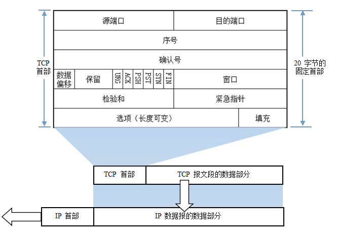

# 网络与安全

## 网络分层

网络协议体系结构的两种国际标准。
* 理论上的国际标准 OSI网络协议体系
* 事实上的国际标准 TCP/IP网络协议体系

OSI七层协议

TCP/IP四层协议

TCP/IP四层体系结构最下层的网络接口层并没有具体内容，因此往往采取折中的方法，即综合OSI和TCP/IP的优点，采用一种只有五层协议的体系结构。

**物理层协议：**

负责0、1 比特流（0/1序列）与电压的高低、逛的闪灭之间的转换。规定了激活、维持、关闭通信端点之间的机械特性、电气特性、功能特性以及过程特性；该层为上层协议提供了一个传输数据的物理媒体，只是说明标准。
在这一层，数据的单位称为比特（bit）（注：bit和字节Byte，我们常说的1字节8位2进制即：1B=8bit）。属于物理层定义的典型规范代表包括：EIA/TIA RS-232、EIA/TIA RS-449、V.35、RJ-45、fddi令牌环网。

**数据链路层协议：**

负责物理层面上的互联的、节点间的通信传输（例如一个以太网项链的2个节点之间的通信）；该层的作用包括：物理地址寻址、数据的成帧、流量控制、数据的检错、重发等。
在这一层，数据的单位称为帧（frame）。数据链路层协议的代表包括：ARP、RARP、SDLC、HDLC、PPP、STP、帧中继等。

**网络层协议：**

将数据传输到目标地址；目标地址可以使多个网络通过路由器连接而成的某一个地址，主要负责寻找地址和路由选择，网络层还可以实现拥塞控制、网际互连等功能。在这一层，数据的单位称为数据包（packet）。网络层协议的代表包括：IP、IPX、RIP、OSPF等。

**传输层协议（核心层）：**

传输层是OSI中最重要、最关键的一层,是唯一负责总体的数据传输和数据控制的一层；

传输层提供端到端的交换数据的机制，检查分组编号与次序，传输层对其上三层如会话层等，提供可靠的传输服务,对网络层提供可靠的目的地站点信息主要功能。

在这一层，数据的单位称为数据段（segment）。主要功能：

1：为端到端连接提供传输服务。

2：这种传输服务分为可靠和不可靠的,其中TCP是典型的可靠传输,而UDP则是不可靠传输。

3：为端到端连接提供流量控制,差错控制,服务质量(Quality of Service,QoS)等管理服务。

包括的协议如下：

TCP：传输控制协议，传输效率低，可靠性强。

UDP：用户数据报协议，适用于传输可靠性要求不高，数据量小的数据。

DCCP、SCTP、RTP、RSVP、PPTP等协议。

**会话层协议：**

负责建立和断开通信连接（数据流动的逻辑通路），记忆数据的分隔等数据传输相关的管理。

**表示层协议：**

将数据格式转换为标准格式。将应用处理的信息转换为适合网络传输的格式，或将来自下一层的数据转换为上层能够处理的格式；主要负责数据格式的转换，确保一个系统的应用层信息可被另一个系统应用层读取。具体来说，就是将设备固有的数据格式转换为网络标准传输格式，不同设备对同一比特流解释的结果可能会不同；因此，主要负责使它们保持一致。

**应用层协议：**

1：超文本传输协议HTTP：这是一种最基本的客户机/服务器的访问协议；浏览器向服务器发送请求，而服务器回应相应的网页。

2：文件传送协议FTP：提供交互式的访问，基于客户服务器模式，面向连接 使用TCP可靠的运输服务。主要功能:减少/消除不同操作系统下文件的不兼容性。

3：远程登录协议TELNET：客户服务器模式，能适应许多计算机和操作系统的差异，网络虚拟终端NVT的意义。

4：简单邮件传送协议SMTP：Client/Server模式，面向连接。基本功能：写信、传送、报告传送情况、显示信件、接收方处理信件。

5：DNS域名解析协议：DNS是一种用以将域名转换为IP地址的Internet服务。

6：简单文件传送协议TFTP：客户服务器模式，使用UDP数据报，只支持文件传输，不支持交互，TFTP代码占内存小。

7：简单网络管理协议（SNMP）: SNMP模型的4个组件：被管理结点、管理站、管理信息、管理协议。SNMP代理：运行SNMP管理进程的被管理结点。

8：DHCP动态主机配置协议: 发现协议中的引导文件名、空终止符、属名或者空,DHCP供应协议中的受限目录路径名 Options –可选参数字段，参考定义选择列表中的选择文件。

## TCP协议

TCP(Transmission Control Protocol 传输控制协议)是一种面向连接的、可靠的、基于字节流的传输层通信协议。

TCP协议具有的特点：
* 基于流的方式
* 面向连接的传输层协议
* 可靠通信方式
* 在网络状况不佳的时候尽量降低系统由于重传带来的带宽开销
* 通信连接维护是面向通信的两个端点的，而不考虑中间网段和节点

### TCP报文格式 

### TCP的工作方式

如下图TCP的通信过程所示：

seq:Sequence Number是发送数据包中的第一个字节的序列号，32位；

ACK表示Acknowledgment Number, Acknowledgment Number是确认序列号，32位。

FIN表示没有数据需要发送了

#### 建立连接（三次握手）

建立一个TCP连接时需要三次握手，指的是客户端和服务端总共发送3个包以确认连接的建立。

1. 第一次握手 客户端发送SYN（seq=x）报文给服务器端,进入SYN_SENT状态，等待服务器确认

2. 第二次握手 服务器端收到SYN报文，回应一个SYN （seq=y）ACK（ACK=x+1）报文，进入SYN_RCVD状态。

3. 第三次握手 客户端收到服务器端的SYN报文，回应一个ACK（ACK=y+1）报文，进入ESTABLISHED状态。

#### 连接终止（四次挥手）

建立一个连接需要三次握手，而终止一个连接要经过四次握手，这是由TCP的半关闭（half-close）造成的

四次挥手（Four-Way Wavehand）指断开一个TCP连接时，需要客户端和服务端总共发送4个包以确认连接的断开。

1. 第一次挥手 客户端发送一个 FIN ，用来关闭客户端到服务端的数据传送，客户端进入 FIN_WAIT_1 状态。

2. 第二次挥手 服务端收到 FIN 后，发送一个 ACK 给客户端，确认序号为收到序号+1，服务端进入 CLOSE_WAIT 状态。

3. 第三次挥手 服务端发送一个 FIN ，用来关闭服务端到客户端的数据传送，服务端进入 LAST_ACK 状态。

4. 第四次挥手 客户端收到 FIN 后，客户端进入 TIME_WAIT 状态，接着发送一个 ACK 给服务端，确认序号为收到序号+1，服务端进入 CLOSED 状态，完成四次挥手。

