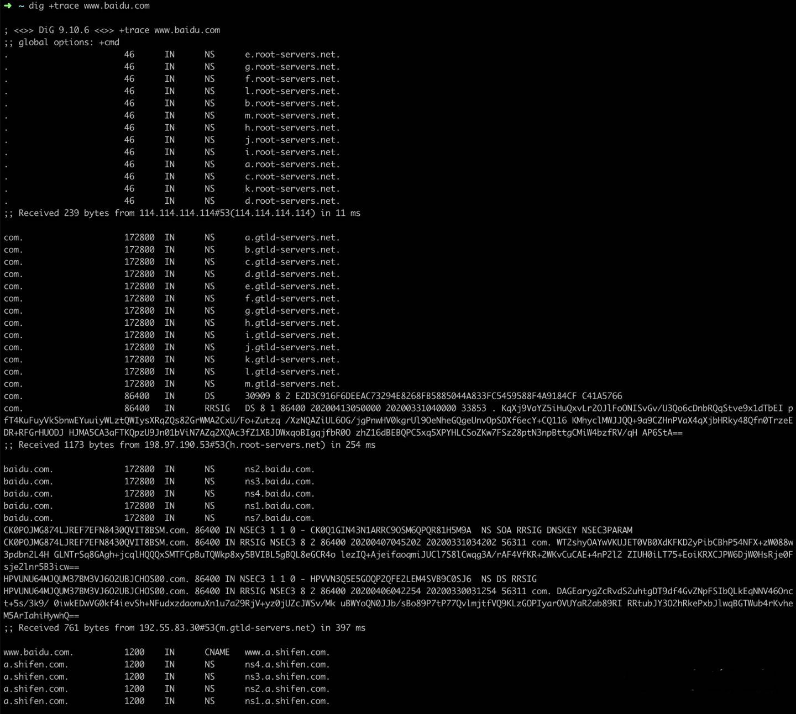

# 性能

## 前言

网页的优化，根据在浏览器输入一个地址访问网页的原理，对整条链路进行拆分。可以初步拆分为：
1. 网络请求优化
2. 浏览器渲染优化
3. 浏览器js执行优化

## 网络请求优化

网络请求优化又可以细分为：
1. 网络优化
2. 资源、数据加载优化
3. 缓存优
4. 服务器响应优化

### 网络优化

网络优化主要是从路由和DNS还有请求协议等多方面偏网络本身进行优化。这主要是运维的工作，但是需要了解

### DNS优化

当通过域名来访问页面的时候，浏览器发起页面请求时，是需要通过DNS解析，来寻找服务器所在的真实网络IP地址。

可以通过 dig +trace 命令来看整个过程 

1. 浏览器先读取自己最近访问、访问频繁的 `域名-IP` 缓存
2. 从本机hosts配置中读取是否已经有静态配置好的 `域名-IP` 配置
3. 通过本机配置的DNS服务器，一般在电脑的网络适配器配置，通过DNS服务器查找`域名-IP`
4. 没有本机配置的DNS服务器的话，会去网络运营商的DNS服务器中查找`域名-IP`
5. 从一级域名下，找二级域名，再三级。。。直到找到为止

ps:具体信息解读 自己百度dig命令

这个过程中，1和2比较难控制，毕竟是用户本身本地环境，无法通过人工进行干涉。3～5，都可以进行一定的干涉。
