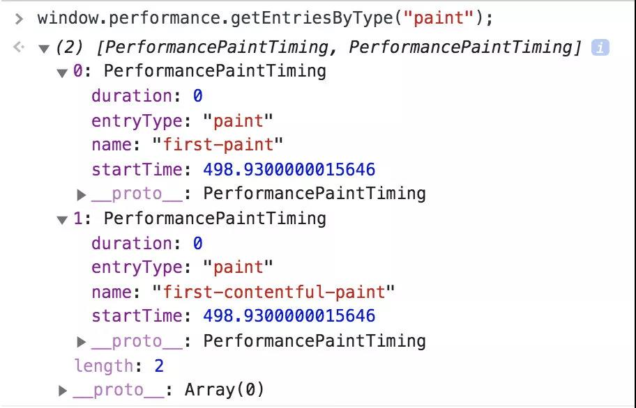

# 性能

<!-- http://www.alloyteam.com/2020/01/14184/ -->
## web性能领域专业术语

### FP（First Paint）

FP 全称"First Paint",翻译为"首次绘制" 是时间线上的第一个“时间点”，它代表浏览器第一次向屏幕传输像素的时间，也就是页面在屏幕上首次发生视觉变化的时间。

注意：FP不包含默认背景绘制，但包含非默认的背景绘制。

### FCP （First Contentful Paint）

FCP 全称 First Contentful Paint 翻译为首次内容绘制，它代表浏览器第一次向屏幕绘制“内容”。

注意：只有首次绘制文本、图片（包含背景图）、非白色的canvas或者SVG时才被算作FCP

FP 与 FCP这两个指标之间的主要区别是：FP是当浏览器开始绘制内容到屏幕上的时候，只要在视觉上开始发生变化，无论是什么内容触发的视觉变化，在这个时间点，叫做FP

相比较，FCP指的是浏览器首次绘制来之DOM的内容。例如：文本，图片，SVG，canvas元素等，这个时间点叫FCP。

FP和FCP可能是相同的时间，也可能是先FP后FCP,这两个指标浏览器已经标准化了，从 performance 的 The Paint Timing API 可以获取到。

`window.performance.getEntriesByType("paint")`

### FMP (First Meaningful Paint)

FMP 全称First Meaningful Paint 翻译为首次有效绘制 表示页面的”主要内容“开始出现在屏幕上的时间点。它是我们测量用户加载体验的主要指标。

### LCP （Largest Contentful Paint） 

表示可视区”内容“最大的可见元素开始出现在屏幕上的时间点。

### TTI (Time to Interactive)

TTI 全称 Time to Interactive 翻译为可交换时间。表示网页第一次**完全达到可交互状态**的时间点。可交互状态只的是页面上的UI组件时可以交互的，不仅如此，此时主线程已经达到“流畅”的程度，主线程的任务均不超过50毫秒。TTI很重要，因为TTI可以让我们了解我们的产品需要多久可以真正达到“可用”的状态。

### TTFB (Time to First Byte) 

TTFB 全称 Time to First Byte 表示浏览器接收第一个字节的时间。

### FCI (First CPU Idle)

通俗的理解TTI与FCI的区别：FCI代表浏览器真正的第一次可以响应用户的输入，而TTI代表浏览器已经可以持续性的响应用户的输入。

### FID (First Input Delay)

FID 全称 First Input Delay 翻译为首次输入延迟。顾名思义，FID指的是用户首次与产品进行交互时，我们产品可以在多长时间给出反馈。

TTI可以告诉我们网页什么时候可以开始流畅地响应用户的交互，但是如果用户在TTI的时间内，没有与网页产生交互，那么TTI其实是影响不到用户的，TTI是不需要用户参与的指标，但如果我们真的想知道TTI对用户的影响，我们需要FID

捕获FID比较简单，我们只需要在网页的head标签里注册一个事件（click、mousedown、keydown、touchstart、pointerdown），然后在事件响应函数中使用当前时间减去事件对象被创建的时间即可。`performance.now() - event.timeStamp`

### DCL

DCL 全称 DomContentloaded事件触发的时间

### L

L表示onLoad事件触发的时间

DomContentloaded事件与onLoad事件的区别是，浏览器解析HTML这个操作完成后立刻触发DomContentloaded事件，而只有页面所有资源都加载完毕后（比如图片，CSS），才会触发onLoad事件。

### Speed Index

表示显示页面可见部分的平均时间（注意，是真正的可见，用户可以立马看见的，屏幕外的部分不算），数值越小说明速度越快，它主要用于测量页面内容在视觉上填充的速度

通常会使用这个指标来进行性能的比较。比如优化前和优化后，我们的产品与竞品的性能比较等。但是只能用于 粗略 的比较，不同的产品侧重点完全不同，所以还是需要根据自己产品所侧重的方向，并结合其他指标来进行更详细的对比。

博客文章这样的页面更侧重FMP（用户希望尽快看到有价值的内容），而类似后台管理系统或在线PPT这种产品则更侧重TTI（用户希望尽快与产品进行交互）。

## 网页性能优化

<a href="/assets/img/performance.c49ff497.png" target="_blank">点击查看大图</a>

网页的优化，根据在浏览器输入一个地址访问网页的原理，对整条链路进行拆分。可以初步拆分为：
1. 网络请求优化
2. 浏览器渲染优化
3. 浏览器js执行优化

### 网络请求优化

网络请求优化又可以细分为：
* 网络优化
* DNS优化
* 资源加载的优化
  * 减少请求次数
  * 减小请求大小
* 缓存
* 服务器响应优化

#### 网络优化

网络优化主要是从路由和DNS还有请求协议等多方面偏网络本身进行优化。这主要是运维的工作，但是需要了解。使用CDN

#### DNS优化

当通过域名来访问页面的时候，浏览器发起页面请求时，是需要通过DNS解析，来寻找服务器所在的真实网络IP地址。可以使用dns-prefetch
#### 资源加载的优化

网页请求过程中，会有很多数据和资源需要加载。其中静态资源的请求过程，如html、css、js、图片等等，都可以进行一定程度的优化。

其实主要有2个方面 减少请求次数和减小请求大小，但这者是互斥的。

##### 减少请求次数

因为浏览器对网页的并发请求数目都会有一定限制，不考虑资源大小来说，资源个数越多，即页面加载的内容越多，页面加载的速度就越慢，因此就需要减少请求次数。

常见的优化方案有：

1. 对资源进行合并，如js的bundle、css的合并，雪碧图等
2. 静态资源数据化，如icon图等较小资源转base64加载等
3. 按需加载，如按需加载js、图片等资源的懒加载等

##### 减小请求大小

当请求次数固定下来无法减少后，对请求、请求返回内容的大小也是影响整个网页加载的重要因素。

其次，如果一味的强调减少请求次数，出现例如资源合并，结果合并的单个资源文件很大，而不加载完这个文件，其他操作都没法继续下去，这种场景，一味的减少请求个数就很鸡肋，拆分多个请求包后充分利用并发加载资源能够反而更好。

常见的优化方案有： 
1. 服务器级的整体压缩，如gzip 
2. 对资源本身进行压缩，如图片压缩、js css压缩 
3. 去除无用代码，如tree shaking
4. 按需加载，而不是直接引入一个完整包然后使用其中极少的某一部分 
5. 接口数据，去除无用的数据

#### 缓存

利用浏览器缓存 强缓存与协商缓存

#### 服务器响应优化

当请求到服务器时，快速响应。

### 浏览器渲染优化

1. js 文件加载位置  script preload、prefetch、defer、async
2. 资源按需加载 js代码和图片懒加载
3. 减少重绘与重排
4. requestAnimationFrame的使用
5. 骨架屏代替loading菊花
6. 图片大小格式类型

## 具体优化操作
1. 骨架屏代替loading菊花
2. js 文件加载位置  script preload、prefetch、defer、async
3. 浏览器缓存
4. 减少资源体积
5. 资源按需加载 js代码和图片懒加载
6. 图片大小格式类型
7. 减少http请求 合并请求
8. CDN
9. DNS优化 dns-prefetch dns 预解析
10. 减少重绘重排

