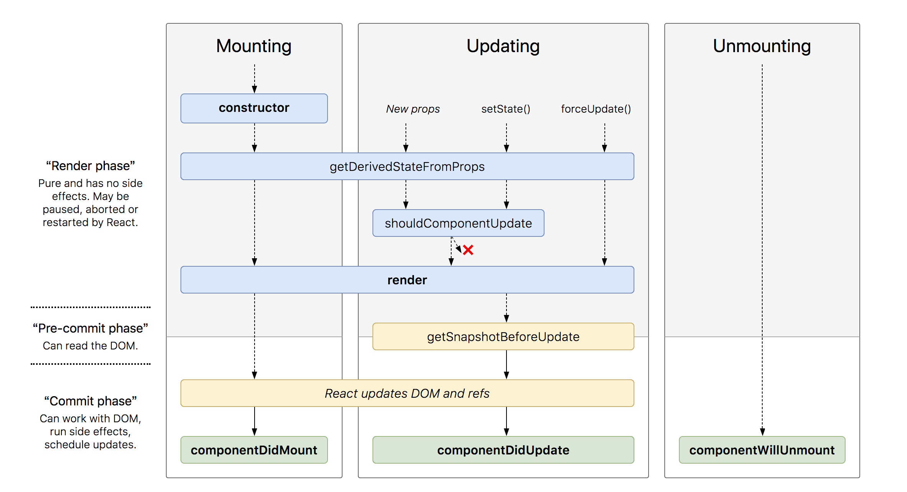
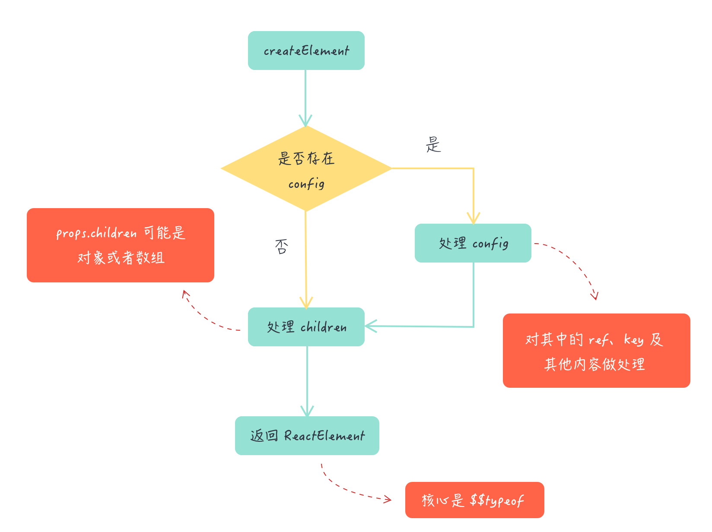
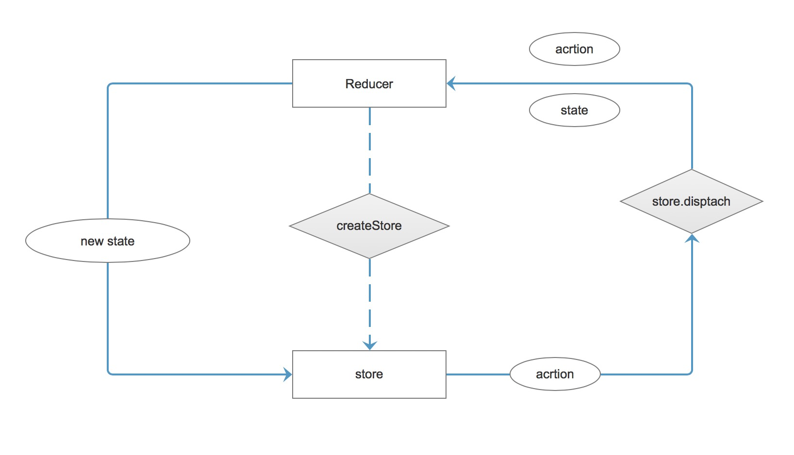

#  React

## V16 版本生命周期

### 生命周期图


### 用法建议 
```
class ExampleComponent extends React.Component {
  // 用于初始化 state
  constructor() {}
  // 用于替换 `componentWillReceiveProps` ，该函数会在初始化和 `update` 时被调用
  // 因为该函数是静态函数，所以取不到 `this`
  // 如果需要对比 `prevProps` 需要单独在 `state` 中维护
  static getDerivedStateFromProps(nextProps, prevState) {}
  // 判断是否需要更新组件，多用于组件性能优化
  shouldComponentUpdate(nextProps, nextState) {}
  // 组件挂载后调用
  // 可以在该函数中进行请求或者订阅
  componentDidMount() {}
  // 用于获得最新的 DOM 数据
  getSnapshotBeforeUpdate() {}
  // 组件即将销毁
  // 可以在此处移除订阅，定时器等等
  componentWillUnmount() {}
  // 组件销毁后调用
  componentDidUnMount() {}
  // 组件更新后调用
  componentDidUpdate() {}
  // 渲染组件函数
  render() {}
  // 以下函数不建议使用
  UNSAFE_componentWillMount() {}
  UNSAFE_componentWillUpdate(nextProps, nextState) {}
  UNSAFE_componentWillReceiveProps(nextProps) {}
}
```

### Mounting
在该阶段包含生命周期函数
* constructor()
* static getDerivedStateFromProps()
* render()
* componentDidMount()

#### constructor()
构造函数的作用有两个
一个通过分配对象来初始化本地状态this.state，另一个是将事件处理程序方法绑定到实例。
在构造函数中不用使用this.setState
```
constructor(props) {
  super(props);
  // Don't call this.setState() here!
  this.state = { counter: 0 };
  this.handleClick = this.handleClick.bind(this);
}
```
#### static getDerivedStateFromProps()

`static getDerivedStateFromProps(props, state)`

getDerivedStateFromProps在调用render方法之前调用，无论是在初始安装还是后续更新。它会返回一个对象去更新状态，或者返回null不更新任何东西

该生命周期是在16.3版本中新增的，当props或者state改变都会触发改生命周期，与这个相似的UNSAFE_componentWillReceiveProps()生命周期在之后的版本将会逐渐被替代，避免使用

#### render()
render()方法是类组件中唯一必需的方法。并且它是一个纯函数，意味着不会修改组件状态，每次调用时都返回相同的结果，并且它不直接与浏览器交互。
调用时它会校验this.state和this.props,然后返回下列的几种类型的返回值
* React elements
* Arrays and fragments
* Portals
* String and numbers
* Booleans or null

不能使用this.setState在该生命周期

#### componentDidMount() 

在该生命周期中可以进行dom的操作和数据的网络请求

### Updating
* static getDerivedStateFromProps()
* shouldComponentUpdate()
* render()
* getSnapshotBeforeUpdate()
* componentDidUpdate()
* UNSAFE_componentWillUpdate()
* UNSAFE_componentWillReceiveProps()

#### shouldComponentUpdate()

`shouldComponentUpdate(nextProps, nextState)`

shouldComponentUpdate 在接受到新的props和新的state的 在渲染之前会调用 默认的是返回true。该方法不会在初始的时候和使用forceUpdate()方法的时候调用。

在该生命周期中，可以进行性能的优化。也可以使用继承PureComponent组件，该组件已经对shouldComponentUpdate做了处理但是是浅比较。例如 state中有数组和对象时，你改变state的数组和对象它可能不会更新，不会深入的比较数组和对象。此时可以引入immutable.js进行结合使用。

### getSnapshotBeforeUpdate()

`getSnapshotBeforeUpdate(prevProps, prevState)`

在该生命周期中 state 已经更新，可以进行一些dom 操作，在render更新之前

### componentDidUpdate()

`componentDidUpdate(prevProps, prevState, snapshot)`

componentDidUpdate()更新发生后立即调用。初始渲染不会调用此方法。
该生命周期你也可以去操作dom，或者进行网络请求，当你发现props改变时。但是不能使用直接setState那样会导致无限循环，你可以再某种判断条件下使用。
如果组件使用了 getSnapshotBeforeUpdate()生命周期，则它返回的值将作为第三个“快照”参数传递给componentDidUpdate()。否则此参数将是未定义的。

###  UNSAFE_componentWillUpdate()

`UNSAFE_componentWillUpdate(nextProps, nextState)`

此生命周期之前已命名componentWillUpdate。该名称将继续有效，直到版本17.使用rename-unsafe-lifecyclescodemod自动更新组件。
UNSAFE_componentWillUpdate()在收到新的props或state时，在渲染之前调用。使用此作为在更新发生之前执行准备的机会。初始渲染不会调用此方法
不能再此使用this.setState

### UNSAFE_componentWillReceiveProps()

`UNSAFE_componentWillReceiveProps(nextProps)`

此生命周期之前已命名componentWillReceiveProps。该名称将继续有效，直到版本17.使用rename-unsafe-lifecyclescodemod自动更新组件。

该生命周期在初始化的时候不会被调用，只有当props被改变的时候会被调用,this.setState不会触发它

### Unmounting
* componentWillUnmount()

#### componentWillUnmount()
componentWillUnmount()在卸载和销毁组件之前立即调用。在此方法中执行任何必要的清理，例如使计时器无效，取消网络请求或清除在componentDidMount()其中创建的任何订阅。

不能调用setState()，componentWillUnmount()因为组件永远不会被重新呈现。卸载组件实例后，将永远不会再次mount它。

### Error Handling
* static getDerivedStateFromError()
* componentDidCatch()

#### static getDerivedStateFromError()

`static getDerivedStateFromError(error)`

在子组件抛出错误后会调用此生命周期。它接收作为参数抛出的错误，并返回值以更新状态。
在组件 “render” 阶段的时候就会被调用，不允许副作用

#### componentDidCatch()

`componentDidCatch(error, info)`

在子组件抛出错误的时候回调用此生命周期，它有2个参数，一个是错误，还有一个是对象，key对应的是错误来自哪个子组件。
该生命周期在 “ commit” 阶段调用所以可以有副作用

### Finally

#### 16 版本新增的生命周期 

* static getDerivedStateFromProps()
*  getSnapshotBeforeUpdate()
*  static getDerivedStateFromError()
* componentDidCatch()

#### 16 版本废除和减少使用的生命周期

* UNSAFE_componentWillUpdate()
* UNSAFE_componentWillReceiveProps()
* UNSAFE_componentWillMount()

#### this.setState 不能调用的生命周期

* constructor()
* render()
* componentDidUpdate() 不能直接使用
* UNSAFE_componentWillUpdate()
* UNSAFE_componentWillMount()

## createElement

写React我们用的是JSX语法，那它如何被解析呢。通过Babel转义之后，调用React.createElement.
例子说明：
```
<div className="box" style={{pading:16}}>1</div>
// 转义之后
React.createElement("div", {
  className: "box",
  style: {
    pading: 16
  }
}, "1");

```
你可以自己尝试查看转义之后的代码 [转义地址](https://www.babeljs.cn/repl)

那接下来看看它的内部实现。

### 源码解读

首先定位到 [ReactElement.js](https://github.com/facebook/react/blob/master/packages/react/src/ReactElement.js)文件，找到createElement方法。可以分为以下几部分解读。

#### 函数参数
```
export function createElement(type, config, children) {}
```
发现createElement接收3个参数。对比上述的示例代码明白：
* type 代表节点类型 上述的div
* config 代表节点配置的属性，className等
* children 代表子节点

#### config处理

```
if (config != null) {

    // 验证 ref 和 key，只在开发环境下
    if (hasValidRef(config)) {
      ref = config.ref;
    }
    if (hasValidKey(config)) {
      key = '' + config.key;
    }

    // 赋值操作
    // self 呢就是为了以后正确获取 this
    // source 基本来说没啥用，内部有一些 filename, line number 这种
    self = config.__self === undefined ? null : config.__self;
    source = config.__source === undefined ? null : config.__source;


    // Remaining properties are added to a new props object
    // 遍历配置，把内建的几个属性剔除后丢到 props 中
    for (propName in config) {
      if (
        hasOwnProperty.call(config, propName) &&
        !RESERVED_PROPS.hasOwnProperty(propName) // RESERVED_PROPS 保留属性 就是ref、key等
      ) {
        props[propName] = config[propName];
      }
    }
  }
```

验证config 是否为空，当不为空时，当传入ref、key值时 采用传入的值。然后遍历 config 并把内建的几个属性（比如 ref 和 key）剔除后丢到 props 对象中。

#### children的处理

```
 const childrenLength = arguments.length - 2;
  if (childrenLength === 1) {
    props.children = children;
  } else if (childrenLength > 1) {
    const childArray = Array(childrenLength);
    for (let i = 0; i < childrenLength; i++) {
      childArray[i] = arguments[i + 2];
    }
    props.children = childArray;
  }
```

首先获取子节点的长度,利用类数组剔除2个参数就是type和config，剩下的就是子节点长度。根据长度的不同进行不同的处理，长度为1时，直接赋值，当长度大于1时，就会有多个children，props.children处理成数组

#### 默认值处理

```
 if (type && type.defaultProps) {
    const defaultProps = type.defaultProps;
    for (propName in defaultProps) {
      if (props[propName] === undefined) {
        props[propName] = defaultProps[propName];
      }
    }
  }
```
当组件有设置defaultProps默认属性时，有的话判断是否有给 props 赋值，只有当值为undefined 时，才会设置默认值

#### 返回值
```
return ReactElement(
  type,
  key,
  ref,
  self,
  source,
  ReactCurrentOwner.current,
  props,
);
```
返回一个ReactElement对象。

### ReactElement

```
const ReactElement = function(type, key, ref, self, source, owner, props) {
  const element = {
    $$typeof: REACT_ELEMENT_TYPE,
    type: type,
    key: key,
    ref: ref,
    props: props,
    _owner: owner,
  };
  return element;
};
```
定义一个对象来表示，核心通过 $$typeof 来帮助我们识别这是一个 ReactElement，$$typeof 是一个Symbol的值。


该小节流程图




## Component

## Fiber

## setState

## Virtual Dom

## Diff算法

## Redux

### 三大原则

1. 单一数据源

一个应用永远只有唯一的数据源

2. 状态是只读的

不能直接的修改应用的状态，但是可以利用store.dispatch达到修改状态的目的

3. 状态修改均由纯函数完成

通过定义reducer来确定状态的修改，每一个reducer 都是纯函数。

数据流如图：



### 核心API

Redux 的核心是一个`store`，这个`store`由Redux提供的`createStore(reducers[,initialState])`方法生成。

`createStore` 函数具有2个参数，第一个参数为必须传入的`reducers`，第二个参数为可以选的初始化状态 `initialState`

#### reducer

在Redux里，负责响应action并修改数据的角色就是reducer。reducer本质上是一个函数，其函数签名为`reducer(perviousState,action)=>newState`。可以看出reducer的职责是根据perviousState和action 计算出新的 newState

当reducer第一次执行的时候，并没有任何的perviousState,但是需要返回一个新的newState，但是就会需要一个初始值initialState

#### createStore

createStore是Redux中最核心的API。通过该方法可以生成一个store 对象。该store对象本身具有4个方法。

1. getState():获取store中当前的状态
2. dispatch(action):分发一个action,并返回这个action，这是唯一能改变store中数据的方式
3. subscribe(listener):注册一个监听者，它在store发生变化时被调用
4. replaceReducer(nextReducer):更新当前store里的reducer，一般只会在开发模式中调用


