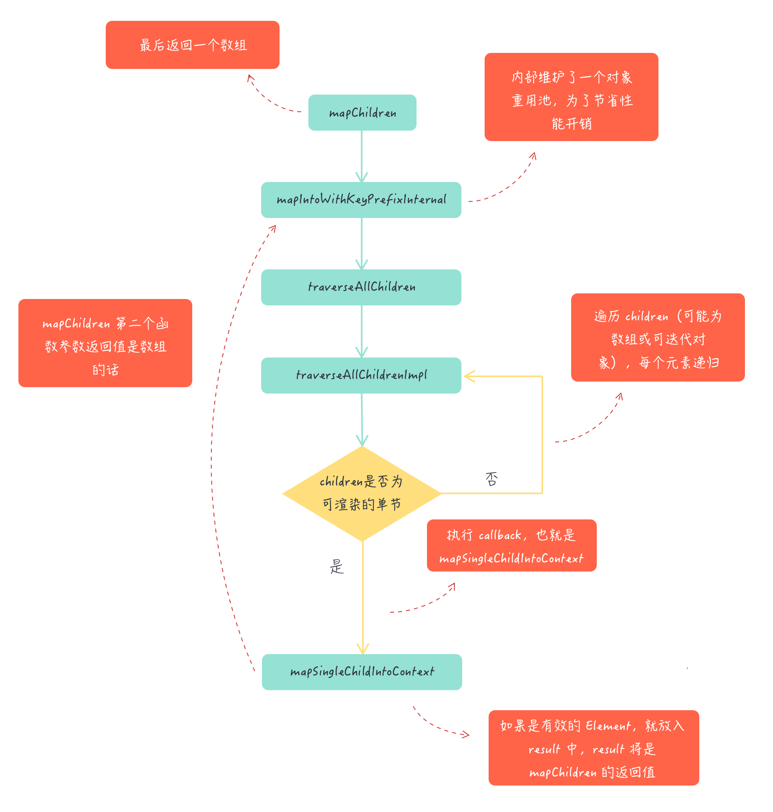
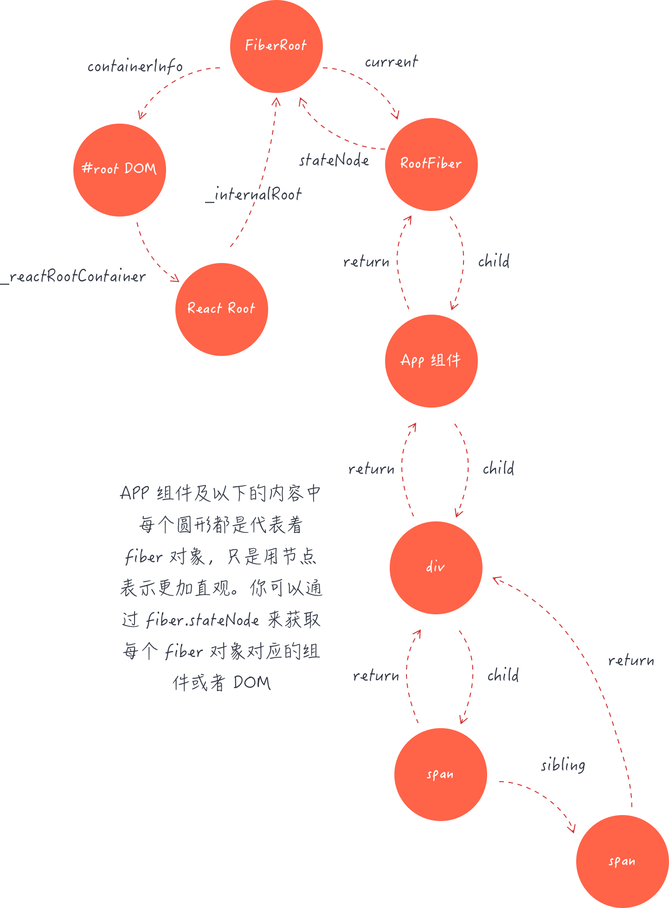
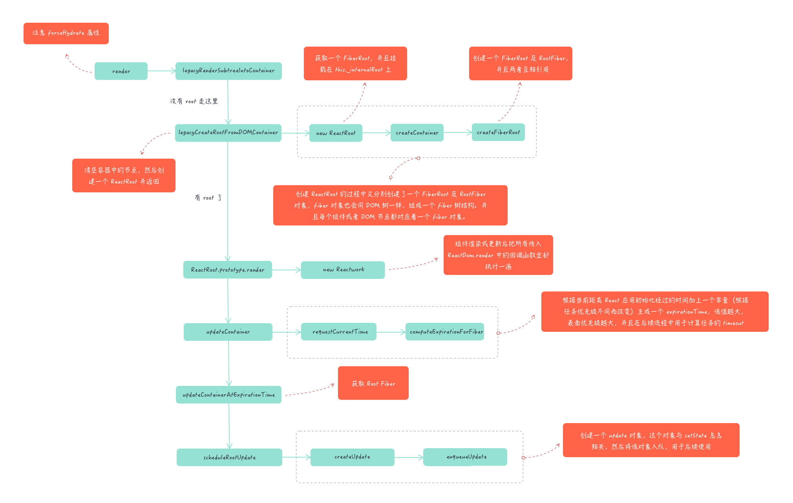

#  React

先申明本系列基于 React 版本 16.8.6

## V16 Lifecycle

### Lifecycle Map


### Usage 

``` javascript
class ExampleComponent extends React.Component {
    // 用于初始化 state
    constructor() {}

    // 用于替换 `componentWillReceiveProps` ，该函数会在初始化和 `update` 时被调用
    // 因为该函数是静态函数，所以取不到 `this` 
    // 如果需要对比 `prevProps` 需要单独在 `state` 中维护
    static getDerivedStateFromProps(nextProps, prevState) {}

    // 判断是否需要更新组件，多用于组件性能优化
    shouldComponentUpdate(nextProps, nextState) {}


    // 组件挂载后调用
    // 可以在该函数中进行请求或者订阅
    componentDidMount() {}


    // 用于获得最新的 DOM 数据
    getSnapshotBeforeUpdate() {}

    
    // 组件即将销毁
    // 可以在此处移除订阅，定时器等等
    componentWillUnmount() {}


    // 组件销毁后调用
    componentDidUnMount() {}


    // 组件更新后调用
    componentDidUpdate() {}
    // 渲染组件函数
    render() {}


    // 以下函数不建议使用
    UNSAFE_componentWillMount() {}
    UNSAFE_componentWillUpdate(nextProps, nextState) {}
    UNSAFE_componentWillReceiveProps(nextProps) {}
}
```

### Mounting

在该阶段包含生命周期函数

* constructor()
* static getDerivedStateFromProps()
* render()
* componentDidMount()

#### constructor()

构造函数的作用有两个
一个通过分配对象来初始化本地状态this.state，另一个是将事件处理程序方法绑定到实例。
在构造函数中不用使用this.setState

``` javascript
constructor(props) {
    super(props);
    // Don't call this.setState() here!
    this.state = {
        counter: 0
    };
    this.handleClick = this.handleClick.bind(this);
}
```

#### static getDerivedStateFromProps()

`static getDerivedStateFromProps(props, state)` 

getDerivedStateFromProps在调用render方法之前调用，无论是在初始安装还是后续更新。它会返回一个对象去更新状态，或者返回null不更新任何东西

该生命周期是在16.3版本中新增的，当props或者state改变都会触发改生命周期，与这个相似的UNSAFE_componentWillReceiveProps()生命周期在之后的版本将会逐渐被替代，避免使用

#### render()

render()方法是类组件中唯一必需的方法。并且它是一个纯函数，意味着不会修改组件状态，每次调用时都返回相同的结果，并且它不直接与浏览器交互。
调用时它会校验this.state和this.props, 然后返回下列的几种类型的返回值

* React elements
* Arrays and fragments
* Portals
* String and numbers
* Booleans or null

不能使用this.setState在该生命周期

#### componentDidMount() 

在该生命周期中可以进行dom的操作和数据的网络请求

### Updating

* static getDerivedStateFromProps()
* shouldComponentUpdate()
* render()
* getSnapshotBeforeUpdate()
* componentDidUpdate()
* UNSAFE_componentWillUpdate()
* UNSAFE_componentWillReceiveProps()

#### shouldComponentUpdate()

`shouldComponentUpdate(nextProps, nextState)` 

shouldComponentUpdate 在接受到新的props和新的state的 在渲染之前会调用 默认的是返回true。该方法不会在初始的时候和使用forceUpdate()方法的时候调用。

在该生命周期中，可以进行性能的优化。也可以使用继承PureComponent组件，该组件已经对shouldComponentUpdate做了处理但是是浅比较。例如 state中有数组和对象时，你改变state的数组和对象它可能不会更新，不会深入的比较数组和对象。此时可以引入immutable.js进行结合使用。

#### getSnapshotBeforeUpdate()

`getSnapshotBeforeUpdate(prevProps, prevState)` 

在该生命周期中 state 已经更新，可以进行一些dom 操作，在render更新之前

#### componentDidUpdate()

`componentDidUpdate(prevProps, prevState, snapshot)` 

componentDidUpdate()更新发生后立即调用。初始渲染不会调用此方法。
该生命周期你也可以去操作dom，或者进行网络请求，当你发现props改变时。但是不能使用直接setState那样会导致无限循环，你可以再某种判断条件下使用。
如果组件使用了 getSnapshotBeforeUpdate()生命周期，则它返回的值将作为第三个“快照”参数传递给componentDidUpdate()。否则此参数将是未定义的。

####  UNSAFE_componentWillUpdate()

`UNSAFE_componentWillUpdate(nextProps, nextState)` 

此生命周期之前已命名componentWillUpdate。该名称将继续有效，直到版本17. 使用rename-unsafe-lifecyclescodemod自动更新组件。
UNSAFE_componentWillUpdate()在收到新的props或state时，在渲染之前调用。使用此作为在更新发生之前执行准备的机会。初始渲染不会调用此方法
不能再此使用this.setState

#### UNSAFE_componentWillReceiveProps()

`UNSAFE_componentWillReceiveProps(nextProps)` 

此生命周期之前已命名componentWillReceiveProps。该名称将继续有效，直到版本17. 使用rename-unsafe-lifecyclescodemod自动更新组件。

该生命周期在初始化的时候不会被调用，只有当props被改变的时候会被调用, this.setState不会触发它

### Unmounting

* componentWillUnmount()

#### componentWillUnmount()

componentWillUnmount()在卸载和销毁组件之前立即调用。在此方法中执行任何必要的清理，例如使计时器无效，取消网络请求或清除在componentDidMount()其中创建的任何订阅。

不能调用setState()，componentWillUnmount()因为组件永远不会被重新呈现。卸载组件实例后，将永远不会再次mount它。

### Error Handling

* static getDerivedStateFromError()
* componentDidCatch()

#### static getDerivedStateFromError()

`static getDerivedStateFromError(error)` 

在子组件抛出错误后会调用此生命周期。它接收作为参数抛出的错误，并返回值以更新状态。
在组件 “render” 阶段的时候就会被调用，不允许副作用

#### componentDidCatch()

`componentDidCatch(error, info)` 

在子组件抛出错误的时候回调用此生命周期，它有2个参数，一个是错误，还有一个是对象，key对应的是错误来自哪个子组件。
该生命周期在 “ commit” 阶段调用所以可以有副作用

### Finally

#### 16 版本新增的生命周期 

* static getDerivedStateFromProps()
*  getSnapshotBeforeUpdate()
*  static getDerivedStateFromError()
* componentDidCatch()

#### 16 版本废除和减少使用的生命周期

* UNSAFE_componentWillUpdate()
* UNSAFE_componentWillReceiveProps()
* UNSAFE_componentWillMount()

#### this.setState 不能调用的生命周期

* constructor()
* render()
* componentDidUpdate() 不能直接使用
* UNSAFE_componentWillUpdate()
* UNSAFE_componentWillMount()

## Advanced Guides

### Lazy and Suspense

React.lazy 接受一个函数，这个函数需要动态调用 import()。它必须返回一个 Promise，该 Promise 需要 resolve 一个 default export 的 React 组件。

然后应在 Suspense 组件中渲染 lazy 组件，如此使得我们可以使用在等待加载 lazy 组件时做优雅降级（如 loading 指示器等）。

React.lazy 目前只支持默认导出（default exports）

示例：
```javascript
import React, { Suspense } from 'react';

const OtherComponent = React.lazy(() => import('./OtherComponent'));

function MyComponent() {
  return (
    <div>
      <Suspense fallback={<div>Loading...</div>}>
        <OtherComponent />
      </Suspense>
    </div>
  );
}
```
fallback 属性接受任何在组件加载过程中你想展示的 React 元素。你可以将 Suspense 组件置于懒加载组件之上的任何位置。你甚至可以用一个 Suspense 组件包裹多个懒加载组件。

**总结：使用该组方法可以实现代码的动态加载 更好的进行代码分割**

### Context

Context 提供了一个无需为每层组件手动添加 props，就能在组件树间进行数据传递的方法。

#### Context使用场景

当一个父组件需要给子组件传递一个props时，但是嵌套层数比较多时，比如4-5层，那去维护这个props就显得复杂。那么就可以使用context来共享这些数据。

#### 如何使用

API

* React.createContext
* Context.Provider
* Class.contextType
* Context.Consumer
* Context.displayName

**React.createContext**

``` javascript
const MyContext = React.createContext(defaultValue);
```

创建一个 Context 对象。当 React 渲染一个订阅了这个 Context 对象的组件，这个组件会从组件树中离自身最近的那个匹配的 Provider 中读取到当前的 context 值。

只有当组件所处的树中没有匹配到 Provider 时，其 defaultValue 参数才会生效。

注意：将 undefined 传递给 Provider 的 value 时，消费组件的 defaultValue 不会生效。

**Context. Provider**

```javascript
<MyContext.Provider value = {/* 某个值 */ } >
```

Provider 接收一个 value 属性，传递给消费组件。一个 Provider 可以和多个消费组件有对应关系。多个 Provider 也可以嵌套使用，里层的会覆盖外层的数据。

当 Provider 的 value 值发生变化时，它内部的所有消费组件都会重新渲染。Provider 及其内部 consumer 组件都不受制于 shouldComponentUpdate 函数，因此当 consumer 组件在其祖先组件退出更新的情况下也能更新。

通过新旧值检测来确定变化，使用了与 Object.is 相同的算法。

**Class.contextType**

挂载在 class 上的 contextType 属性会被重赋值为一个由 React.createContext() 创建的 Context 对象。这能让你使用 this.context 来消费最近 Context 上的那个值。你可以在任何生命周期中访问到它，包括 render 函数中。

``` javascript
class MyClass extends React.Component {
    static contextType = MyContext // 该写法需要安装babel插件转义
    componentDidMount() {
        let value = this.context;
        /* 在组件挂载完成后，使用 MyContext 组件的值来执行一些有副作用的操作 */
    }
    componentDidUpdate() {
        let value = this.context;
        /* ... */
    }
    componentWillUnmount() {
        let value = this.context;
        /* ... */
    }
    render() {
        let value = this.context;
        /* 基于 MyContext 组件的值进行渲染 */
    }
}
MyClass.contextType = MyContext;
```

**Context.Consumer**

```javascript
<MyContext.Consumer>
  {value => /* 基于 context 值进行渲染*/}
</MyContext.Consumer>
```

这需要函数作为子元素（function as a child）这种做法。这个函数接收当前的 context 值，返回一个 React 节点。传递给函数的 value 值等同于往上组件树离这个 context 最近的 Provider 提供的 value 值。如果没有对应的 Provider，value 参数等同于传递给 createContext() 的 defaultValue。

**Context.displayName**

context 对象接受一个名为 displayName 的 property，类型为字符串。React DevTools 使用该字符串来确定 context 要显示的内容。

```javascript
const MyContext = React.createContext(/* some value */);
MyContext.displayName = 'MyDisplayName';

<MyContext.Provider> // "MyDisplayName.Provider" 在 DevTools 中
<MyContext.Consumer> // "MyDisplayName.Consumer" 在 DevTools 中
```

组合使用例子
```javascript
// Context 可以让我们无须明确地传遍每一个组件，就能将值深入传递进组件树。
// 为当前的 theme 创建一个 context（“light”为默认值）。
const ThemeContext = React.createContext('light');
class App extends React.Component {
  render() {
    // 使用一个 Provider 来将当前的 theme 传递给以下的组件树。
    // 无论多深，任何组件都能读取这个值。
    // 在这个例子中，我们将 “dark” 作为当前的值传递下去。
    return (
      <ThemeContext.Provider value="dark">
        <Toolbar />
      </ThemeContext.Provider>
    );
  }
}

// 中间的组件再也不必指明往下传递 theme 了。
function Toolbar() {
  return (
    <div>
      <ThemedButton />
    </div>
  );
}

class ThemedButton extends React.Component {
  // 指定 contextType 读取当前的 theme context。
  // React 会往上找到最近的 theme Provider，然后使用它的值。
  // 在这个例子中，当前的 theme 值为 “dark”。
  static contextType = ThemeContext;
  render() {
    return <Button theme={this.context} />;
  }
}
```

### ErrorBoundary

错误边界是一种 React 组件，这种组件**可以捕获并打印发生在其子组件树任何位置的 JavaScript 错误，并且，它会渲染出备用 UI**，而不是渲染那些崩溃了的子组件树。错误边界在渲染期间、生命周期方法和整个组件树的构造函数中捕获错误。

注意事项:

错误边界无法捕获以下场景中产生的错误：

* 事件处理
* 异步代码（例如 setTimeout 或 requestAnimationFrame 回调函数）
* 服务端渲染
* 它自身抛出来的错误（并非它的子组件）

#### 形成条件

如果一个 class 组件中定义了 `static getDerivedStateFromError()` 或 `componentDidCatch()` 这两个生命周期方法中的任意一个（或两个）时，那么它就变成一个错误边界。当抛出错误后，请使用 `static getDerivedStateFromError()` 渲染备用 UI ，使用 `componentDidCatch()` 打印错误信息。

```javascript
class ErrorBoundary extends React.Component {
  constructor(props) {
    super(props);
    this.state = { hasError: false };
  }

  static getDerivedStateFromError(error) {
    // 更新 state 使下一次渲染能够显示降级后的 UI
    return { hasError: true };
  }

  componentDidCatch(error, errorInfo) {
    // 你同样可以将错误日志上报给服务器
    logErrorToMyService(error, errorInfo);
  }

  render() {
    if (this.state.hasError) {
      // 你可以自定义降级后的 UI 并渲染
      return <h1>Something went wrong.</h1>;
    }

    return this.props.children; 
  }
}
```
### Fragments

React 中的一个常见模式是一个组件返回多个元素。Fragments 允许你将子列表分组，而无需向 DOM 添加额外节点。

用法：
```javascript
render() {
  return (
    <React.Fragment>
      <ChildA />
      <ChildB />
      <ChildC />
    </React.Fragment>
  );
}

//或者短语法
render() {
  return (
    <>
      <ChildA />
      <ChildB />
      <ChildC />
    </>
  );
}

```

使用显式 `<React.Fragment> `语法声明的片段可能具有 key ;短语法不支持key.


### React.forwardRef

Ref forwarding 是一项将 ref 自动地通过组件传递到其一子组件的技巧。

为什么会有这个功能呢 因为refs 不会被props透传下去。这是因为 ref 不是 prop 属性。就像 key 一样，其被 React 进行了特殊处理。

用法：React.forwardRef 接受一个渲染函数，其接收 props 和 ref 参数并返回一个 React 节点。

```javascript
function logProps(Component) {
  class LogProps extends React.Component {
    componentDidUpdate(prevProps) {
      console.log('old props:', prevProps);
      console.log('new props:', this.props);
    }
    render() {
      const {forwardedRef, ...rest} = this.props;
      // 将自定义的 prop 属性 “forwardedRef” 定义为 ref
      return <Component ref={forwardedRef} {...rest} />;
    }
  }

  // 注意 React.forwardRef 回调的第二个参数 “ref”。
  // 我们可以将其作为常规 prop 属性传递给 LogProps，例如 “forwardedRef”
  // 然后它就可以被挂载到被 LogProps 包裹的子组件上。
  return React.forwardRef((props, ref) => {
    return <LogProps {...props} forwardedRef={ref} />;
  });
}
```

该方法常用于高阶函数。

### Higher-Order Components

高阶组件（HOC）是React中一个复用组件逻辑的高级技术。简单的说，就是获取一个组件返回一个新的组件。常见的如Redux的connect方法等。 它是一个纯函数，没有副作用

用法
```javascript
function logProps(WrappedComponent) {
  return class extends React.Component {
    componentDidUpdate(prevProps) {
      console.log('Current props: ', this.props);
      console.log('Previous props: ', prevProps);
    }
    render() {
      return <WrappedComponent {...this.props} />;
    }
  }
}
```
注意点:
* HOC 应该透传与自身无关的 props
* HOC创建的容器在调试的时候会显示一样的名字 可以用displayname 来处理
* 不能在render中使用HOC
* 静态方法必须复制 higherOrderComponent.staticMethod = WrappedComponent.staticMethod;
* Refs 不会被传递 可以只用React.forwardRef解决

### React.memo

React.memo 为高阶组件。它与 React.PureComponent 非常相似，但只适用于函数组件，而不适用 class 组件。

如果你的函数组件在给定相同 props 的情况下渲染相同的结果，那么你可以通过将其包装在 React.memo 中调用，以此通过记忆组件渲染结果的方式来提高组件的性能表现。这意味着在这种情况下，React 将跳过渲染组件的操作并直接复用最近一次渲染的结果。

React.memo 仅检查 props 变更。如果函数组件被 React.memo 包裹，且其实现中拥有 useState 或 useContext 的 Hook，当 context 发生变化时，它仍会重新渲染。

默认情况下其只会对复杂对象做浅层对比，如果你想要控制对比过程，那么请将自定义的比较函数通过第二个参数传入来实现。

用法
```javascript
function MyComponent(props) {
  /* 使用 props 渲染 */
}
function areEqual(prevProps, nextProps) {
  /*
  如果把 nextProps 传入 render 方法的返回结果与
  将 prevProps 传入 render 方法的返回结果一致则返回 true，
  否则返回 false
  */
}
export default React.memo(MyComponent, areEqual);
```

## 性能优化

### 性能和渲染（Render）正相关

React 基于虚拟 DOM 和高效 Diff 算法的完美配合，实现了对 DOM 最小粒度的更新。但在个别复杂业务场景下，性能问题依然会困扰我们。此时需要采取一些措施来提升运行性能，其很重要的一个方向，就是避免不必要的渲染（Render）。

### 渲染（Render）时影响性能的点

React 处理 render 的基本思维模式是每次一有变动就会去重新渲染整个应用。Virtual DOM 厉害的地方并不是说它比直接操作 DOM 快，而是说不管数据怎么变，都会尽量以最小的代价去更新 DOM。React 将 render 函数返回的虚拟 DOM 树与老的进行比较，从而确定 DOM 要不要更新、怎么更新。当 DOM 树很大时，遍历两棵树进行各种比对还是相当耗性能的，特别是在顶层 setState 一个微小的修改，默认会去遍历整棵树。尽管 React 使用高度优化的 Diff 算法 ，但是这个过程仍然会损耗性能。

### 渲染（Render）何时会被触发

触发render的条件有：

* 组件挂载

    React 组件构建并将 DOM 元素插入页面的过程称为挂载。当组件首次渲染的时候会调用 render，这个过程不可避免。

* setState 方法的调用

    通常情况下，执行 setState 会触发 render。但当 setState 传入 null 的时候，并不会触发 render 。

* 父组件重新渲染

    只要父组件重新渲染了，即使传入子组件的 props 未发生变化，那么子组件也会重新渲染，进而触发 render。

### 如何优化

根本思路减少不必要的render

#### shouldComponentUpdate 和 PureComponent
在React类组件中，可以利用`shouldComponentUpdate` 或者 `PureComponent` 来减少因父组件更新而触发子组件的render。

`shouldComponentUpdate` 生命周期，可以通过返回true代表需要重新渲染，返回false代表不渲染

`PureComponent` 通过对props和state的**浅比较**结果来实现`shouldComponentUpdate`,但是当对象包含复杂的数据结构时，可能就不灵啦，对象深层的数据改变但是没有触发render。

在React中`PureComponent`源码如下
```javascript
if (this._compositeType === CompositeTypes.PureClass) {
  shouldUpdate = !shallowEqual(prevProps, nextProps) || ! shallowEqual(inst.state, nextState);
}
```
`shallowEqual`的实现代码
```javascript
const hasOwnProperty = Object.prototype.hasOwnProperty;

/**
 * is 方法来判断两个值是否是相等的值，为何这么写可以移步 MDN 的文档
 * https://developer.mozilla.org/zh-CN/docs/Web/JavaScript/Reference/Global_Objects/Object/is
 */
function is(x: mixed, y: mixed): boolean {
  if (x === y) {
    return x !== 0 || y !== 0 || 1 / x === 1 / y;
  } else {
    return x !== x && y !== y;
  }
}

function shallowEqual(objA: mixed, objB: mixed): boolean {
  // 首先对基本类型进行比较
  if (is(objA, objB)) {
    return true;
  }

  if (typeof objA !== 'object' || objA === null ||
      typeof objB !== 'object' || objB === null) {
    return false;
  }

  const keysA = Object.keys(objA);
  const keysB = Object.keys(objB);

  // 长度不相等直接返回false
  if (keysA.length !== keysB.length) {
    return false;
  }

  // key相等的情况下，再去循环比较
  for (let i = 0; i < keysA.length; i++) {
    if (
      !hasOwnProperty.call(objB, keysA[i]) ||
      !is(objA[keysA[i]], objB[keysA[i]])
    ) {
      return false;
    }
  }

  return true;
}
```

#### 高阶组件

在函数组件中，并没有`shouldComponnetUpdate`这个生命周期，但是可以利用高阶组件来实现一个类型的功能。

```javascript
const shouldComponentUpdate = areEqual => BaseComponent => {
    class ShouldComponentUpdate extends React.Component{
        shouldComponentUpdate(nextProps){
            return areEqual(this.props,nextProps)
        }
        render(){
            return <BaseComponent {...this.props}/>
        }
    }
    ShouldComponentUpdate.displayName = `Pure(${BaseComponent.displayName})`
    return ShouldComponentUpdate
}

const Pure = BaseComponent => {
  const hoc = shouldComponentUpdate(
  	(props, nextProps) => !shallowEqual(props, nextProps)
  )

  return hoc(BaseComponent);
}
```

使用`Pure`高阶组件时，只需要对我们子组件进行装饰即可

```javascript
import React from'react';

const Child = (props) =><div>{props.name}</div>;

export default Pure(Child);
```

#### React.memo

React.memo 为高阶组件。它与 React.PureComponent 非常相似，但只适用于函数组件，而不适用 class 组件。

默认情况下其只会对复杂对象做浅层对比，如果你想要控制对比过程，那么请将自定义的比较函数通过第二个参数传入来实现。

```javascript
function MyComponent(props) {
  /* 使用 props 渲染 */
}
function areEqual(prevProps, nextProps) {
  /*
  如果把 nextProps 传入 render 方法的返回结果与
  将 prevProps 传入 render 方法的返回结果一致则返回 true，
  否则返回 false
  */
}
export default React.memo(MyComponent, areEqual);
```

**注意**

与 class 组件中 shouldComponentUpdate() 方法不同的是，如果 props 相等，areEqual 会返回 true；如果 props 不相等，则返回 false。这与 shouldComponentUpdate 方法的返回值相反。

#### 合理拆分组件

试想当整个页面只有一个组件时，无论哪处改动都会触发render，那么对于组件进行拆分，颗粒度更细，render就可以得到更细的控制，性能也有一定的提升


## HOOKS

Hook 是一些可以让你在函数组件里“钩入” React state 及生命周期等特性的函数。Hook 不能在 class 组件中使用 —— 这使得你不使用 class 也能使用 React。

### Hook 的产生

Hook的产生为了解决什么问题 或者 带来了什么便利呢？

#### Hook 使你在无需修改组件结构的情况下复用状态逻辑

在React 中 复用状态逻辑很难，常用的方法有 高阶组件 和 render props 。但是这些方法需要你重新组织你的组件结构，使得代码难以理解。

#### Hook 将组件中相互关联的部分拆分成更小的函数（比如设置订阅或请求数据）

组件常常在 componentDidMount 和 componentDidUpdate 中获取数据。但是，同一个 componentDidMount 中可能也包含很多其它的逻辑，如设置事件监听，而之后需在 componentWillUnmount 中清除。相互关联且需要对照修改的代码被进行了拆分，而完全不相关的代码却在同一个方法中组合在一起。如此很容易产生 bug，并且导致逻辑不一致。

#### Hook 使你在非 class 的情况下可以使用更多的 React 特性

在使用class 你需要理解js中的this机制

### State Hook

`useState`是React内置的一个Hook，以它为例实现一个计数器:
```javascript
import React, { useState } from 'react';

function Example() {
  // 声明一个叫 "count" 的 state 变量
  const [count, setCount] = useState(0);

  return (
    <div>
      <p>You clicked {count} times</p>
      <button onClick={() => setCount(count + 1)}>
        Click me
      </button>
    </div>
  );
}
```

`useState`方法定义了一个 state 变量，变量名叫做count。

`useState`方法有一个唯一的参数，代表是变量的初始化，可以是数字、字符、对象等类型

`useState`方法的返回值为 当前 state 以及更新 state 的函数

**在一个函数组件中也可以声明多个state变量**

```javascript
function ExampleWithManyStates() {
  // 声明多个 state 变量！
  const [age, setAge] = useState(42);
  const [fruit, setFruit] = useState('banana');
  const [todos, setTodos] = useState([{ text: 'Learn Hooks' }]);
  // ...
}
```

### Effect Hook

Effect Hook 可以让你在函数组件中执行副作用操作。数据获取，设置订阅以及手动更改 React 组件中的 DOM 都属于副作用。

我们为计数器增加了一个小功能：将 document 的 title 设置为包含了点击次数的消息。使用到useEffect：
```javascript
import React, { useState, useEffect } from 'react';

function Example() {
  const [count, setCount] = useState(0);

  // 类似于 componentDidMount and componentDidUpdate:
  useEffect(() => {
    document.title = `You clicked ${count} times`;
  });

  return (
    <div>
      <p>You clicked {count} times</p>
      <button onClick={() => setCount(count + 1)}>
        Click me
      </button>
    </div>
  );
}
```

通过使用这个 useEffect Hook，你可以告诉 React 组件需要在渲染后执行某些操作。React 会保存你传递的函数（我们将它称之为 “effect”），并且在执行 DOM 更新之后调用它。


在 React 组件中有两种常见副作用操作：需要清除的和不需要清除的。effect Hook 使用同一个 API 来满足这两种情况。通过在函数中 返回一个函数来处理。
```javascript
useEffect(() => {
    // 使用
    return () => {
      // 清除
    };
  });
```

**使用多个 Effect 实现关注点分离**

Hook 允许我们按照代码的用途分离他们， 而不是像生命周期函数那样。React 将按照 effect 声明的顺序依次调用组件中的每一个 effect。

```javascript
function FriendStatusWithCounter(props) {
  const [count, setCount] = useState(0);
  useEffect(() => {
    document.title = `You clicked ${count} times`;
  });

  const [isOnline, setIsOnline] = useState(null);
  useEffect(() => {
    function handleStatusChange(status) {
      setIsOnline(status.isOnline);
    }

    ChatAPI.subscribeToFriendStatus(props.friend.id, handleStatusChange);
    return () => {
      ChatAPI.unsubscribeFromFriendStatus(props.friend.id, handleStatusChange);
    };
  });
  // ...
}
```
**为什么每次更新的时候都要运行 Effect**

当组件已经显示在屏幕上时，prop 发生变化时会发生什么？ 我们的组件将继续展示原来状态 这是一个 bug。在class写法中需要在componentDidUpdate生命周期中处理。但是effect 并不需要特定的代码来处理更新逻辑，因为 useEffect 默认就会处理。它会在调用一个新的 effect 之前对前一个 effect 进行清理

**通过跳过 Effect 进行性能优化**

在某些情况下，每次渲染后都执行清理或者执行 effect 可能会导致性能问题。在 class 组件中，我们可以通过在 componentDidUpdate 中添加对 prevProps 或 prevState 的比较逻辑解决。

所以它被内置到了 useEffect 的 Hook API 中。如果某些特定值在两次重渲染之间没有发生变化，你可以通知 React 跳过对 effect 的调用，只要传递数组作为 useEffect 的第二个可选参数即可：

```javascript
useEffect(() => {
  document.title = `You clicked ${count} times`;
}, [count]); // 仅在 count 更改时更新
```

如果你要使用此优化方式，请确保数组中包含了所有外部作用域中会随时间变化并且在 effect 中使用的变量，否则你的代码会引用到先前渲染中的旧变量

如果想执行只运行一次的 effect（仅在组件挂载和卸载时执行），可以传递一个空数组（[]）作为第二个参数。

### Hook Rules

Hook 本质就是 JavaScript 函数，但是在使用它时需要遵循两条规则

* 只在最顶层使用 Hook
* 只在 React 函数中调用 Hook

#### 只在最顶层使用 Hook

**不要在循环，条件或嵌套函数中调用 Hook**， 确保总是在你的 React 函数的最顶层调用他们

遵守这条规则，你就能确保 Hook 在每一次渲染中都按照同样的顺序被调用。这让 React 能够在多次的 useState 和 useEffect 调用之间保持 hook 状态的正确

如果我们想要有条件地执行一个 effect，可以将判断放到 Hook 的内部

#### 只在 React 函数中调用 Hook

**不要在普通的 JavaScript 函数中调用 Hook**

你可以：

* ✅ 在 React 的函数组件中调用 Hook
* ✅ 在自定义 Hook 中调用其他 Hook 

### 自定义 Hook

自定义 Hook 是一个函数，其名称以 “use” 开头，函数内部可以调用其他的 Hook。

自定义 Hook 是一种重用状态逻辑的机制(例如设置为订阅并存储当前值)，所以每次使用自定义 Hook 时，其中的所有 state 和副作用都是完全隔离的。在两个组件中使用相同的 Hook 不会共享 state。

自定义 Hook 解决了以前在 React 组件中无法灵活共享逻辑的问题

### API概览

* 基础Hook
    * useState
    * useEffect
    * useContext
* 额外的Hook
    * useReducer
    * useCallback
    * useMemo
    * useRef
    * useImperativeHandle
    * useLayoutEffect
    * useDebugValue

#### useState

```javascript
const [state,setState] = useState(initialState)
```
返回一个state，以及更新state的函数

在初始渲染期间，返回的状态 (state) 与传入的第一个参数 (initialState) 值相同。

setState 函数用于更新 state。它接收一个新的 state 值并将组件的一次重新渲染加入队列。`setState(newState)`

在后续的重新渲染中，useState 返回的第一个值将始终是更新后最新的 state。

**函数式更新**

如果新的 state 需要通过使用先前的 state 计算得出，那么可以将函数传递给 setState。该函数将接收先前的 state，并返回一个更新后的值。

```javascript
setState(pervState => pervState + 1)
```

如果你的更新函数返回值与当前 state 完全相同，则随后的重渲染会被完全跳过。

与 class 组件中的 setState 方法不同，useState 不会自动合并更新对象。你可以用函数式的 setState 结合展开运算符来达到合并更新对象的效果。
```javascript
setState(prevState => {
  // 也可以使用 Object.assign
  return {...prevState, ...updatedValues};
});
```

**惰性初始state**

如果初始 state 需要通过复杂计算获得，则可以传入一个函数，在函数中计算并返回初始的 state，此函数只在初始渲染时被调用
```javascript
const [state, setState] = useState(() => {
  const initialState = someExpensiveComputation(props);
  return initialState;
});
```

#### useEffect

`useEffect(didUpdate)`

该Hook接收一个包含命令式、且可能有副作用代码的函数

使用 useEffect 完成副作用操作。赋值给 useEffect 的函数会在组件渲染到屏幕之后执行。

**清除effect**

通常，组件卸载时需要清除 effect 创建的诸如订阅或计时器 ID 等资源。要实现这一点，useEffect 函数需返回一个清除函数。以下就是一个创建订阅的例子：

```javascript
useEffect(()=>{
  const subscription = props.source.subscribe()
  return ()=>{
    //清除订阅
    subscription.unsubscribe()
  }
})
```

为防止内存泄漏，清除函数会在组件卸载前执行。另外，如果组件多次渲染（通常如此），则在执行下一个 effect 之前，上一个 effect 就已被清除。

**effect的条件执行**

默认情况下，effect 会在每轮组件渲染完成后执行。这样的话，一旦 effect 的依赖发生变化，它就会被重新创建。但某些场景并不需要每次组件更新时，被执行。

要实现这一点，可以给 useEffect 传递第二个参数，它是 effect 所依赖的值数组。

```javascript
useEffect(
  ()=>{
    const subscription = props.source.subscribe()
    return ()=>{
      subscription.unsubscribe()
    }
  },
  [props.source]
)
```
此时，只有当 props.source 改变后才会重新创建订阅。

注意：

* 如果你要使用此优化方式，请确保数组中包含了所有外部作用域中会发生变化且在 effect 中使用的变量，否则你的代码会引用到先前渲染中的旧变量。

* 如果想执行只运行一次的 effect（仅在组件挂载和卸载时执行），可以传递一个空数组（[]）作为第二个参数。

#### useContext

`const value = useContext(MyContext)`

接收一个 context 对象（React.createContext 的返回值）并返回该 context 的当前值。当前的 context 值由上层组件中距离当前组件最近的 <MyContext.Provider> 的 value prop 决定。

当组件上层最近的 <MyContext.Provider> 更新时，该 Hook 会触发重渲染，并使用最新传递给 MyContext provider 的 context value 值。即使祖先使用 React.memo 或 shouldComponentUpdate，也会在组件本身使用 useContext 时重新渲染。

示例：
```javascript
const themes = {
  foreground:"#000000",
  background:"#eeeeee"
}

const ThemeContext = React.createContext(themes);

function App(){
  return(
    <ThemeContext.Provider value={themes}>
      <Toolbar/>
    </ThemeContext.Provider>
  )
}

function Toolbar(props){
  return(
    <div>
      <ThemedButton/>
    </div>
  )
}

function ThemedButton(){
  const theme = useContext(ThemeContext)
  return(
    <button style={{background:theme.background,color:theme.foreground}}>
    I am styled by theme context!
    </button>
  )
}
```

#### useReducer

```javascript
const [state,dispacth] = useReducer(reducer,initialArg,init);
```

useState 的替代方案。它接收一个形如 (state, action) => newState 的 reducer，并返回当前的 state 以及与其配套的 dispatch 方法

在某些场景下，useReducer 会比 useState 更适用，例如 state 逻辑较复杂且包含多个子值，或者下一个 state 依赖于之前的 state 等。并且，使用 useReducer 还能给那些会触发深更新的组件做性能优化，因为你可以向子组件传递 dispatch 而不是回调函数 

```javascript
const initialState = {count: 0};

function reducer(state, action) {
  switch (action.type) {
    case 'increment':
      return {count: state.count + 1};
    case 'decrement':
      return {count: state.count - 1};
    default:
      throw new Error();
  }
}

function Counter() {
  const [state, dispatch] = useReducer(reducer, initialState);
  return (
    <>
      Count: {state.count}
      <button onClick={() => dispatch({type: 'decrement'})}>-</button>
      <button onClick={() => dispatch({type: 'increment'})}>+</button>
    </>
  );
}
```

**初始化state**

有两种不同初始化 useReducer state 的方式，你可以根据使用场景选择其中的一种。将初始 state 作为第二个参数传入 useReducer 是最简单的方法：
```javascript
const [state, dispatch] = useReducer(
    reducer,
    {count: initialCount}
  );
```

也可以选择惰性地创建初始 state。为此，需要将 init 函数作为 useReducer 的第三个参数传入，这样初始 state 将被设置为 init(initialArg)。

#### useCallback

```javascript
const memoizedCallback = useCallback(
  () => {
    doSomething(a, b);
  },
  [a, b],
);
```

返回一个 memoized 回调函数。

把内联回调函数及依赖项数组作为参数传入 useCallback，它将返回该回调函数的 memoized 版本，该回调函数仅在某个依赖项改变时才会更新

useCallback(fn, deps) 相当于 useMemo(() => fn, deps)

#### useMemo

`const memoizedValue = useMemo(() => computeExpensiveValue(a, b), [a, b])`

返回一个 memoized 值。

把“创建”函数和依赖项数组作为参数传入 useMemo，它仅会在某个依赖项改变时才重新计算 memoized 值。这种优化有助于避免在每次渲染时都进行高开销的计算

记住，传入 useMemo 的函数会在渲染期间执行。请不要在这个函数内部执行与渲染无关的操作，诸如副作用这类的操作属于 useEffect 的适用范畴，而不是 useMemo。

如果没有提供依赖项数组，useMemo 在每次渲染时都会计算新的值


#### useRef

`const refContainer = useRef(initialValue)`

useRef 返回一个可变的ref对象，其.current属性被初始化为传入的参数(initialValue).返回的ref对象在组件的整个生命周期内保持不变

示例：
```javascript
function TextInputWithFocusButton() {
  const inputEl = useRef(null);
  const onButtonClick = () => {
    // `current` 指向已挂载到 DOM 上的文本输入元素
    inputEl.current.focus();
  };
  return (
    <>
      <input ref={inputEl} type="text" />
      <button onClick={onButtonClick}>Focus the input</button>
    </>
  );
}
```


## 事件机制


## React.createElement

写React我们用的是JSX语法，那它如何被解析呢。通过Babel转义之后，调用React.createElement.
例子说明：

``` javascript
<div className = "box" style = {{pading: 16}}>1</div>
// 转义之后
React.createElement("div", {
    className: "box",
    style: {
        pading: 16
    }
}, "1");
```

你可以自己尝试查看转义之后的代码 [转义地址](https://www.babeljs.cn/repl)

那接下来看看它的内部实现。

### 源码解读

首先定位到 [ReactElement.js](https://github.com/facebook/react/blob/master/packages/react/src/ReactElement.js)文件，找到createElement方法。可以分为以下几部分解读。

#### 函数参数

``` javascript
export function createElement(type, config, children) {}
```

发现createElement接收3个参数。对比上述的示例代码明白：

* type 代表节点类型 上述的div
* config 代表节点配置的属性，className等
* children 代表子节点

#### config处理

``` javascript
if (config != null) {

    // 验证 ref 和 key，只在开发环境下
    if (hasValidRef(config)) {
        ref = config.ref;
    }
    if (hasValidKey(config)) {
        key = '' + config.key;
    }

    // 赋值操作
    // self 呢就是为了以后正确获取 this
    // source 基本来说没啥用，内部有一些 filename, line number 这种
    self = config.__self === undefined ? null : config.__self;
    source = config.__source === undefined ? null : config.__source;

    // Remaining properties are added to a new props object
    // 遍历配置，把内建的几个属性剔除后丢到 props 中
    for (propName in config) {
        if (
            hasOwnProperty.call(config, propName) &&
            !RESERVED_PROPS.hasOwnProperty(propName) // RESERVED_PROPS 保留属性 就是ref、key等
        ) {
            props[propName] = config[propName];
        }
    }
}
```

验证config 是否为空，当不为空时，当传入ref、key值时 采用传入的值。然后遍历 config 并把内建的几个属性（比如 ref 和 key）剔除后丢到 props 对象中。

#### children的处理

``` javascript
 const childrenLength = arguments.length - 2;
 if (childrenLength === 1) {
     props.children = children;
 } else if (childrenLength > 1) {
     const childArray = Array(childrenLength);
     for (let i = 0; i < childrenLength; i++) {
         childArray[i] = arguments[i + 2];
     }
     props.children = childArray;
 }
```

首先获取子节点的长度, 利用类数组剔除2个参数就是type和config，剩下的就是子节点长度。根据长度的不同进行不同的处理，长度为1时，直接赋值，当长度大于1时，就会有多个children，props.children处理成数组

#### 默认值处理

``` javascript
 if (type && type.defaultProps) {
     const defaultProps = type.defaultProps;
     for (propName in defaultProps) {
         if (props[propName] === undefined) {
             props[propName] = defaultProps[propName];
         }
     }
 }
```

当组件有设置defaultProps默认属性时，有的话判断是否有给 props 赋值，只有当值为undefined 时，才会设置默认值

#### 返回值

``` javascript
return ReactElement(
    type,
    key,
    ref,
    self,
    source,
    ReactCurrentOwner.current,
    props,
);
```

返回一个ReactElement对象。

### ReactElement

``` javascript
const ReactElement = function(type, key, ref, self, source, owner, props) {
    const element = {
        $$typeof: REACT_ELEMENT_TYPE,
        type: type,
        key: key,
        ref: ref,
        props: props,
        _owner: owner,
    };
    return element;
};
```

定义一个对象来表示，核心通过 $$typeof 来帮助我们识别这是一个 ReactElement，$$typeof 是一个Symbol的值。

该小节流程图


## Component

React 中有组件类有两种Component 和 PureComponent. [源码地址](https://github.com/facebook/react/blob/master/packages/react/src/ReactBaseClasses.js)

1. Component

``` javascript
function Component(props, context, updater) {
    this.props = props;
    this.context = context;
    this.refs = emptyObject;
    this.updater = updater || ReactNoopUpdateQueue;
}

Component.prototype.isReactComponent = {};

Component.prototype.setState = function(partialState, callback) {
    this.updater.enqueueSetState(this, partialState, callback, 'setState');
};

Component.prototype.forceUpdate = function(callback) {
    this.updater.enqueueForceUpdate(this, callback, 'forceUpdate');
};
```

构造函数 Component 中需要主要的是 refs 和 updater, updater 在setState和forceUpdate中都有被调用。 ReactNoopUpdateQueue 该文件是一个报警错误处理。

2. PureComponent

``` javascript
function ComponentDummy() {}
ComponentDummy.prototype = Component.prototype;

function PureComponent(props, context, updater) {
    this.props = props;
    this.context = context;
    this.refs = emptyObject;
    this.updater = updater || ReactNoopUpdateQueue;
}

const pureComponentPrototype = (PureComponent.prototype = new ComponentDummy());
pureComponentPrototype.constructor = PureComponent;
Object.assign(pureComponentPrototype, Component.prototype);
pureComponentPrototype.isPureReactComponent = true;
```

PureComponent 继承自 Component，继承方法使用了很典型的寄生组合式。所以基本代码是一致的。

## React Children

主要来看下mapChildren方法的实现。其对应日常接触的API就是React.children.map [文档](https://reactjs.org/docs/react-api.html#reactchildren)

### mapChildren

代码如下

``` javascript
function mapChildren(children, func, context) {
    if (children == null) {
        return children;
    }
    const result = [];
    mapIntoWithKeyPrefixInternal(children, result, null, func, context);
    return result;
}
```

定义了一个result数组，将他传入 `mapIntoWithKeyPrefixInternal` ，得到处理之后的结果。

接着看函数 `mapIntoWithKeyPrefixInternal` 代码

### mapIntoWithKeyPrefixInternal

``` javascript
function mapIntoWithKeyPrefixInternal(children, array, prefix, func, context) {
    let escapedPrefix = '';
    // 当前缀不为空时，对key值进行一些处理
    if (prefix != null) {
        escapedPrefix = escapeUserProvidedKey(prefix) + '/';
    }
    const traverseContext = getPooledTraverseContext(
        array, // 结果数组
        escapedPrefix,
        func,
        context,
    );
    traverseAllChildren(children, mapSingleChildIntoContext, traverseContext);
    releaseTraverseContext(traverseContext);
}
```

### getPooledTraverseContext、releaseTraverseContext

`getPooledTraverseContext` 和 `releaseTraverseContext` 是配套使用的。这是一种对象重用池的设计模式。当然它的用处其实很简单，就是维护一个大小固定的对象重用池，每次从这个池子里取一个对象去赋值，用完了就将对象上的属性置空然后丢回池子。维护这个池子的用意就是提高性能。

``` javascript
const POOL_SIZE = 10;
const traverseContextPool = [];

function getPooledTraverseContext(mapResult, keyPrefix, mapFunction, mapContext) {
    if (traverseContextPool.length) {
        const traverseContext = traverseContextPool.pop();
        traverseContext.result = mapResult;
        traverseContext.keyPrefix = keyPrefix;
        traverseContext.func = mapFunction;
        traverseContext.context = mapContext;
        traverseContext.count = 0;
        return traverseContext;
    } else {
        return {
            result: mapResult,
            keyPrefix: keyPrefix,
            func: mapFunction,
            context: mapContext,
            count: 0,
        };
    }
}

function releaseTraverseContext(traverseContext) {
    traverseContext.result = null;
    traverseContext.keyPrefix = null;
    traverseContext.func = null;
    traverseContext.context = null;
    traverseContext.count = 0;
    if (traverseContextPool.length < POOL_SIZE) {
        traverseContextPool.push(traverseContext);
    }
}
```

继续看 `traverseAllChildren` 函数

### traverseAllChildren

``` javascript
function traverseAllChildren(children, callback, traverseContext) {
    if (children == null) {
        return 0;
    }

    return traverseAllChildrenImpl(children, '', callback, traverseContext);
}
```

这么代码很简单就是显而易懂，children为null返回0, 否则调用traverseAllChildrenImpl函数。

### traverseAllChildrenImpl

`traverseAllChildrenImpl` 函数代码如下

``` javascript
function traverseAllChildrenImpl(children, nameSoFar, callback, traverseContext) {
    const type = typeof children;

    if (type === 'undefined' || type === 'boolean') {
        children = null;
    }

    let invokeCallback = false; // 调用函数标识

    if (children === null) {
        invokeCallback = true;
    } else {
        switch (type) {
            case 'string':
            case 'number':
                invokeCallback = true;
                break;
            case 'object':
                switch (children.$$typeof) {
                    case REACT_ELEMENT_TYPE:
                    case REACT_PORTAL_TYPE:
                        invokeCallback = true;
                }
        }
    }
    if (invokeCallback) {
        callback(
            traverseContext,
            children,
            nameSoFar === '' ? SEPARATOR + getComponentKey(children, 0) : nameSoFar,
        );
        return 1;
    }
    let child;
    let nextName;
    let subtreeCount = 0; // Count of children found in the current subtree.
    const nextNamePrefix = nameSoFar === '' ? SEPARATOR : nameSoFar + SUBSEPARATOR;
    if (Array.isArray(children)) {
        for (let i = 0; i < children.length; i++) {
            child = children[i];
            nextName = nextNamePrefix + getComponentKey(child, i);
            subtreeCount += traverseAllChildrenImpl(
                child,
                nextName,
                callback,
                traverseContext,
            );
        }
    } else {
        const iteratorFn = getIteratorFn(children);
        if (typeof iteratorFn === 'function') {
            const iterator = iteratorFn.call(children);
            let step;
            let ii = 0;
            while (!(step = iterator.next()).done) {
                child = step.value;
                nextName = nextNamePrefix + getComponentKey(child, ii++);
                subtreeCount += traverseAllChildrenImpl(
                    child,
                    nextName,
                    callback,
                    traverseContext,
                );
            }
        } else if (type === 'object') {
            let addendum = '';
        }

        return subtreeCount;
    }
```

该函数主要是对children类型进行判断，不同的类型进行不同的处理。当children为undefined和布尔值时等同于null，当null、stirng、number时立即调用回调函数。另外你还可以发现在判断的过程中，代码中有使用到 $$typeof 去判断的流程。

当children类型不满足上述情况，不立即调用回调时。首先会判断children是否为数组，如果为数组的话，就遍历数组并把其中的每个元素都递归调用 traverseAllChildrenImpl，也就是说必须是单个可渲染节点才可以执行上半部分代码中的 callback。

如果不是数组的话，就看看 children 是否可以支持迭代，原理就是通过 obj[Symbol.iterator] 的方式去取迭代器，返回值如果是个函数的话就代表支持迭代，然后逻辑就和之前的一样了。

其实这个函数核心作用就是通过把传入的 children 数组通过遍历变成一维的单个节点。上述的callback指的是 `mapSingleChildIntoContext` 函数。

这里引出一个小思考题，如下的JSX结构在页面的展示结果是什么

``` javascript
< div > {
    true
} < /div>或者<div>{undefined}</div >
```

聪明的同学肯定已经知道答案是什么了，如果还不知道的同学动动手看看结果再回来理解下。

### mapSingleChildIntoContext

`mapSingleChildIntoContext` 函数代码如下：

``` javascript
function mapSingleChildIntoContext(bookKeeping, child, childKey) {
    const {
        result,
        keyPrefix,
        func,
        context
    } = bookKeeping;
    let mappedChild = func.call(context, child, bookKeeping.count++);
    if (Array.isArray(mappedChild)) {
        mapIntoWithKeyPrefixInternal(mappedChild, result, childKey, c => c);
    } else if (mappedChild != null) {
        if (isValidElement(mappedChild)) {
            mappedChild = cloneAndReplaceKey(
                mappedChild,
                keyPrefix +
                (mappedChild.key && (!child || child.key !== mappedChild.key) ?
                    escapeUserProvidedKey(mappedChild.key) + '/' :
                    '') +
                childKey,
            );
        }
        result.push(mappedChild);
    }
}
```

参数bookKeeping就是对象复用池取出的对象。func为mapChildren 函数的第二个参数。func函数调用得到mappedChild结果。如果结果是数组这调用 `mapIntoWithKeyPrefixInternal` 再走一遍循环。在 `mapIntoWithKeyPrefixInternal` 有结果且不为null的时候，并判断是否是一个有效的Element, 验证通过的话就 clone 一份并且替换掉 key，最后把返回值放入 result 中，result 其实也就是 mapChildren 的返回值。

至此，mapChildren 函数相关的内容已经解析完毕。可以对照流程图再理解



## ReactDOM.render

本节主要介绍render方法源码，[源码地址](https://github.com/facebook/react/blob/master/packages/react-dom/src/client/ReactDOM.js)

### render

直接定位到render方法函数

``` javascript
export function render(
    element: React$Element < any > ,
    container: Container,
    callback: ? Function,
) {
    invariant(
        isValidContainer(container),
        'Target container is not a DOM element.',
    );
    return legacyRenderSubtreeIntoContainer(
        null,
        element,
        container,
        false,
        callback,
    );
}
```

该方法很简单，刚开始是一个校验，然后调用 `legacyRenderSubtreeIntoContainer` 方法, 该注意的是 `legacyRenderSubtreeIntoContainer` 方法的第四个参数，这里默认写死的是false，因为我们看的是client 端代码。

### legacyRenderSubtreeIntoContainer

``` javascript
function legacyRenderSubtreeIntoContainer(
    parentComponent: ? React$Component < any, any > ,
    children : ReactNodeList,
    container: DOMContainer,
    forceHydrate: boolean,
    callback: ? Function,
) {

    // 一开始进来 container 上是肯定没有这个属性的
    let root: Root = (container._reactRootContainer: any);
    // 没有 root 会执行 if 中的操作
    if (!root) {
        // Initial mount
        // 创建一个 root 出来，类型是 ReactRoot
        root = container._reactRootContainer = legacyCreateRootFromDOMContainer(
            container,
            forceHydrate,
        );
        // 反正我从没传过 callback，不关心实现
        if (typeof callback === 'function') {
            const originalCallback = callback;
            callback = function() {
                const instance = getPublicRootInstance(root._internalRoot);
                originalCallback.call(instance);
            };
        }
        // Initial mount should not be batched.
        // batchedUpdate 是 React 中很重要的一步，也就是批量更新
        // this.setState({ age: 1 })
        // this.setState({ age: 2 })
        // this.setState({ age: 3 })
        // 以上三次 setState 会被优化成一次更新，减少了渲染次数
        // 但是对于 Root 来说没必要批量更新，直接调用回调函数
        unbatchedUpdates(() => {
            // 创建 root 的时候不可能存在 parentComponent，所以也跳过了
            // 其实也不是没可能存在 parentComponent，如果在 root 上使用 context 就可以了
            if (parentComponent != null) {
                root.legacy_renderSubtreeIntoContainer(
                    parentComponent,
                    children,
                    callback,
                );
            } else {
                // 调用的是 ReactRoot.prototype.render
                root.render(children, callback);
            }
        });
    } else {
        if (typeof callback === 'function') {
            const originalCallback = callback;
            callback = function() {
                const instance = getPublicRootInstance(root._internalRoot);
                originalCallback.call(instance);
            };
        }
        // Update
        if (parentComponent != null) {
            root.legacy_renderSubtreeIntoContainer(
                parentComponent,
                children,
                callback,
            );
        } else {
            root.render(children, callback);
        }
    }
    return getPublicRootInstance(root._internalRoot);
}
```

该函数首先判断root是否存在，第一次进入root为null时创建一个root。创建root使用的是 `legacyCreateRootFromDOMContainer` 函数方法，同时得到的root对象也挂载在 `container._reactRootContainer` 属性上。container指的就是挂载节点。可以在react项目中输入以下代码查看

``` javascript
document.getElementById('app')._reactRootContainer
```

具体来看 `legacyCreateRootFromDOMContainer` 函数内部实现

### legacyCreateRootFromDOMContainer

``` javascript
function legacyCreateRootFromDOMContainer(
    container: DOMContainer,
    forceHydrate: boolean,
): Root {
    // 还是和 SSR 有关，不管这部分
    const shouldHydrate =
        forceHydrate || shouldHydrateDueToLegacyHeuristic(container);
    // First clear any existing content.
    if (!shouldHydrate) {
        let warned = false;
        let rootSibling;
        // container 内部如果有元素的话，就全部清掉
        // 但是一般来说我们都是这样写 container 的： <div id='app'></div>
        // 所以说 container 内部不要写任何的节点，一是会被清掉，二是还要进行 DOM 操作，可能还会涉及到重绘回流等等
        while ((rootSibling = container.lastChild)) {
            container.removeChild(rootSibling);
        }
    }
    // Legacy roots are not async by default.
    // 对于 Root 来说不需要异步
    const isConcurrent = false;
    return new ReactRoot(container, isConcurrent, shouldHydrate);
}
```

该函数就接收2个参数，一个是挂载容器节点，另一个是表示是否是服务端渲染，该参数就不多解释了。接下来可以看到该方法主要功能是去除挂载节点的内部子节点，直至内部子节点为空，然后返回一个 `ReactRoot` 对象。

### ReactRoot

``` javascript
function ReactRoot(
    container: DOMContainer,
    isConcurrent: boolean,
    hydrate: boolean,
) {
    // 这个 root 指的是 FiberRoot
    const root = createContainer(container, isConcurrent, hydrate);
    this._internalRoot = root;
}

function createContainer(
    containerInfo: Container,
    isConcurrent: boolean,
    hydrate: boolean,
): OpaqueRoot {
    return createFiberRoot(containerInfo, isConcurrent, hydrate);
}

function createFiberRoot(
    containerInfo: any,
    isConcurrent: boolean,
    hydrate: boolean,
): FiberRoot {
    // FiberRootNode 内部创建了很多属性
    const root: FiberRoot = (new FiberRootNode(containerInfo, hydrate): any);

    // Cyclic construction. This cheats the type system right now because
    // stateNode is any.
    // 创建一个 root fiber，这也是 React 16 中的核心架构了
    // fiber 其实也会组成一个树结构，内部使用了单链表树结构，每个节点及组件都会对应一个 fiber
    // FiberRoot 和 Root Fiber 会互相引用
    // 这两个对象的内部属性可以自行查阅，反正有详细的注释表面重要的属性的含义
    // 另外如果你有 React 写的项目的话，可以通过以下代码找到 Fiber Root，它对应着容器
    // document.querySelector('#root')._reactRootContainer._internalRoot
    // 另外 fiber tree 的结构可以看我画的这个图
    // https://user-gold-cdn.xitu.io/2019/5/2/16a7672bc5152431?w=1372&h=2024&f=png&s=316240
    const uninitializedFiber = createHostRootFiber(isConcurrent);
    root.current = uninitializedFiber;
    uninitializedFiber.stateNode = root;

    return root;
}
```

在 ReactRoot 构造函数内部就进行了一步操作，那就是创建了一个 FiberRoot 对象，并挂载到了 _internalRoot 上。和 DOM 树一样，fiber 也会构建出一个树结构（每个 DOM 节点一定对应着一个 fiber 对象），FiberRoot 就是整个 fiber 树的根节点

注意 fiber 和 Fiber 的区别，fiber代表数据结构，Fiber代码整体架构

在 createFiberRoot 函数内部，分别创建了两个 root，一个由 `FiberRootNode` 创建叫做 FiberRoot，另一个由 `createHostRootFiber` 创建叫做 RootFiber，并且它们两者通过 `current` 和 `stateNode` 相互引用的。

这两个对象拥有很多属性，我们具有看其中几个。

对于 FiberRoot 对象来说，我们现在只需要了解两个属性，分别是 containerInfo 及 current。前者代表着容器信息，也就是我们的 document.querySelector('#root')；后者指向 RootFiber。

对于 RootFiber 对象来说，最终是生成 `FiberNode` 

``` javascript
function FiberNode(
    tag: WorkTag,
    pendingProps: mixed,
    key: null | string,
    mode: TypeOfMode,
) {
    // 对于 FiberNode 中的属性，我们当下只需要以下几点
    // stateNode 保存了每个节点的 DOM 信息
    // return、child、sibling、index 组成了单链表树结构
    // return 代表父 fiber，child 代表子 fiber、sibling 代表下一个兄弟节点，和链表中的 next 一个含义
    // index 代表了当前 fiber 的索引
    // 另外还有一个 alternate 属性很重要，这个属性代表了一个更新中的 fiber，这部分的内容后面会涉及到
    this.stateNode = null;
    this.return = null;
    this.child = null;
    this.sibling = null;
    this.effectTag = NoEffect;
    this.alternate = null;
}
```

return、child、sibling 这三个属性很重要，它们是构成 fiber 树的主体数据结构。fiber 树其实是一个单链表树结构，return 及 child 分别对应着树的父子节点，并且父节点只有一个 child 指向它的第一个子节点，即便是父节点有好多个子节点, 可以用sibling，每个子节点都有一个 sibling 属性指向着下一个子节点，都有一个 return 属性指向着父节点。这么说可能有点绕，我们通过图来了解一下这个 fiber 树的结构。



在说 effectTag 之前，我们先来了解下啥是 effect，简单来说就是 DOM 的一些操作，比如增删改，那么 effectTag 就是来记录所有的 effect 的，但是这个记录是通过**位运算**来实现的，这里 是 effectTag 相关的二进制内容。

``` Javascript
export type SideEffectTag = number;

// Don't change these two values. They're used by React Dev Tools.
export const NoEffect = /*              */ 0b000000000000;
export const PerformedWork = /*         */ 0b000000000001;

// You can change the rest (and add more).
export const Placement = /*             */ 0b000000000010;
export const Update = /*                */ 0b000000000100;
export const PlacementAndUpdate = /*    */ 0b000000000110;
export const Deletion = /*              */ 0b000000001000;
export const ContentReset = /*          */ 0b000000010000;
export const Callback = /*              */ 0b000000100000;
export const DidCapture = /*            */ 0b000001000000;
export const Ref = /*                   */ 0b000010000000;
export const Snapshot = /*              */ 0b000100000000;
export const Passive = /*               */ 0b001000000000;

// Passive & Update & Callback & Ref & Snapshot
export const LifecycleEffectMask = /*   */ 0b001110100100;

// Union of all host effects
export const HostEffectMask = /*        */ 0b001111111111;

export const Incomplete = /*            */ 0b010000000000;
export const ShouldCapture = /*         */ 0b100000000000;
```

如果我们想新增一个 effect 的话，可以这样写 effectTag |= Update；如果我们想删除一个 effect 的话，可以这样写 effectTag &= ~Update。

### ReactRoot.prototype.render

当我们创建完root之后，或者root已经存在。执行以下代码

``` javascript
    if (typeof callback === 'function') {
        const originalCallback = callback;
        callback = function() {
            const instance = getPublicRootInstance(root._internalRoot);
            originalCallback.call(instance);
        };
    }
    // Initial mount should not be batched.
    // batchedUpdate 是 React 中很重要的一步，也就是批量更新
    // 但是对于 Root 来说没必要批量更新，直接调用回调函数
    unbatchedUpdates(() => {
        // 创建 root 的时候不可能存在 parentComponent，所以也跳过了
        // 其实也不是没可能存在 parentComponent，如果在 root 上使用 context 就可以了
        if (parentComponent != null) {
            root.legacy_renderSubtreeIntoContainer(
                parentComponent,
                children,
                callback,
            );
        } else {
            // 调用的是 ReactRoot.prototype.render
            root.render(children, callback);
        }
    });
```

`unbatchedUpdates` 函数 看名字就知道不需要批量更新。对于 root 来说其实没必要去批量更新，所以这里调用了 unbatchedUpdates 函数来告知内部不需要批量更新。然后在 unbatchedUpdates 回调内部判断是否存在 parentComponent。这一步我们可以假定不会存在 parentComponent，因为很少有人会在 root 外部加上 context 组件。不存在 parentComponent 的话就会执行 root.render(children, callback)，这里的 render 指的是 ReactRoot.prototype.render。

``` javascript
ReactRoot.prototype.render = function(
    children: ReactNodeList,
    callback: ? () => mixed,
): Work {
    // 这里指 FiberRoot
    const root = this._internalRoot;
    // ReactWork 的功能就是为了在组件渲染或更新后把所有传入
    // ReactDom.render 中的回调函数全部执行一遍
    const work = new ReactWork();
    callback = callback === undefined ? null : callback;
    if (__DEV__) {
        warnOnInvalidCallback(callback, 'render');
    }
    // 如果有 callback，就 push 进 work 中的数组
    if (callback !== null) {
        work.then(callback);
    }
    // work._onCommit 就是用于执行所有回调函数的
    updateContainer(children, root, null, work._onCommit);
    return work;
};
```

首先从 `_internalRoot` 获取到 `root` 的信息，然后当存在 `callback` 时, 调用 `ReactWork` 的方法。 `ReactWork` 函数的主要功能就是将回调函数执行。
那么剩下的就是 `updateContainer` 方法了。

### updateContainer

``` javascript
export function updateContainer(
    element: ReactNodeList,
    container: OpaqueRoot,
    parentComponent: ? React$Component < any, any > ,
    callback : ? Function,
): ExpirationTime {
    // 取出容器的 fiber 对象，也就是 fiber root
    const current = container.current;
    // 计算时间
    const currentTime = requestCurrentTime();
    // expirationTime 代表优先级，数字越大优先级越高
    // sync 的数字是最大的，所以优先级也是最高的
    const expirationTime = computeExpirationForFiber(currentTime, current);
    return updateContainerAtExpirationTime(
        element,
        container,
        parentComponent,
        expirationTime,
        callback,
    );
}
```

从 FiberRoot 的 current 属性中取出它的 fiber 对象，然后计算了两个时间，currentTime 和 expirationTime

### requestCurrentTime

该函数计算得出currentTime，该函数在react-reconciler/src/ReactFiberScheduler.old.js文件下

``` javascript
function requestCurrentTime() {
    if (isRendering) {
        // We're already rendering. Return the most recently read time.
        return currentSchedulerTime;
    }
    // Check if there's pending work.
    findHighestPriorityRoot();
    if (
        nextFlushedExpirationTime === NoWork ||
        nextFlushedExpirationTime === Never
    ) {
        // If there's no pending work, or if the pending work is offscreen, we can
        // read the current time without risk of tearing.
        recomputeCurrentRendererTime();
        currentSchedulerTime = currentRendererTime;
        return currentSchedulerTime;
    }
    return currentSchedulerTime;
}
```

核心函数在于 `recomputeCurrentRendererTime` 

``` javaScript
function recomputeCurrentRendererTime() {
    const currentTimeMs = now() - originalStartTimeMs;
    currentRendererTime = msToExpirationTime(currentTimeMs);
}
```

`now()` 是 `performance.now()` 该方法返回一个精确到毫秒的DOMHighResTimeStamp 。返回的时间戳没有被限制在一毫秒的精确度内，而它使用了一个浮点数来达到微秒级别的精确度。

originalStartTimeMs 是 React 应用初始化时就会生成的一个变量，值也是 performance.now()，并且这个值不会在后期再被改变。那么这两个值相减以后，得到的结果也就是现在离 React 应用初始化时经过了多少时间。

将得到的currentTimeMs的值带入到msToExpirationTime函数中

``` javascript
// Max 31 bit integer. The max integer size in V8 for 32-bit systems.
// Math.pow(2, 30) - 1
// 0b111111111111111111111111111111
const MAX_SIGNED_31_BIT_INT = 1073741823;

const UNIT_SIZE = 10;
const MAGIC_NUMBER_OFFSET = MAX_SIGNED_31_BIT_INT - 1 = 1073741822;

// 1 unit of expiration time represents 10ms.
export function msToExpirationTime(ms: number): ExpirationTime {
    // Always add an offset so that we don't clash with the magic number for NoWork.
    // 5000 - 2500 = 2500
    // 1073741822 - 250 = 1073741572
    return MAGIC_NUMBER_OFFSET - ((ms / UNIT_SIZE) | 0);
}
```

不能理解的可能是 `| 0` 的作用, 它的作用是取整。列如 `(21/20) | 0 = 2` 

假如 originalStartTimeMs 为 2500，当前时间为 5000，那么算出来的差值就是 2500，也就是说当前距离 React 应用初始化已经过去了 2500 毫秒，最后通过公式得出的结果为：

``` javascript
currentTime = 1073741822 - ((2500 / 10) | 0) = 1073741572
```

### computeExpirationForFiber

接下来是计算 expirationTime，这个时间和优先级有关，值越大，优先级越高。并且同步是优先级最高的，同步的值为 1073741823，也就是之前我们看到的常量 MAGIC_NUMBER_OFFSET 加一。

``` javascript
function computeExpirationForFiber(currentTime: ExpirationTime, fiber: Fiber) {
    let expirationTime;
    if (expirationContext !== NoWork) {
        // An explicit expiration context was set;
        expirationTime = expirationContext;
    } else if (isWorking) {
        if (isCommitting) {
            // Updates that occur during the commit phase should have sync priority
            // by default.
            expirationTime = Sync;
        } else {
            // Updates during the render phase should expire at the same time as
            // the work that is being rendered.
            expirationTime = nextRenderExpirationTime;
        }
    } else {
        // No explicit expiration context was set, and we're not currently
        // performing work. Calculate a new expiration time.
        if (fiber.mode & ConcurrentMode) {
            if (isBatchingInteractiveUpdates) {
                // This is an interactive update
                expirationTime = computeInteractiveExpiration(currentTime);
            } else {
                // This is an async update
                expirationTime = computeAsyncExpiration(currentTime);
            }
            // If we're in the middle of rendering a tree, do not update at the same
            // expiration time that is already rendering.
            if (nextRoot !== null && expirationTime === nextRenderExpirationTime) {
                expirationTime -= 1;
            }
        } else {
            // This is a sync update
            expirationTime = Sync;
        }
    }
    if (isBatchingInteractiveUpdates) {
        // This is an interactive update. Keep track of the lowest pending
        // interactive expiration time. This allows us to synchronously flush
        // all interactive updates when needed.
        if (
            lowestPriorityPendingInteractiveExpirationTime === NoWork ||
            expirationTime < lowestPriorityPendingInteractiveExpirationTime
        ) {
            lowestPriorityPendingInteractiveExpirationTime = expirationTime;
        }
    }
    return expirationTime;
}
```

该段代码的核心在于

``` javascript
// 同步
expirationTime = Sync
// 交互事件，优先级较高
expirationTime = computeInteractiveExpiration(currentTime)
// 异步，优先级较低
expirationTime = computeAsyncExpiration(currentTime)
```

接下来我们就来分析 computeInteractiveExpiration 函数内部是如何计算时间的.

#### computeInteractiveExpiration

``` javascript
export const HIGH_PRIORITY_EXPIRATION = __DEV__ ? 500 : 150;
export const HIGH_PRIORITY_BATCH_SIZE = 100;

export function computeInteractiveExpiration(currentTime: ExpirationTime) {
    // currentTime = 1073741572
    // 250 * 10 = 经过的时间
    // 250 + 50 = 300
    // 1073741822 - ((((1073741822 - 1073741572 + 15) / 10) | 0) + 1) * 10
    return computeExpirationBucket(
        currentTime,
        HIGH_PRIORITY_EXPIRATION,
        HIGH_PRIORITY_BATCH_SIZE,
    );
}

function computeExpirationBucket(
    currentTime,
    expirationInMs,
    bucketSizeMs,
): ExpirationTime {
    // currentTime 一般是通过 performance.now() - 程序一开始进来就执行一次的 performance.now() 然后再通过 msToExpirationTime 算出来的
    // 1073741823 毫秒（也就是同步）换算成天是 12 天多点 10737418240
    // 另外 | 0 + 1 * bucketSizeMs / UNIT_SIZE 是为了抹平一段时间内的时间差
    return (
        MAGIC_NUMBER_OFFSET -
        ceiling(
            MAGIC_NUMBER_OFFSET - currentTime + expirationInMs / UNIT_SIZE,
            bucketSizeMs / UNIT_SIZE,
        )
    );
}

function ceiling(num: number, precision: number): number {
    return (((num / precision) | 0) + 1) * precision;
}
```

将数值代入公式计算一波：

``` javascript
MAGIC_NUMBER_OFFSET = 1073741822
currentTime = 1073741572
expirationInMs = 150
UNIT_SIZE = 10
bucketSizeMs = 100

1073741822 - ceiling(1073741822 - 1073741572 + 150 / 10, 100 / 10)
1073741822 - ceiling(265, 10)
1073741822 - 270 = 1073741552
```

在 ceiling 函数中的 1 * bucketSizeMs / UNIT_SIZE 是为了抹平一段时间内的时间差，在抹平的时间差内不管有多少个任务需要执行，他们的过期时间都是同一个，这也算是一个性能优化，帮助渲染页面行为节流。

最后其实我们这个计算出来的 expirationTime 是可以反推出另外一个时间的：

``` javascript
export function expirationTimeToMs(expirationTime: ExpirationTime): number {
    return (MAGIC_NUMBER_OFFSET - expirationTime) * UNIT_SIZE;
}
```

将值代入计算

```javascript 
(1073741822-1073741552)*10 = 2700
```
这个时间其实和我们之前在上文中计算出来的 2500 毫秒差值很接近。因为 expirationTime 指的就是一个任务的过期时间，React 根据任务的优先级和当前时间来计算出一个任务的执行截止时间。只要这个值比当前时间大就可以一直让 React 延后这个任务的执行，以便让更高优先级的任务执行，但是一旦过了任务的截止时间，就必须让这个任务马上执行。

### scheduleRootUpdate

当时间被计算好之后，调用`updateContainerAtExpirationTime`方法。其核心为`scheduleRootUpdate`函数

```javascript
function scheduleRootUpdate(
  current: Fiber,
  element: ReactNodeList,
  expirationTime: ExpirationTime,
  callback: ?Function,
) {
  // 创建一个 update，就是内部有几个属性的对象
  const update = createUpdate(expirationTime);
  // Caution: React DevTools currently depends on this property
  // being called "element".
  update.payload = {element};
  callback = callback === undefined ? null : callback;
  if (callback !== null) {
    update.callback = callback;
  }
  flushPassiveEffects();
  // 把 update 入队，内部就是一些创建或者获取 queue（链表结构），然后给链表添加一个节点的操作
  enqueueUpdate(current, update);
  scheduleWork(current, expirationTime);

  return expirationTime;
}
```

首先是通过`createUpdate`创建一个`update`对象 ,这个对象和 `setState` 息息相关
```javascript
function createUpdate(expirationTime: ExpirationTime): Update<*> {
  return {
    expirationTime: expirationTime,

    tag: UpdateState,
    // setState 的第一二个参数
    payload: null,
    callback: null,
    // 用于在队列中找到下一个节点
    next: null,
    nextEffect: null,
  };
}
```
对于 update 对象内部的属性来说，我们需要重点关注的是 next 属性。因为 update 其实就是一个队列中的节点，这个属性可以用于帮助我们寻找下一个 update。对于批量更新来说，我们可能会创建多个 update，因此我们需要将这些 update 串联并存储起来，在必要的时候拿出来用于更新 state。

在 render 的过程中其实也是一次更新的操作，但是我们并没有 setState，因此就把 payload 赋值为 {element} 了。

接下来我们将 callback 赋值给 update 的属性，这里的 callback 还是 ReactDom.render 的第三个参数。

然后我们将刚才创建出来的 update 对象插入队列中，enqueueUpdate 函数核心作用就是创建或者获取一个队列，然后把 update 对象入队。
```javascript
export function enqueueUpdate<State>(fiber: Fiber, update: Update<State>) {
  // Update queues are created lazily.
  // 获取 fiber 的镜像
  const alternate = fiber.alternate;
  let queue1;
  let queue2;
  // 第一次 render 的时候肯定是没有这个镜像的，所以进第一个条件
  if (alternate === null) {
    // There's only one fiber.
    // 一开始也没这个 queue，所以需要创建一次
    queue1 = fiber.updateQueue;
    queue2 = null;
    if (queue1 === null) {
      // UpdateQueue 是一个链表组成的队列
      queue1 = fiber.updateQueue = createUpdateQueue(fiber.memoizedState);
    }
  } else {
    // There are two owners.
    queue1 = fiber.updateQueue;
    queue2 = alternate.updateQueue;
    // 以下就是在判断 q1、q2 存不存在了，不存在的话就赋值一遍
    // clone 的意义也是为了节省开销
    if (queue1 === null) {
      if (queue2 === null) {
        // Neither fiber has an update queue. Create new ones.
        queue1 = fiber.updateQueue = createUpdateQueue(fiber.memoizedState);
        queue2 = alternate.updateQueue = createUpdateQueue(
          alternate.memoizedState,
        );
      } else {
        // Only one fiber has an update queue. Clone to create a new one.
        queue1 = fiber.updateQueue = cloneUpdateQueue(queue2);
      }
    } else {
      if (queue2 === null) {
        // Only one fiber has an update queue. Clone to create a new one.
        queue2 = alternate.updateQueue = cloneUpdateQueue(queue1);
      } else {
        // Both owners have an update queue.
      }
    }
  }
  // 获取队列操作完毕以后，就开始入队了
  // 以下的代码很简单，熟悉链表的应该清楚链表添加一个节点的逻辑
  if (queue2 === null || queue1 === queue2) {
    // There's only a single queue.
    appendUpdateToQueue(queue1, update);
  } else {
    // There are two queues. We need to append the update to both queues,
    // while accounting for the persistent structure of the list — we don't
    // want the same update to be added multiple times.
    if (queue1.lastUpdate === null || queue2.lastUpdate === null) {
      // One of the queues is not empty. We must add the update to both queues.
      appendUpdateToQueue(queue1, update);
      appendUpdateToQueue(queue2, update);
    } else {
      // Both queues are non-empty. The last update is the same in both lists,
      // because of structural sharing. So, only append to one of the lists.
      appendUpdateToQueue(queue1, update);
      // But we still need to update the `lastUpdate` pointer of queue2.
      queue2.lastUpdate = update;
    }
  }
}
```

最后调用 scheduleWork 函数，这里开始就是调度相关的内容。


### finally

以上内容的流程图如下


## 任务调度

### scheduleWork

```javascript
function scheduleWork (fiber: Fiber, expirationTime: ExpirationTime) {
  // 获取 fiber root
  const root = scheduleWorkToRoot(fiber, expirationTime);
  if (root === null) {
    return;
  }
  // 这个分支表示高优先级任务打断低优先级任务
  // 这种情况发生于以下场景：有一个优先级较低的任务（必然是异步任务）没有执行完，
  // 执行权交给了浏览器，然后再交还给 JS 的时候有一个新的高优先级任务进来了
  // 这时候需要去执行高优先级任务，所以需要打断低优先级任务
  if (
    !isWorking &&
    nextRenderExpirationTime !== NoWork &&
    expirationTime > nextRenderExpirationTime
  ) {
    // This is an interruption. (Used for performance tracking.)
    // 记录被谁打断的
    interruptedBy = fiber;
    // 重置 stack，具体来说应该是 valueStack
    resetStack();
  }
  markPendingPriorityLevel(root, expirationTime);
  if (
    // If we're in the render phase, we don't need to schedule this root
    // for an update, because we'll do it before we exit...
    !isWorking ||
    isCommitting ||
    // ...unless this is a different root than the one we're rendering.
    nextRoot !== root
  ) {
    const rootExpirationTime = root.expirationTime;
    requestWork(root, rootExpirationTime);
  }
  // 在某些生命周期函数中 setState 会造成无限循环
  // 这里是告知你的代码触发无限循环了
  if (nestedUpdateCount > NESTED_UPDATE_LIMIT) {
    // Reset this back to zero so subsequent updates don't throw.
    nestedUpdateCount = 0;
  }
}
```
1. **`scheduleWorkToRoot`函数**

该函数的功能是以下几个：
    1. 找到当前Fiber的 root
    2. 给更新节点的父节点链上的每个节点的expirationTime设置为这个update的expirationTime，除非他本身时间要小于expirationTime
    3. 给更新节点的父节点链上的每个节点的childExpirationTime设置为这个update的expirationTime，除非他本身时间要小于expirationTime
    4. 最终返回 root 节点的Fiber对象

```javascript
function scheduleWorkToRoot(fiber: Fiber, expirationTime): FiberRoot | null {
  // 用于记录调度器的状态
  recordScheduleUpdate();

  // Update the source fiber's expiration time
  // expirationTime 越大说明优先级越高
  // 以下两个 if 判断是在把 fiber 的优先级设置的更高
  if (fiber.expirationTime < expirationTime) {
    fiber.expirationTime = expirationTime;
  }
  let alternate = fiber.alternate;
  if (alternate !== null && alternate.expirationTime < expirationTime) {
    alternate.expirationTime = expirationTime;
  }
  // Walk the parent path to the root and update the child expiration time.
  // 获取 fiber 的父节点，Root Fiber 是没有 return 属性的
  let node = fiber.return;
  let root = null;
  // 判断这时候 fiber 是否为 Root Fiber
  if (node === null && fiber.tag === HostRoot) {
    // 取出 Fiber Root
    root = fiber.stateNode;
  } else {
    while (node !== null) {
      alternate = node.alternate;
      // 下面的判断都是在将低优先级设置为高的优先级
      // 最后判断是否获得了 Root Fiber
      if (node.childExpirationTime < expirationTime) {
        node.childExpirationTime = expirationTime;
        if (
          alternate !== null &&
          alternate.childExpirationTime < expirationTime
        ) {
          alternate.childExpirationTime = expirationTime;
        }
      } else if (
        alternate !== null &&
        alternate.childExpirationTime < expirationTime
      ) {
        alternate.childExpirationTime = expirationTime;
      }
      if (node.return === null && node.tag === HostRoot) {
        root = node.stateNode;
        break;
      }
      node = node.return;
    }
  }
  return root;
}
```

2. **判断逻辑**
```javascript
if (
  !isWorking &&
  nextRenderExpirationTime !== NoWork &&
  expirationTime < nextRenderExpirationTime
)
```
1. isWorking代表是否正在工作，在开始renderRoot和commitRoot的时候会设置为 true，也就是在render和commit两个阶段都会为true
2. nextRenderExpirationTime在是新的renderRoot的时候会被设置为当前任务的expirationTime，而且一旦他被，只有当下次任务是NoWork的时候他才会被再次设置为NoWork，当然最开始也是NoWork

那么这个条件就很明显了：目前没有任何任务在执行，并且之前有执行过任务，同时当前的任务比之前执行的任务过期时间要早（也就是优先级要高）符合该条件的时候任务会被打断并记录，同时清空状态 `resetStack`

```javascript
function resetStack() {
  // nextUnitOfWork：下一个需要执行的 fiber 节点
  if (nextUnitOfWork !== null) {
    // 往上找 fiber 节点
    let interruptedWork = nextUnitOfWork.return;
    // 如果存在父节点的话，就清掉父节点的 valueStack
    // valueStack 因为之前代码里没见过，所以去网上查了点资料
    // 发现这个数组应该是用来存储数据的
    // 这个做法应该是为了重头开始一个新的任务。因为打断一个任务的时候
    // 被打断的任务可能已经改变一部分节点的数据，这时候新的任务开始时
    // 不应该被之前的任务所影响，需要清掉之前任务的影响。
    while (interruptedWork !== null) {
      unwindInterruptedWork(interruptedWork);
      interruptedWork = interruptedWork.return;
    }
  }
  // 重置变量
  nextRoot = null;
  nextRenderExpirationTime = NoWork;
  nextLatestAbsoluteTimeoutMs = -1;
  nextRenderDidError = false;
  nextUnitOfWork = null;
}
```
3. **markPendingPriorityLevel**

4. **满足条件调用requestWork**

```javascript
if (
    // If we're in the render phase, we don't need to schedule this root
    // for an update, because we'll do it before we exit...
    !isWorking ||
    isCommitting ||
    // ...unless this is a different root than the one we're rendering.
    nextRoot !== root
  ) {
    const rootExpirationTime = root.expirationTime;
    requestWork(root, rootExpirationTime);
  }
```
这个判断条件就比较简单了，!isWorking || isCommitting简单来说就是要么处于没有 work 的状态，要么只能在 render 阶段，不能处于 commit 阶段。还有一个选项nextRoot !== root，这个的意思就是你的 APP 如果有两个不同的 root，这时候也符合条件。

在符合条件之后就requestWork了

5. **requestWork**

```javascript
function requestWork(root: FiberRoot, expirationTime: ExpirationTime) {
  // 将 root 加入调度中
  addRootToSchedule(root, expirationTime);
  if (isRendering) {
    // Prevent reentrancy. Remaining work will be scheduled at the end of
    // the currently rendering batch.
    return;
  }
  // 判断是否需要批量更新
  // 当我们触发事件回调时，其实回调会被 batchedUpdates 函数封装一次
  // 这个函数会把 isBatchingUpdates 设为 true，也就是说我们在事件回调函数内部
  // 调用 setState 不会马上触发 state 的更新及渲染，只是单纯创建了一个 updater，然后在这个分支 return 了
  // 只有当整个事件回调函数执行完毕后恢复 isBatchingUpdates 的值，并且执行 performSyncWork
  // 想必很多人知道在类似 setTimeout 中使用 setState 以后 state 会马上更新，如果你想在定时器回调中也实现批量更新，
  // 就可以使用 batchedUpdates 将你需要的代码封装一下
  if (isBatchingUpdates) {
    // Flush work at the end of the batch.
    // 判断是否不需要批量更新
    if (isUnbatchingUpdates) {
      // ...unless we're inside unbatchedUpdates, in which case we should
      // flush it now.
      nextFlushedRoot = root;
      nextFlushedExpirationTime = Sync;
      performWorkOnRoot(root, Sync, false);
    }
    return;
  }

  // TODO: Get rid of Sync and use current time?
  // 判断优先级是同步还是异步，异步的话需要调度
  if (expirationTime === Sync) {
    performSyncWork();
  } else {
    // 函数核心是实现了 requestIdleCallback 的 polyfill 版本
    // 因为这个函数浏览器的兼容性很差
    // 具体作用可以查看 MDN 文档 https://developer.mozilla.org/zh-CN/docs/Web/API/Window/requestIdleCallback
    // 这个函数可以让浏览器空闲时期依次调用函数，这就可以让开发者在主事件循环中执行后台或低优先级的任务，
    // 而且不会对像动画和用户交互这样延迟敏感的事件产生影响
    scheduleCallbackWithExpirationTime(root, expirationTime);
  }
}
```

**addRootToSchedule**

```javascript
function addRootToSchedule(root: FiberRoot, expirationTime: ExpirationTime) {
  // Add the root to the schedule.
  // Check if this root is already part of the schedule.
  // 判断 root 是否调度过
  if (root.nextScheduledRoot === null) {
    // This root is not already scheduled. Add it.
    // root 没有调度过
    root.expirationTime = expirationTime;
    if (lastScheduledRoot === null) {
      firstScheduledRoot = lastScheduledRoot = root;
      root.nextScheduledRoot = root;
    } else {
      lastScheduledRoot.nextScheduledRoot = root;
      lastScheduledRoot = root;
      lastScheduledRoot.nextScheduledRoot = firstScheduledRoot;
    }
  } else {
    // This root is already scheduled, but its priority may have increased.
    // root 已经调度过，判断是否需要更新优先级
    const remainingExpirationTime = root.expirationTime;
    if (expirationTime > remainingExpirationTime) {
      // Update the priority.
      root.expirationTime = expirationTime;
    }
  }
}
```
addRootToSchedule把 root 加入到调度队列，但是要注意一点，不会存在两个相同的 root 前后出现在队列中.


## setState

## Virtual Dom

## Diffing Algorithm

## Redux

### 三大原则

1. 单一数据源

一个应用永远只有唯一的数据源

2. 状态是只读的

不能直接的修改应用的状态，但是可以利用store.dispatch达到修改状态的目的

3. 状态修改均由纯函数完成

通过定义reducer来确定状态的修改，每一个reducer 都是纯函数。

数据流如图：


### 核心API

Redux 的核心是一个 `store` ，这个 `store` 由Redux提供的 `createStore(reducers[,initialState])` 方法生成。

`createStore` 函数具有2个参数，第一个参数为必须传入的 `reducers` ，第二个参数为可以选的初始化状态 `initialState` 

#### reducer

在Redux里，负责响应action并修改数据的角色就是reducer。reducer本质上是一个函数，其函数签名为 `reducer(perviousState,action)=>newState` 。可以看出reducer的职责是根据perviousState和action 计算出新的 newState

当reducer第一次执行的时候，并没有任何的perviousState, 但是需要返回一个新的newState，但是就会需要一个初始值initialState

#### createStore

createStore是Redux中最核心的API。通过该方法可以生成一个store 对象。该store对象本身具有4个方法。

1. getState():获取store中当前的状态
2. dispatch(action):分发一个action,并返回这个action，这是唯一能改变store中数据的方式
3. subscribe(listener):注册一个监听者，它在store发生变化时被调用
4. replaceReducer(nextReducer):更新当前store里的reducer，一般只会在开发模式中调用
