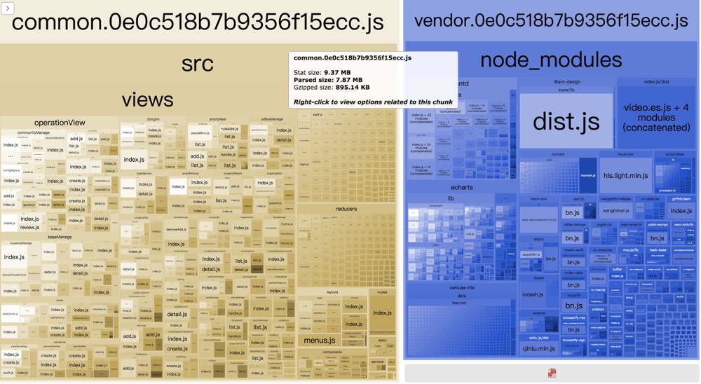

# Webpack

## 基础配置

本文就不过多的说明基础配置, 具体配置可查看[本链接](https://github.com/lewisYe/react-cli)

## 性能优化

### 分析工具

在进行性能优化之前，是不是需要知道哪里需要被优化，所以我们需要分析工具。

#### 速度分析

使用 `speed-measure-webpack-plugin` 插件

``` javascript

// 安装

npm i speed-measure-webpack-plugin -D

// webpack.config.js配置
const SpeedMeasureWebpackPlugin = require('speed-measure-webpack-plugin')
const swp = new SpeedMeasureWebpackPlugin()

swp.warp({
    // webpack配置
})
```

使用warp方法将webpack配置包裹 [具体配置查看](https://www.npmjs.com/package/speed-measure-webpack-plugin)

效果如下图：


该插件主要的工作是：计算整个打包总消耗；具体loader和plugin所花费的具体时间


#### 体积分析

打包后的体积优化是一个可以着重优化的点，比如引入的一些第三方组件库过大，这时就要考虑是否需要寻找替代品了。例如moment

使用 `webpack-bundle-analyzer` 插件来分析包体积大小

``` javascript

// 安装 
npm i webpack-bundle-analyzer -D

//webpack.config.js
const BundleAnalyzerPlugin = require('webpack-bundle-analyzer').BundleAnalyzerPlugin;

module.exports = {
    plugins: [
        new BundleAnalyzerPlugin()
    ]
}
```

[具体配置查看](https://www.npmjs.com/package/webpack-bundle-analyzer)

然后在命令行工具中输入npm run build，它默认会起一个端口号为 8888 的本地服务器：



###  优化方案

#### 使用高版本的webpack 和 node.js

比如webpack4 的打包速度就快于webpack3；node 的版本更高速度也会更快

webpack 优化原因

V8 带来的优化 使用for of 代替了forEach 、Map和Set代替了Object 、includes代替了indexOf

默认使用更快的md4 hash算法

webpacks AST可以直接从loader传递给 AST 减少传递时间

使用字符串代替正则表达式

#### 多进程/多实例构建

可以使用的插件有

* thread-loader
* happypack
* parallel-webpack

**thread-loader 用法**

thread-loader 会将你的 loader 放置在一个 worker 池里面运行，以达到多线程构建。

``` javascript
// 安装
npm i thread-loader -D

//webpack.config.js
module.exports = {
    module: {
        rules: [{
            test: /\.js$/,
            include: path.resolve("src"),
            use: [
                {
                    loader: 'thread-loader',
                    options: {
                    workers: 4,
                    },
                },
                'babel-loader',
            ],
        }]
    }
}
```

把这个 loader 放置在其他 loader 之前（如下面示例的位置）， 放置在这个 loader 之后的 loader 就会在一个单独的 worker 池(worker pool)中运行。

[更多配置查看](https://www.npmjs.com/package/thread-loader)

**HappyPack 用法**

HappyPack 可以让 Webpack 同一时间处理多个任务，发挥多核 CPU 的能力，将任务分解给多个子进程去并发的执行，子进程处理完后，再把结果发送给主进程。通过多进程模型，来加速代码构建。

``` javascript
// 安装

npm i happypack -D

// webpack.config.js
const HappyPack = require('happypack');

exports.module = {
    rules: [{
        test: /.js$/,
        use: 'happypack/loader',
    }]
};

exports.plugins = [
    new HappyPack({
        loaders: ['babel-loader']
    })
];
```

该方法在webpack3中使用比较多，而且目前作者都不在维护该库，并推荐在webpack 4中使用 `thread-loader` 更多happypack配置查看[配置连接](https://www.npmjs.com/package/happypack)


`thread-loader` 和 `happypack` 对于小型项目来说打包速度几乎没有影响，甚至可能会增加开销，所以建议尽量在大项目中采用。

#### 多进程并行压缩

webpack默认提供了UglifyJS插件来压缩JS代码，但是它使用的是单线程压缩代码，也就是说多个js文件需要被压缩，它需要一个个文件进行压缩。所以说在正式环境打包压缩代码速度非常慢(因为压缩JS代码需要先把代码解析成用Object抽象表示的AST语法树，再应用各种规则分析和处理AST，导致这个过程耗时非常大)。

所以我们要对压缩代码这一步骤进行优化，常用的做法就是多进程并行压缩


目前有三种主流的压缩方案：

* terser-webpack-plugin
* uglifyjs-webpack-plugin
* parallel-uglify-plugin

#### terser-webpack-plugin

不知道你有没有发现：webpack4 已经默认支持 ES6语法的压缩。而这离不开terser-webpack-plugin。

```javascript
// 安装
npm i terser-webpack-plugin -D

//webpack.config.js

const TerserPlugin = require('terser-webpack-plugin');

module.exports = {
  optimization: {
    minimize: true,
    minimizer: [
      new TerserPlugin({
        parallel: 4,
      }),
    ],
  },
};
```

#### uglifyjs-webpack-plugin

```javascript
// 安装 
npm i uglifyjs-webpack-plugin -D

//webpack.config.js
const UglifyJsPlugin = require('uglifyjs-webpack-plugin');

module.exports = {
  plugins: [
    new UglifyJsPlugin({
      uglifyOptions: {
        warnings: false,
        parse: {},
        compress: {},
        ie8: false
      },
      parallel: true
    })
  ]
};
```
通过设置parallel: true开启多进程压缩。

#### parallel-uglify-plugin

当webpack有多个JS文件需要输出和压缩时，原来会使用UglifyJS去一个个压缩并且输出，而ParallelUglifyPlugin插件则会开启多个子进程，把对多个文件压缩的工作分给多个子进程去完成，但是每个子进程还是通过UglifyJS去压缩代码。并行压缩可以显著的提升效率。

```javascript
// 安装
npm i webpack-parallel-uglify-plugin -D

//webpack.comfig.jss

import ParallelUglifyPlugin from 'webpack-parallel-uglify-plugin';

module.exports = {
  plugins: [
    new ParallelUglifyPlugin({
      // Optional regex, or array of regex to match file against. Only matching files get minified.
      // Defaults to /.js$/, any file ending in .js.
      test,
      include, // Optional regex, or array of regex to include in minification. Only matching files get minified.
      exclude, // Optional regex, or array of regex to exclude from minification. Matching files are not minified.
      cacheDir, // Optional absolute path to use as a cache. If not provided, caching will not be used.
      workerCount, // Optional int. Number of workers to run uglify. Defaults to num of cpus - 1 or asset count (whichever is smaller)
      sourceMap, // Optional Boolean. This slows down the compilation. Defaults to false.
      uglifyJS: {
        // These pass straight through to uglify-js@3.
        // Cannot be used with uglifyES.
        // Defaults to {} if not neither uglifyJS or uglifyES are provided.
        // You should use this option if you need to ensure es5 support. uglify-js will produce an error message
        // if it comes across any es6 code that it can't parse.
      },
      uglifyES: {
        // These pass straight through to uglify-es.
        // Cannot be used with uglifyJS.
        // uglify-es is a version of uglify that understands newer es6 syntax. You should use this option if the
        // files that you're minifying do not need to run in older browsers/versions of node.
      }
    }),
  ],
};
```

注意：webpack-parallel-uglify-plugin已不再维护，这里不推荐使用

#### 分包 与 预编译

什么是预编译

在使用webpack进行打包时候，对于依赖的第三方库，比如React，Redux等这些不会修改的依赖，我们可以让它和我们自己编写的代码分开打包，这样做的好处是每次更改我本地代码的文件的时候，webpack只需要打包我项目本身的文件代码，而不会再去编译第三方库。

那么第三方库在第一次打包的时候只打包一次，以后只要我们不升级第三方包的时候，那么webpack就不会对这些库去打包，这样的可以快速的提高打包的速度。其实也就是预编译资源模块。

webpack中，我们可以结合DllPlugin 和 DllReferencePlugin插件来实现。

但是发现在 vue-cli 和 create-react-app 抛弃了 该种方法 也可以使用hard-source-webpack-plugin 来代替 所以该方法作为了解吧。有兴趣的同学可以深入了解一下。

#### 开启缓存

* babel-loader 开始缓存
* terser-webpack-plugin 开启缓存
* cache-loader 和 hard-source-webpack-plugin

缓存对于首次构建时间没有太大变化，但是第二次构建有显著提升

#### 缩小构建目标

* babel-loader 的时候 不解析node_modules里面的内容 使用exclude,和include的使用
* 优化 resolve.modules 配置 缩小搜索范围层级
* 优化 resolve.mainFields 配置 查询入口文件
* 优化 resolve.extensions 后缀名
* 合理使用 resolve.alias

#### tree shaking 

* purgecss-webpack-plugin 去除无效css

#### 图片压缩

* image-webpack-loader

#### polyfill service优化构建体积


es6语法不兼容 需要使用到polyfill去转换

|方案|优点|缺点|推荐|
|:-:|:-:|:-:|:-:|
|babel-polyfill|react推荐|1.包体积200k+，难以单独抽离Map、Set|❎|
|babel-plugin-transform-runtime|能只polyfill用到的类和方法，相对体积小|不能polyfill原型上的方法，不能应用于复杂的业务场景|❎|
|自己写一个库|定制化、体积小|重复造轮子、需要更新维护|❎|
|polyfill-service|只给用户返回用到的polyfill、社区维护|国内奇葩浏览器UA不能识别、但可以降级处理返回全部的polyfill|✅|


https://polyfill.io/v3/ 官网

#### socpe hoisting

Scope hoisting 直译过来就是「作用域提升」。熟悉 JavaScript 都应该知道「函数提升」和「变量提升」，JavaScript 会把函数和变量声明提升到当前作用域的顶部。「作用域提升」也类似于此，webpack 会把引入的 js 文件“提升到”它的引入者顶部。

Scope Hoisting 可以让 Webpack 打包出来的代码文件更小、运行的更快。

要在 Webpack 中使用 Scope Hoisting 非常简单，因为这是 Webpack 内置的功能，只需要配置一个插件，相关代码如下：

```javascript
module.exports = {
  plugins: [
    new webpack.optimize.ModuleConcatenationPlugin()
  ],
};
```
该插件在webpack4中是默认开启的。

**对比使用效果**

现在有个文件分别是：
```javascript
// constant.js

export default 'Hello,Jack-cool';


// 入口文件 main.js
import str from './constant.js';
console.log(str);

```

未启用Scope Hoisting打包之后
```javascript
[
  (function (module, __webpack_exports__, __webpack_require__) {
    var __WEBPACK_IMPORTED_MODULE_0__constant_js__ = __webpack_require__(1);
    console.log(__WEBPACK_IMPORTED_MODULE_0__constant_js__["a"]);
  }),
  (function (module, __webpack_exports__, __webpack_require__) {
    __webpack_exports__["a"] = ('Hello,Jack-cool');
  })
]
```

在开启 Scope Hoisting 后

```javascript
[
  (function (module, __webpack_exports__, __webpack_require__) {
    var constant = ('Hello,Jack-cool');
    console.log(constant);
  })
]

```

从中可以看出开启 Scope Hoisting 后，函数申明由两个变成了一个，constant.js 中定义的内容被直接注入到了 main.js 对应的模块中。

这样做的好处是：

* 代码体积更小，因为函数申明语句会产生大量代码；
* 代码在运行时因为创建的函数作用域更少了，内存开销也随之变小。


Scope Hoisting 的实现原理其实很简单：分析出模块之间的依赖关系，尽可能的把打散的模块合并到一个函数中去，但前提是不能造成代码冗余。因此只有那些被引用了一次的模块才能被合并。

注意： 由于 Scope Hoisting 需要分析出模块之间的依赖关系，因此源码必须采用 ES6 模块化语句，不然它将无法生效。


## Writing a Loader

[文档链接](https://webpack.js.org/contribute/writing-a-loader/)

开发插件中一般会用到的工具库 `loader-utils` 和 `schema-utils`

`loader-utils` 有很多工具类方法 [具体配置项链接](https://github.com/webpack/loader-utils)

`schema-utils`用于参数校验

可以直接return 单个结果  多个结果可以使用`this.callback(err, values...)`

比如实现一个中文转unicode

## Writing a Plugin

开发一个插件 必须是一个类，类中必须有一个apply 方法。 apply方法会有一个`complier`参数。

然后通过监听hooks 进行操作 比如监听emit hook
```javascript
 complier.hooks.emit.tapAsync('MyPlugin',(compilation,callback)=>{
     // 插件功能
 })
```

[文档链接](https://webpack.js.org/contribute/writing-a-plugin/)

 
## AST

<!-- https://mp.weixin.qq.com/s/ek97O_jKk5_bD2WBdd95Yw -->